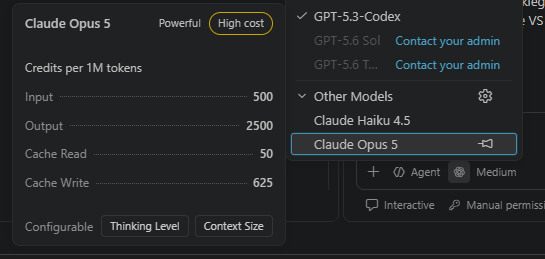
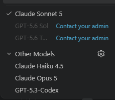
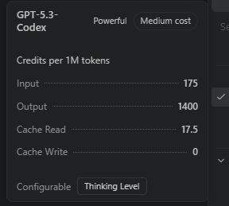

# Dzień 2 — Podsumowanie

**Data:** 29 września 2026 r.

## Przebieg dnia

Poranny fragment spotkania został przerwany z powodu problemów z połączeniem Zoom; zajęcia wznowiono o 10:07. Łukasz pokazał wznowienie sesji Codex, rozgałęzianie rozmowy i dodatkowy czat w trakcie pracy agenta. Uczestnicy poznali też pracę z Windows Subsystem for Linux, otwieranie projektu w VS Code oraz terminalowe narzędzia do obsługi Git i edytorów.

Znaczna część dnia była poświęcona porównywaniu modeli, benchmarków, kosztów i szybkości generowania. Grupa obejrzała przykłady stron tworzonych przez różne modele, korzystając m.in. z Artificial Analysis, Arena i OpenRouter. Rozmawiano o tym, jak oceniać benchmarki i dobierać model do konkretnego zadania.

Omówiono Spec-Driven Development, podejście „zero dependency”, repozytoria skills i prompty do przygotowania PRD. Wśród udostępnionych materiałów znalazły się GitHub Spec Kit, przykłady umiejętności, repozytorium kursu oraz prompt do dalszej pracy nad aplikacją.

Podczas rozmowy o dostawcach i planach modeli pojawiły się OpenRouter, Z.ai/GLM, OVH AI Endpoints, Bielik, Mistral i Xiaomi MiMo. Poruszono również kwestię prywatności oraz lokalizacji hostowania modeli. Pod koniec dnia pokazano ustawienia edytorów terminalowych i skróty przydatne podczas pracy z promptami.

## Ustalenia i rezultaty

- Udostępniono linki do benchmarków, przykładów stron, repozytoriów skills i promptów.
- Przećwiczono porównywanie wyników generowania stron oraz omawianie jakości modeli.
- Uczestnicy poznali przykłady podejścia Spec-Driven Development i przygotowania PRD.
- Z powodu problemów technicznych spotkanie zostało przerwane i wznowione; rozmowa zakończyła się zapowiedzią kontynuacji pracy nad aplikacją.

## Zrzuty ekranu z części o modelach

Panel Claude Opus 5 pokazuje 500 kredytów za wejście, 2500 za wyjście, 50 za odczyt cache i 625 za zapis cache na milion tokenów.

Widok wyboru modeli z Claude Sonnet 5 oraz alternatywami Claude Haiku 4.5, Claude Opus 5 i GPT-5.3-Code.

Panel GPT-5.3-Code pokazuje 175 kredytów za wejście, 1400 za wyjście, 17,5 za odczyt cache i 0 za zapis cache na milion tokenów.

## Kolejne kroki

### Prowadzący

- Brak potwierdzonych zaległych działań z tego dnia.

### Uczestnicy z imienia

- Brak indywidualnych działań do kontynuowania.

### Wszyscy uczestnicy

- Przygotować lub odświeżyć pomysł aplikacji/PRD przed kolejnymi zajęciami poświęconymi planowaniu i implementacji.
- Uporządkować workspace projektu i agenta przed dalszą pracą.
- Przed dalszymi eksperymentami sprawdzić dostępne modele i plany w swoim środowisku oraz ich koszty.
