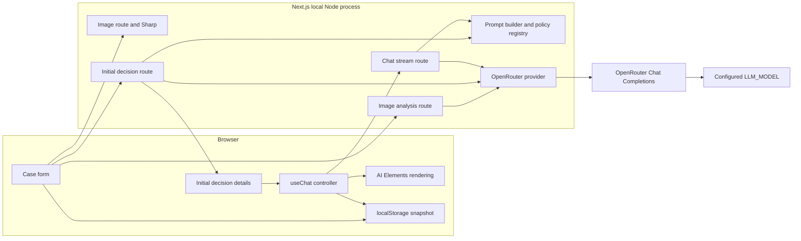
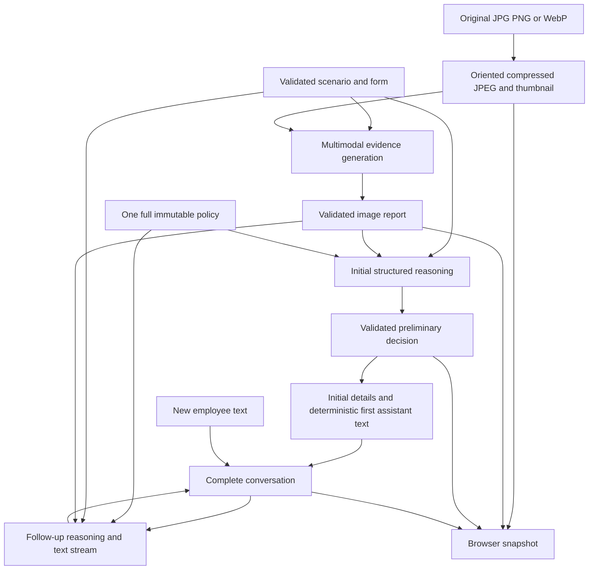
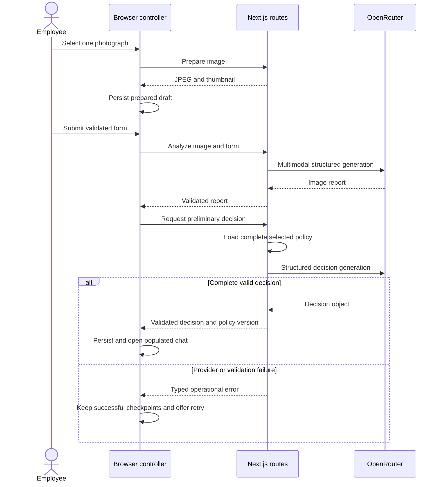
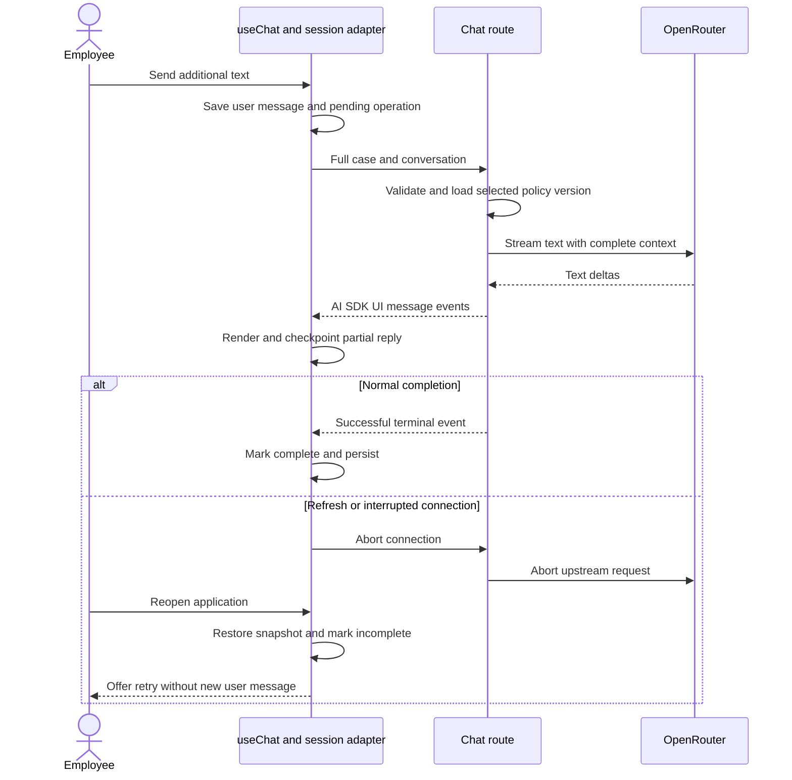

# ADR: Hardware Service Decision Copilot — Main Architecture

**Date:** 2026-09-30

**Status:** Accepted

**PRD:** [Hardware Service Decision Copilot](../PRD.md)

---

## 1. Overview

Build a local training PoC that turns a complaint/return form and one photograph into a validated preliminary decision, then supports a streaming text conversation. A single Next.js application owns both the browser UI and server-side OpenRouter integration. There is no database, authentication, background worker, RAG service or business-action integration.

The user confirmed local development only, one configured model for both AI stages, a 120-second initial-assessment deadline, a target of five concurrent cases, AI Elements with useChat, structured initial decisions and unsigned browser-held case state. These decisions are for a trusted classroom demonstration, not a production authorization system.

Read this record with the focused records:

| Record | Responsibility |
| --- | --- |
| [001 — Project initialization](001-project-initialization.md) | Scaffold, package compatibility, assets and developer commands |
| [002 — Backend and AI workflow](002-backend-ai-workflow.md) | Upload processing, schemas, prompts, policies, OpenRouter and APIs |
| [003 — Frontend and session](003-frontend-session.md) | Form, initial decision UI, streaming chat, localStorage and recovery |
| [004 — Verification](004-verification.md) | TDD, integration boundaries, completely real E2E and manual QA |

---

## 2. Technology Documentation References

References were checked on 30 September 2026. IDs were supplied explicitly or resolved through Context7 MCP and then queried. Use the IDs directly for subsequent documentation lookups; do not mix examples from different AI SDK major versions.

| Library | Context7 ID or official docs | Used for |
| --- | --- | --- |
| Vercel AI SDK | `/vercel/ai`; [docs](https://ai-sdk.dev/docs); [source](https://github.com/vercel/ai) | Core generation, typed output, UI transport and current v7 APIs |
| Next.js | `/vercel/next.js`; [installation](https://nextjs.org/docs/app/getting-started/installation) | App Router, scaffold, Route Handlers and Node runtime |
| AI Elements | `/vercel/ai-elements`; [components](https://elements.ai-sdk.dev/) | Ready-made streaming conversation components |
| OpenRouter | `/openrouterteam/docs`; [AI SDK integration](https://openrouter.ai/docs/guides/community/vercel-ai-sdk) | Provider configuration, reasoning and multimodal access |
| OpenRouter provider | [official package source](https://github.com/OpenRouterTeam/ai-sdk-provider) | Explicit Chat Completions adapter and peer compatibility |
| OpenRouter Responses API | [overview](https://openrouter.ai/docs/api_reference/responses/overview) | Evaluated alternative; stateless conversation semantics |
| OpenRouter model catalog | [public Models API](https://openrouter.ai/api/v1/models) | Verified capabilities of the configured model |
| assistant-ui | `/assistant-ui/assistant-ui`; [source](https://github.com/assistant-ui/assistant-ui) | Evaluated alternative chat UI/runtime |
| Chat SDK | `/vercel/chat`; [site](https://chat-sdk.dev/); [web adapter](https://chat-sdk.dev/adapters/official/web.md) | Evaluated bot framework, including its current browser adapter |
| Vercel Chatbot template | `/vercel/chatbot`; [source](https://github.com/vercel/chatbot) | Evaluated actual Next.js web-chat template |
| shadcn/ui | `/shadcn-ui/ui`; [docs](https://ui.shadcn.com/docs) | Copied UI primitives and AI Elements prerequisites |
| Sharp | `/lovell/sharp`; [docs](https://sharp.pixelplumbing.com/) | Backend-only image preparation |
| Zod | `/colinhacks/zod`; [docs](https://zod.dev/) | Runtime validation and structured-generation schemas |
| Vitest | `/vitest-dev/vitest`; [docs](https://vitest.dev/guide/) | Unit and integration verification |
| React Testing Library | `/testing-library/react-testing-library`; [docs](https://testing-library.com/docs/react-testing-library/intro/) | User-oriented component tests |
| Playwright | `/microsoft/playwright`; [docs](https://playwright.dev/docs/intro) | Real-stack browser E2E |
| Playwright CLI | `/microsoft/playwright-cli`; [source](https://github.com/microsoft/playwright-cli) | Separate manual browser QA |

The supplied chat-sdk.dev URL currently describes Chat SDK, not the full web-chat template. Its web adapter supports the AI SDK UI stream protocol, so it is technically capable of browser chat, but it is still a bot/adapters architecture. The actual web application template is vercel/chatbot. This distinction is confirmed by the respective current documentation, rather than inferred from their names.

---

## 3. System Architecture

### Architecture Pattern

A modular monolith: Next.js App Router pages and client components call same-origin Node.js Route Handlers. AI requests originate only from the server. Browser state is the session store; routes are stateless with respect to cases. Server filesystem resources contain immutable, versioned policy snapshots and prompt files.

### Repository Structure

The generated application lives under the existing repository's app directory; App Router files live inside app/src/app. Product-specific feature modules live under app/src/features, shared contracts under app/src/lib/contracts, and server-only services under app/src/server. Copied UI primitives and AI Elements live under app/src/components. Policy/prompt resources live under app/resources; public brand assets live under app/public.

The existing docs, assets and teaching material remain at repository level. app/.next and test output are generated artifacts. Initialization must not create another Git repository or place a Node project at repository root.

### Technology Stack

| Layer | Technology | Reason |
| --- | --- | --- |
| Runtime | Installed Node.js 24.14.0, npm | Compatible local runtime; no containers or hosting integration required |
| Full-stack framework | Next.js 16.3.7, App Router | One application for UI and same-origin server endpoints |
| Language | TypeScript, strict mode | Shared typed contracts plus runtime checks at external boundaries |
| Chat state/transport | AI SDK 7 and @ai-sdk/react | Documented useChat and UI-message streaming protocol |
| Chat rendering | AI Elements | Copied, customizable components without a second chat runtime |
| Form/details UI | shadcn/ui and generated Tailwind setup | Accessible controls and ownership of brand styling |
| AI provider | @openrouter/ai-sdk-provider 3.1.0 | Compatible AI SDK 7 adapter with explicit OpenRouter routing |
| Models | LLM_MODEL, currently openai/gpt-6-luna | Same configured model for image evidence, initial decision and follow-up chat |
| Validation | Zod 4 | Validate form, AI output, browser session and endpoint requests |
| Images | Sharp, Node runtime | Decode, orient, resize, strip metadata and compress before model input |
| Persistence | Browser localStorage | One active case survives refresh without database scope |
| Verification | Vitest, React Testing Library, Playwright and Playwright CLI | Deterministic lower layers, real LLM E2E and independent manual QA |

---

## 4. Module Structure & Dependencies

| Module | Responsibility | Dependencies | Consumers |
| --- | --- | --- | --- |
| Shared contracts | Form, image report, initial decision, request/error and session schemas | Zod; no server secrets or filesystem | Browser and server |
| Case form/controller | Form validation, image selection and sequential initial workflow | Shared contracts, image/analysis/decision endpoints | Case page |
| Chat controller | One useChat instance, stream lifecycle and retry | Shared contracts, AI SDK React, session adapter | Chat view |
| Presentation | AI Elements, form controls, decision details and brand styling | Controller data; no OpenRouter access | Browser pages |
| Session adapter | Versioned snapshot, restoration and storage-failure handling | Shared contracts, localStorage | Form/chat controllers |
| Route handlers | Input bounds, validation, errors and response protocol | Shared contracts and server services | Browser HTTP clients |
| Image service | Prepared JPEG and thumbnail | Sharp | Image and analysis routes |
| Policy registry/prompt builder | Select exactly one immutable policy and scenario prompt | Server filesystem and contract enums | Initial-decision/chat services |
| AI service | Evidence generation, structured decision and text streaming | AI SDK Core and configured OpenRouter adapter | Analysis/decision/chat routes |

Dependency direction is presentation → controllers → contracts/transport, and routes → services → provider/resources. Contracts do not import UI or server modules. Browser code must not import server services. Services do not import Route Handlers. No dependency cycles are permitted.

---

## 5. Data Models

| Model | Key fields and purpose | Relationships and persistence |
| --- | --- | --- |
| CaseForm | Scenario/category enums, model name, calendar dates, buyer/seller enums, reason and requested remedy | Immutable submitted evidence; active browser snapshot |
| PreparedImage | JPEG data URL, dimensions, byte count, digest and small thumbnail | One per case; browser snapshot and transient server memory |
| ImageAnalysis | Observation/hypothesis lists, limitations, questions, image digest and form fingerprint | One validated report; active browser snapshot |
| InitialDecision | Outcome enum, explanation, evidence, selected-policy heading references, next steps, questions and nullable resale result | One validated initial result; rendered as the first assistant bubble and retained locally |
| PolicyVersion | Scenario, immutable version digest, source URL and source retrieval time | Server resource registry; browser stores the identifier/metadata, never supplies trusted policy text |
| UIMessage | Stable ID, user/assistant role, text parts and application completion metadata | Full chronological conversation; retained locally |
| ActiveCaseSnapshot | Schema version, case ID, draft/submitted form, prepared image, report, decision, messages and pending operation | Single browser key, no archive or expiry |

All case payloads supplied by the browser are structurally validated but unsigned. Digests detect accidental stale data and identify resources; they do not authenticate the employee or attest evidence. The demonstration must not claim server-authoritative history or tamper resistance.

---

## 6. API / Interface Contracts

Detailed shapes, bounds and error mapping are defined in [ADR-002](002-backend-ai-workflow.md).

| Endpoint | Input | Output | Purpose |
| --- | --- | --- | --- |
| POST /api/images/prepare | Multipart: exactly one image | JSON PreparedImage | Backend compression, orientation, metadata stripping and persisted preview |
| POST /api/analysis | Validated form, prepared image and operation identifiers | JSON ImageAnalysis | First model call; complaint/return-specific multimodal evidence description |
| POST /api/decisions | Same form, validated report and identifiers | JSON InitialDecision with policy metadata | Second model call; complete applicable procedure and validated decision |
| POST /api/chat | Full text conversation and active case context | AI SDK UI-message stream | Follow-up reasoning and incremental text rendering |

No endpoint requires application login. No endpoint accepts a browser-supplied API key, model choice, system instructions, policy path or arbitrary image URL. Responses are not cached. No GET stream-resume, case-archive or action-execution endpoints exist.

The separation gives observable progress and stage-specific retry without a worker, polling channel or custom event protocol. Both initial AI calls are non-streaming structured generation; only follow-up text uses streaming.

---

## 7. Environment Variables

The repository's .env.example currently defines exactly the following variables. It does not define an endpoint URL. Use the official OpenRouter base URL https://openrouter.ai/api/v1 and its Chat Completions endpoint, rather than assuming a hidden endpoint configuration exists.

| Variable | Purpose | Required | Example value |
| --- | --- | --- | --- |
| OPENROUTER_API_KEY | Server-side OpenRouter authentication | Yes, for any AI flow | your_api_key_here |
| LLM_MODEL | Model ID used by both initial stages and chat | Yes | openai/gpt-6-luna |

Initialize app/.env.local from the example during implementation and provision the real value through the existing secret workflow. Next.js loads environment files relative to the application root; a repository-root file alone is insufficient when the project runs from app. Do not use NEXT_PUBLIC prefixes, commit secrets or print their values. Missing credentials produce a configuration error, never a mock result.

The local dev command binds to 127.0.0.1:3000. No deployment credentials, database URLs, signing secret or AI Gateway key are needed.

---

## 8. Technical Decisions

### Use a Generated Minimal Next.js Application

**Status:** Accepted

**Date:** 2026-09-30

**Context:** app contains only a starting README. The PoC excludes accounts, archives, databases and hosted file storage.

**Decision:** Use create-next-app, then add selected components and services; keep one local Node process.

**Rejected alternatives:**
- Vercel Chatbot template: real web-chat starter, but removing Auth.js, Postgres, Blob and Gateway configuration introduces work unrelated to this PRD.
- Chat SDK starter: useful for bot/adapters scenarios, including its web adapter, but unnecessary for a single browser application.
**Consequences:**
- (+) Initialization matches the required scope and existing empty starting point.
- (-) Product-specific form, session recovery and initial-decision UI still need implementation.
**Review trigger:** Add authentication, durable history, deployment or external chat-platform integration.

### Select AI Elements, Not a Second Chat Runtime

**Status:** Accepted

**Date:** 2026-09-30

**Context:** The user prefers simpler PoC options and needs ready-made streaming components plus a custom form and initial decision card. AI SDK UI supplies hooks rather than complete visual components.

**Decision:** useChat owns messages and lifecycle; AI Elements renders Conversation, Message/MessageResponse and a text-only PromptInput. Customize copied components with the existing brand guidance.

**Rejected alternatives:**
- assistant-ui: capable streaming and accessible UI, with current AI SDK integration, but its runtime/adapters add state integration work for this chosen useChat/localStorage design.
- Fully handwritten chat components: fewer packages but unnecessary work for scrolling, streaming Markdown and composer behavior.
**Consequences:**
- (+) One chat state owner and a direct backend stream contract.
- (-) The application implements its own session adapter, error notices and structured decision card.
**Review trigger:** Require multiple threads, built-in branch editing, advanced tools or a UI runtime beyond the single-case workflow.

### Route AI SDK Through OpenRouter Chat Completions

**Status:** Accepted

**Date:** 2026-09-30

**Context:** The user requires the OpenRouter credential/model in the existing example. Browser chat needs AI SDK UI stream events, not raw provider SSE.

**Decision:** Explicit createOpenRouter configuration and its chat model factory call https://openrouter.ai/api/v1/chat/completions. The server adapts the result to the AI SDK UI stream. Never pass a bare model-ID string to AI SDK Core, because that selects its default provider/Gateway rather than this configured OpenRouter adapter.

**Rejected alternatives:**
- Direct OpenRouter Responses API: usable and OpenAI-compatible, but requires a different request/event interface or adapter; its current API is stateless, rejects store=true/non-null previous_response_id and does not eliminate full-history transmission. See [the official overview](https://openrouter.ai/docs/api_reference/responses/overview).
- Vercel AI Gateway: adds a different authentication and routing boundary not requested by the user.
**Consequences:**
- (+) One provider boundary for structured multimodal and streaming calls.
- (-) Provider/model capabilities must be checked and retested after upgrades.
**Review trigger:** Require a Responses-specific capability or a documented provider adapter that materially simplifies the required flow.

### Keep Unsigned Browser State and Immutable Server Policies

**Status:** Accepted

**Date:** 2026-09-30

**Context:** The user chose the simplest classroom option. Refresh continuity is required, but a database and signing secret are excluded.

**Decision:** Persist one validated snapshot in localStorage, send full relevant history on each request and load policy text from a server-side allowlisted version registry. No server case store or signed envelope.

**Rejected alternatives:**
- HMAC-signed case: stronger tamper detection but additional secret/envelope lifecycle for this trusted demonstration.
- Database/Redis or assistant cloud persistence: expands the scope and operational dependencies.
**Consequences:**
- (+) Refresh recovery does not depend on process memory or an external datastore.
- (-) Browser evidence/history can be modified; recovery is conditional on available browser storage.
**Review trigger:** Real customer data, public exposure, approval authority or durable audit requirements.

### Evaluate Two Initial Stages, Then Stream Conversation

**Status:** Accepted

**Date:** 2026-09-30

**Context:** Image interpretation and policy assessment are different responsibilities. The user chose a validated initial object and subsequent text chat.

**Decision:** Generate a validated image report, then a validated decision with generateText and Output.object; render the latter only after full validation. streamText handles subsequent text with the complete selected policy and history. The first decision never requires an extra model call to format a greeting.

**Rejected alternatives:**
- One combined image/decision prompt: loses the separate evidence stage and scenario-specific responsibilities in the PRD.
- Streaming partial decision JSON into the visible decision card: risks presenting unfinished values as a decision.
**Consequences:**
- (+) Reliable decision structure, clear stages and independent retries.
- (-) Initial assessment contains two sequential provider calls.
**Review trigger:** Measured latency makes two stages unsuitable or the PRD changes the first-decision presentation.

### Option Comparison for This PRD

This is a fit assessment based on current documentation, not a benchmark of runtime performance.

| Option | What it provides | Fit and conclusion |
| --- | --- | --- |
| AI SDK Core | Provider abstraction, structured generation and streams | Selected orchestration layer; does not supply a complete app or visual UI |
| AI SDK UI/useChat | Message state and UI stream transport | Selected client state owner; pair with components |
| AI Elements | Copied UI components integrated with useChat | Best fit for the chosen simple, branded, single-case PoC |
| assistant-ui | Components plus runtimes and adapters, including AI SDK support | Viable alternative; not selected because the user prefers direct useChat integration |
| chat-sdk.dev/Chat SDK | Unified bot handlers/adapters; current web adapter supports UI streams | Technically capable, but additional abstraction without required external-platform use |
| vercel/chatbot template | Complete Next.js chatbot, auth and persistent storage | Useful for broader chat products; more dependencies to remove than this PoC needs |
| OpenRouter Responses API | Stateless OpenAI-compatible reasoning/tool API | Alternative transport; no persistence shortcut and no required unique capability here |
| OpenRouter AI SDK provider | Bridges OpenRouter Chat Completions to AI SDK | Selected provider connection; complements AI SDK rather than replacing it |

---

## 9. Diagrams

### 9.1 Architecture / Component Diagram

### 9.2 Data Flow Diagram

### 9.3 Sequence Diagrams

#### Initial Assessment and Failure

#### Streaming Chat and Refresh

---

## 10. Testing Strategy

### Philosophy

Write specification-driven tests before production changes, observe the expected failure and implement the minimum change that passes. Verification must preserve the PRD's behavior, not weaken assertions around nondeterministic model wording. Detailed ownership and scenarios are in [ADR-004](004-verification.md).

### Test Layers

| Layer | Type | Scope | Tools |
| --- | --- | --- | --- |
| Unit | Collaborators mocked | Contracts, pure formatting, state transitions and isolated UI behavior | Vitest, React Testing Library |
| Integration | Only external LLM API mocked | Real route/service composition, policy files, Sharp, schema checks and stream framing | Vitest, provider HTTP-boundary test double |
| E2E | Nothing mocked | Browser → Next.js → Sharp/policies → actual OpenRouter → actual model → UI and storage | Playwright |
| Manual QA | Nothing mocked | Human-driven real flows, every affected screen, console checks and Allegro comparison | Playwright CLI |

### Key Test Scenarios

- Valid complaint and return each produce a validated initial decision and a real follow-up response.
- Missing material facts lead to clarification; return eligibility remains separate from resale condition.
- Failure or cancellation preserves successful stages and never labels partial output as complete.
- Refresh restores the first structured card and history without triggering generation.
- New case clears context; retry does not duplicate the user or completed assistant messages.
- Five concurrent case workflows do not share evidence, messages or scenario policy.

### Technical Acceptance Criteria

- TAC-000-01: Both initial AI stages and chat call only the configured OpenRouter provider/model.
- TAC-000-02: No application database, auth service, bot state adapter or Gateway credential is needed to run the local PoC.
- TAC-000-03: Browser bundles and network responses contain no API credential or reasoning content.
- TAC-000-04: E2E completion evidence includes actual OpenRouter generations; mock-backed tests cannot be reported as E2E success.
- TAC-000-05: All 58 PRD acceptance criteria are mapped to verification scenarios in ADR-004.
