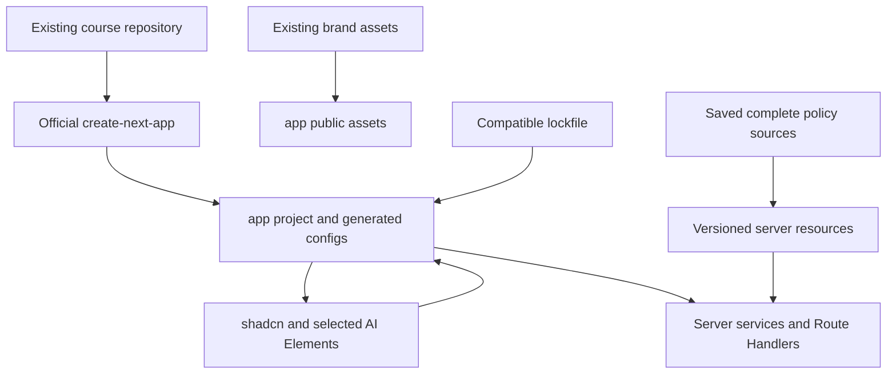
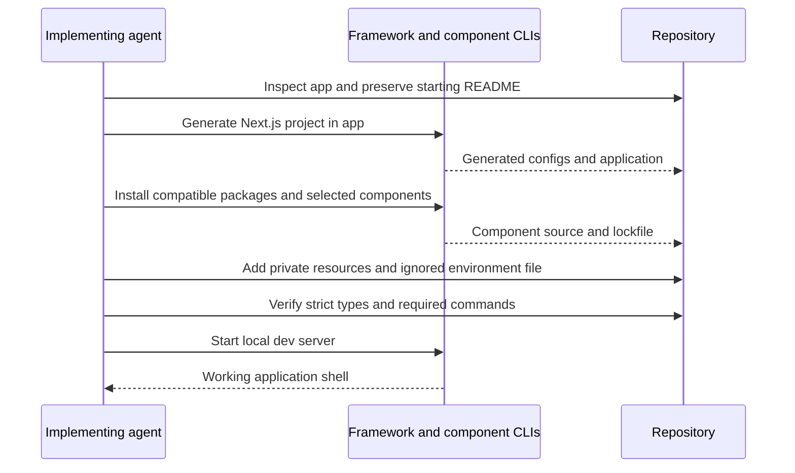

# ADR-001: Project Initialization and Dependency Baseline

**Date:** 2026-09-30

**Status:** Accepted

**Relates to:** [Main architecture](000-main-architecture.md)

---

## 1. Scope

Define how the implementing agent initializes the application from app/README.md, installs compatible current libraries, exposes local developer commands and includes brand/policy resources. This record does not initialize the application now. Business and AI interfaces are in ADR-002; UI behavior is in ADR-003.

---

## 2. Technology Documentation References

| Library | Context7 ID or official docs | Used for |
| --- | --- | --- |
| Next.js/create-next-app | `/vercel/next.js`; [CLI docs](https://nextjs.org/docs/app/api-reference/cli/create-next-app) | Generated scaffold and current flags |
| AI SDK | `/vercel/ai`; [v7 migration](https://ai-sdk.dev/docs/migration-guides/migration-guide-7-0) | Compatible current API generation |
| OpenRouter provider | [package source](https://github.com/OpenRouterTeam/ai-sdk-provider); [registry metadata](https://registry.npmjs.org/@openrouter%2fai-sdk-provider) | ai@7 peer dependency and Node minimum |
| AI Elements | `/vercel/ai-elements`; [installation](https://elements.ai-sdk.dev/docs/setup) | Component CLI and prerequisites |
| shadcn/ui | `/shadcn-ui/ui`; [Next.js setup](https://ui.shadcn.com/docs/installation/next) | Existing-project initialization and selected primitives |
| Vitest | `/vitest-dev/vitest` | Unit/integration runner |
| Playwright | `/microsoft/playwright` | Browser test installation |
| jsdom | [version metadata](https://registry.npmjs.org/jsdom/29.1.1) | Compatible simulated DOM for the installed Node version |
| Package versions | [npm registry](https://registry.npmjs.org/) | Directly checked stable versions and peer/engine constraints |

---

## 3. Component Design

### Initialization Sequence

1. Verify Node and npm without reading secret values. The observed machine has Node 24.14.0 and npm 11.9.0; use this runtime. AI SDK/provider require Node 22+, and the chosen test stack must also accept the installed Node patch.
2. Preserve the existing app README. Initialize directly in app using create-next-app 16.3.7, with explicit TypeScript, App Router, src directory, Tailwind, ESLint, npm and @/* alias selections; disable nested Git initialization. Use its normal empty/minimal application scaffold rather than a chatbot example. If the generator objects to the README, temporarily preserve only that known file and restore/merge its course guidance after generation.
3. Let the generator create its package manifest, tsconfig, ESLint, Next.js and CSS files. Verify TypeScript strict=true in generated configuration. Do not write substitute scaffolding or choose a separate frontend/backend starter. Leave optional experimental compiler/cache features disabled for the PoC.
4. Install the stable version baseline below, resolve peers without legacy-peer-deps or force flags, and commit the generated package lock during implementation. Keep the generated Next.js types/build configuration unless a documented integration requires a change.
5. Initialize shadcn/ui in this existing project using its CLI; use the copied TypeScript component model and CSS variables. Add only button, input, label, select, textarea, card, alert, alert-dialog and collapsible primitives. Use a native date input for the date picker; do not add a calendar library.
6. Use the AI Elements CLI add operation for conversation, message and prompt-input. Do not install all available AI Elements features. Resolve any additional component dependencies through the CLI rather than hand-copying incomplete source files.
7. Add server-only services, shared Zod contracts, prompt resources, versioned policy resources and tests. TDD starts before adding business behavior.
8. Populate app/.env.local using the names in the repository example; keep it ignored. The repository's example remains the source of configuration names. Update documentation to identify the application-root environment-file location.
9. Copy approved existing logos/favicon/fonts to app/public and map existing design tokens into the generated CSS variables. Use existing assets rather than retrieving a new brand system.
10. Expose the commands below, start the app, and verify its generated shell before implementing the PRD workflow.

These are instructions for later implementation, not actions carried out while writing ADRs.

### Verified Version Baseline

Stable registry metadata was checked on 30 September 2026. Exact versions are the reproducible baseline for this ADR; do not silently switch major versions based on an older tutorial or install canary/alpha tags.

| Package/tool | Version | Compatibility note |
| --- | --- | --- |
| create-next-app / next | 16.3.7 | App Router generation |
| react / react-dom | 19.3.0 | Accepted by Next.js, AI SDK React and component-test peers |
| typescript | 6.0.3 | Stable parser-compatible release; strict mode required |
| eslint | 10.11.0 | Supported CLI; direct official plugin composition |
| @next/eslint-plugin-next | 16.3.7 | Next.js recommended and Core Web Vitals rules |
| typescript-eslint | 8.71.0 | Recommended TypeScript rules; peer TypeScript >=4.8.4 <6.1.0 |
| eslint-plugin-react-hooks | 7.1.1 | Recommended Hooks rules; accepts ESLint 10 |
| ai | 7.0.123 | Current Core APIs; Node >=22 |
| @ai-sdk/react | 4.0.126 | Compatible current React UI hook package |
| @openrouter/ai-sdk-provider | 3.1.0 | Peer ai ^7.0.0; ESM; Node >=22 |
| zod | 4.6.5 | Accepted by AI SDK/provider peers |
| sharp | 0.35.5 | Node backend image processing |
| tailwindcss | 4.3.3 | Keep matching generated companion packages |
| shadcn CLI | 4.21.0 | Component generator, not a parallel runtime |
| AI Elements CLI | 1.9.0 | Adds selected component source and dependencies |
| vitest | 5.0.2 | Compatible with installed Node 24.14.0 |
| @testing-library/react | 16.3.3 | React 19-compatible component tests |
| @testing-library/jest-dom | 7.0.1 | DOM assertions; include matching DOM peer dependency |
| jsdom | 29.1.1 | Deliberately selected over 30.1.1, whose Node 24 requirement starts at 24.15.0 |
| @playwright/test | 1.63.0 | Real browser E2E |
| @playwright/cli | 0.1.22 | Manual QA tool, verified current CLI line |

Allow the CLIs to select their compatible supporting dependencies, including React type packages, Tailwind's companion package, component internals and Vite. Lock the complete resolved tree. Engine/peer warnings must be resolved before verification; jsdom's latest tag is not automatically compatible with the currently installed Node patch.

**Compatibility review — 1 October 2026 (S01):** The official scaffold was generated before adjustments. TypeScript 7.0.2 exists in the registry, but stable typescript-eslint 8.71.0 rejects its API at lint startup and requires TypeScript below 6.1.0; use 6.0.3. The generated eslint-config-next composition, including latest 16.3.8, requires React/import/accessibility plugins whose stable peers exclude ESLint 10. All published ESLint 9 patches are deprecated. Use supported ESLint 10 with the official Next.js plugin directly, retaining Next recommended/Core Web Vitals, TypeScript recommended and React Hooks recommended rules. General React, import and JSX accessibility plugin rules are unavailable in this composition until those plugins support ESLint 10; TypeScript checks, scoped tests and manual accessibility QA remain required. No forced peer overrides or warning suppression are permitted.

### Resource Placement

- Preserve existing repository documentation and assets.
- Copy the two complete saved policy HTML sources into app/resources/policies under immutable version-digest filenames. Copy their source provenance into a server registry; changing a snapshot creates a new version rather than replacing an existing one.
- Keep four prompt resources under app/resources/prompts: complaint image, return image, complaint decision and return decision. They implement PRD section 11 without adding tools or RAG.
- Keep secrets, policy files and prompt resources out of public. Only brand assets belong in public.

---

## 4. Data Structures

| Artifact | Contents |
| --- | --- |
| package manifest/lock | Generated framework scaffold plus exact resolved direct/transitive dependencies |
| TypeScript configuration | Generated Next.js settings, strict mode and @/* alias |
| Component configuration | CLI-generated aliases, TypeScript source, CSS variables and selected style primitives |
| Policy registry | Scenario/version → fixed server resource, digest, source URL, retrieval timestamp and known heading IDs |
| Verification configuration | Separate unit/component/integration scope and real E2E configuration |

There is no ORM configuration, migration folder, container definition or managed-service configuration.

---

## 5. Interface Contracts

### Developer Commands

All npm commands run with app as the working directory.

| Command | Required behavior |
| --- | --- |
| npm run dev | Start Next.js development server on 127.0.0.1:3000 |
| npm run build | Compile the application with production build checks |
| npm run start | Serve a previously built application locally; optional diagnostic use, no deployment required |
| npm run lint | Run the generated ESLint CLI configuration, without rewriting files |
| npm run typecheck | TypeScript verification with no emitted output |
| npm run test:unit | Run isolated contract/service/component tests once |
| npm run test:integration | Run real service/route integration with only the external LLM boundary replaced |
| npm run test:e2e | Start/reuse the real dev server and execute browser flows with real OpenRouter calls |

Use the actual ESLint CLI rather than assuming an older next lint command exists. test:e2e must not enable a mock model through NODE_ENV, CI, PLAYWRIGHT or a test-only provider switch.

### Configuration and Startup Failure

The UI shell can render without a configured key, but attempts to assess/chat return CONFIGURATION_ERROR with no provider call. The real E2E suite performs a credential-presence preflight and reports an unmet prerequisite as a failed verification run, not a skipped or fake success.

Evaluate AI credential configuration when an AI route is called, not through module-import side effects that prevent the generated shell or build from running. Replace generated remote-font/demo branding with the existing local brand assets before visual verification.

---

## 6. Technical Decisions

### Generate, Then Extend the Scaffold

**Status:** Accepted

**Date:** 2026-09-30

**Context:** The repository is an intentionally empty course starting point. Existing example apps and teaching materials are not application requirements.

**Decision:** Initialize with the official generator and explicit choices, preserve the base README, then add the selected libraries and product modules.

**Rejected alternatives:** Handwritten configuration risks missing current framework defaults; cloning a full chatbot imports excluded services.

**Consequences:** (+) Current generated defaults and a focused app. (-) A controlled setup step precedes feature development.

**Review trigger:** An existing application is introduced or deployment requirements change.

### Lock Compatible Stable Versions

**Status:** Accepted

**Date:** 2026-09-30

**Context:** Current sources include AI SDK 7 APIs, while some provider examples retain older syntax. npm latest also exposes a jsdom release incompatible with the installed Node patch.

**Decision:** Use the researched stable baseline and verify engines/peers; update versions only as an explicit compatibility review.

**Rejected alternatives:** Mixing AI SDK 6 examples with v7 packages; bypassing dependency warnings; upgrading the machine solely to consume the newest simulated-DOM release.

**Consequences:** (+) Reproducible installation. (-) Upgrades require coordinated verification.

**Review trigger:** Security fix, unavailable package version or a required capability added in a later release.

---

## 7. Diagrams

### Component Diagram

### Initialization Sequence

---

## 8. Testing Strategy

| Scenario | Type | Input | Expected output | Edge cases |
| --- | --- | --- | --- | --- |
| Dependency compatibility | Static/build | Installed baseline on Node 24.14.0 | No engine/peer warnings; lockfile exists | Latest jsdom must not be selected implicitly |
| Generated configuration | Static | Generated project | App Router, strict TypeScript, aliases and lint/typecheck commands | No handwritten replacement scaffold |
| Secret boundary | Build/integration | Application environment | Key used server-side only | Missing key returns typed error |
| Resource availability | Integration | Copied policy registry and sources | Digests match; resources load | Missing file or changed digest blocks AI decision |
| Shell startup | Manual | npm run dev | Form shell reachable locally | No dependency on database or deployment account |

Subsequent behavior follows TDD and the no-mock E2E requirement in ADR-004. This ADR-writing task does not run or claim application verification before the app exists.

- TAC-001-01: The generator initializes app/src/app and no nested Git repository.
- TAC-001-02: strict=true is enabled and typecheck/lint/build pass without warnings for the changed scope.
- TAC-001-03: npm run dev starts with only the two documented OpenRouter variables needed for AI flows.
- TAC-001-04: Both policy versions and all four prompt resources are readable by server services and absent from public.
- TAC-001-05: The lockfile resolves the specified AI SDK/provider major versions without forced peer overrides.
