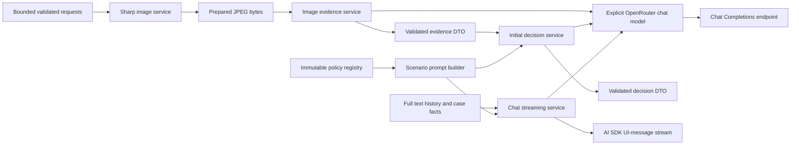
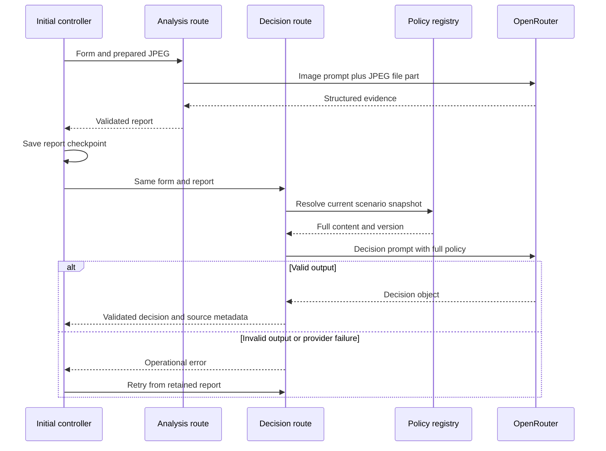
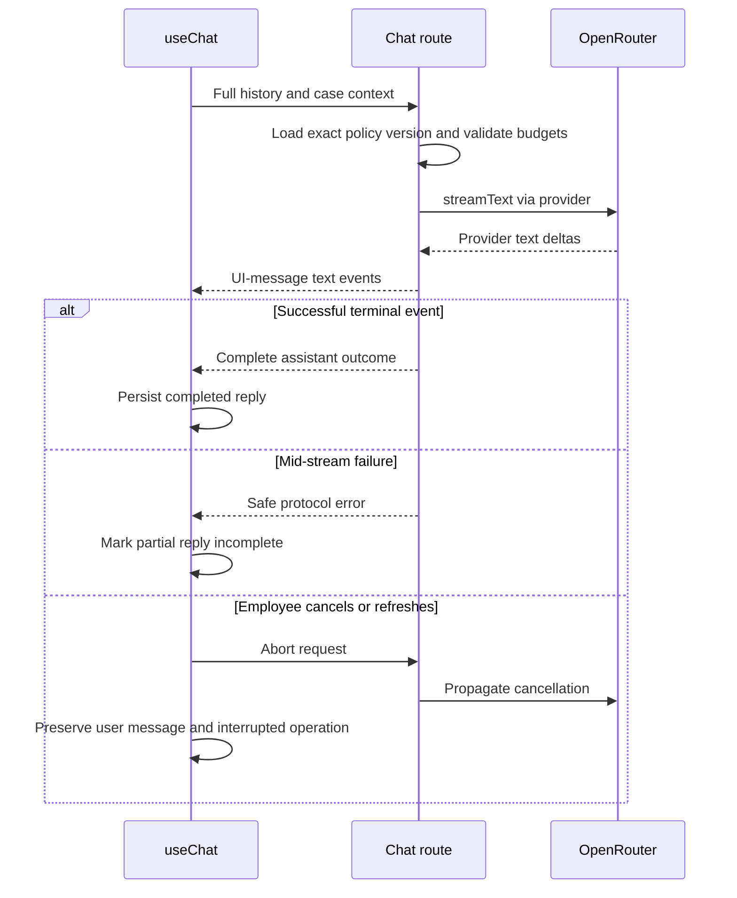

# ADR-002: Backend Contracts, Multimodal Analysis and Decision Workflow

**Date:** 2026-09-30

**Status:** Accepted

**Relates to:** [Main architecture](000-main-architecture.md)

---

## 1. Scope

Define the four server endpoints, image processing, AI output schemas, dynamic prompt assembly, full-policy selection, streaming adaptation and failure semantics. Browser rendering/persistence belongs to ADR-003. Tests must follow ADR-004's distinction between integration and entirely real E2E.

---

## 2. Technology Documentation References

| Library | Context7 ID or official docs | Used for |
| --- | --- | --- |
| AI SDK | `/vercel/ai`; [generateText](https://ai-sdk.dev/docs/reference/ai-sdk-core/generate-text); [streamText](https://ai-sdk.dev/docs/reference/ai-sdk-core/stream-text) | Structured generation and chat streams |
| AI SDK current migration | [v7 migration](https://ai-sdk.dev/docs/migration-guides/migration-guide-7-0) | instructions, file parts, stream adapters and terminal callbacks |
| AI SDK UI protocol | [stream protocols](https://ai-sdk.dev/docs/ai-sdk-ui/stream-protocol) | Browser-compatible UI-message stream rather than raw provider SSE |
| OpenRouter | `/openrouterteam/docs`; [integration guide](https://openrouter.ai/docs/guides/community/vercel-ai-sdk) | Provider configuration |
| OpenRouter provider implementation | [source/package](https://github.com/OpenRouterTeam/ai-sdk-provider); [published metadata](https://registry.npmjs.org/@openrouter%2fai-sdk-provider) | Explicit chat factory, MIME conversion, fetch boundary and ai@7 compatibility |
| OpenRouter reasoning | [reasoning parameters](https://openrouter.ai/docs/guides/best-practices/reasoning-tokens) | Reasoning effort and exclusion of private reasoning |
| OpenRouter multimodal | [image inputs](https://openrouter.ai/docs/guides/overview/multimodal/image-understanding) | Base64 image transport |
| Next.js | `/vercel/next.js`; [Route Handlers](https://nextjs.org/docs/app/api-reference/file-conventions/route) | Multipart, JSON, cancellation and Node runtime |
| Sharp | `/lovell/sharp`; [input](https://sharp.pixelplumbing.com/api-input/); [resize](https://sharp.pixelplumbing.com/api-resize/); [output](https://sharp.pixelplumbing.com/api-output/) | Decode, orientation, resizing and metadata-free JPEG |
| Zod | `/colinhacks/zod` | Shared runtime schemas and post-generation checks |

Context7 and published provider source confirm the current v7 contracts. Some OpenRouter/community examples still show older tools/schema names; they are not the API baseline. The published provider 3.1.0 converts file parts whose MIME type starts with image/ into image_url parts. Specify image/jpeg explicitly rather than relying on the generic image shortcut accepted by AI SDK Core.

---

## 3. Component Design

### Request and Service Boundary

Each Node Route Handler bounds its request body, validates shared schemas and delegates to a service. Server modules are marked server-only. The provider factory reads the two server environment variables and explicitly selects the OpenRouter chat model. There is no direct browser-to-OpenRouter request.

Use JSON responses for image preparation and the two initial model stages. useChat's transport is used only for the text-chat endpoint. The browser displays actual stages while awaiting their respective requests; no estimated timer pretends that analysis has finished.

### Image Preparation

The browser starts image preparation after selecting a valid candidate file. This enables saving a compressed, retryable image before form submission. If preparation is still pending when the employee submits, the initial controller waits for it within the overall deadline.

The server accepts one JPG/JPEG, PNG or WebP file up to 10,000,000 bytes. Validate actual decoded format, not only filename/MIME. Reject corrupt images and animations/multiple pages. A 64,000,000-pixel decode guard bounds memory use; report it as an image-processing limit, not as a policy outcome.

Sharp applies EXIF orientation, fits inside 2048 × 2048 without cropping or enlargement, flattens transparency onto white, strips metadata and encodes JPEG quality 85. Keep a separate JPEG thumbnail inside 512 × 512 at quality 70. Neither output contains source EXIF/GPS metadata. The analysis JPEG must fit within 4,000,000 bytes; exceeding that processing bound produces an actionable error rather than forwarding the original or degrading it through uncontrolled repeated resizing.

Return the analysis JPEG as a data URL plus digest/dimensions and the small thumbnail. Do not write uploaded images to public or persistent server storage. The original File remains available only in the current browser page; the compressed JPEG is the persisted/retry image. LocalStorage failure is handled honestly, not by sacrificing analysis resolution to guarantee a write.

The analysis endpoint decodes and validates the supplied prepared JPEG and digest again, verifies the allowed dimensions/format and supplies its bytes to the model as an AI SDK 7 file part with image/jpeg. It accepts no remote URL and performs no user-directed fetching. The browser is trusted for demonstration continuity, so a prepared-image digest is not a security attestation.

### AI Calls and Current API Selection

| Stage | API | Output | Reasoning configuration | Maximum output tokens |
| --- | --- | --- | --- | --- |
| Image evidence | generateText with Output.object | ImageEvidenceOutput, runtime validated | Low effort; exclude reasoning from response | 8192 |
| Initial decision | generateText with Output.object | DecisionOutput, runtime validated | Medium effort; exclude reasoning from response | 12288 |
| Follow-up chat | streamText | Polish Markdown text via UI-message stream | Medium effort; exclude reasoning from response | 8192 |

All stages use LLM_MODEL, initially openai/gpt-6-luna. The public catalog checked on the research date lists image input, structured outputs and reasoning support for this model, with a 1,050,000-token context window. This is capability evidence, not an end-to-end quality/latency guarantee or proof that the configured account has quota. Verify account/model access with real E2E during implementation.

Apply reasoning settings through providerOptions.openrouter; omit temperature/top-p settings not advertised for this model. Configure no SDK automatic retries. The employee-visible retry controls govern reattempts; silent retries can repeat billable requests and confuse timeout handling.

Use the v7 instructions option for server-controlled directives. Await convertToModelMessages for text-history conversion. Convert streamText's result.stream with the standalone toUIMessageStream helper and return createUIMessageStreamResponse. Do not use the older result.toUIMessageStreamResponse shortcut. Server stream lifecycle uses onEnd, and browser useChat uses its current lifecycle callbacks. Explicitly suppress reasoning parts when adapting the stream; no reasoning/tool/source debug parts are rendered or persisted.

### Dynamic Prompts and Immutable Policies

Maintain four English instruction resources corresponding to PRD sections 11.4–11.7. Use server-side enum selection, never a client-supplied path or arbitrary prompt.

For the image call, select the scenario's image instruction and provide form facts plus compressed image bytes. Do not inject a procedure into image interpretation or ask that model stage to decide policy eligibility.

For initial decision and every chat turn, assemble in this order:

1. Product role, preliminary-decision boundary, Polish output and evidence/instruction separation.
2. Selected complaint or return decision instructions.
3. The complete corresponding policy HTML snapshot, with source metadata and version. Include its entire main content, headings, tables, links and footnotes; no summarization, retrieval or selected chunks.
4. Delimited case facts, explicit unknowns and the validated image evidence description, treated as untrusted factual statements.
5. Initial-assessment request or the complete chronological text conversation.

The first decision captures the current policy version. Subsequent chat uses exactly that version. Store full saved policy sources under immutable version filenames; the registry maps scenario and digest to allowlisted files and known heading IDs. Verify file bytes against the source manifest. The source HTML is policy text in a prompt, never injected into the browser DOM.

Retain old source versions when adding a new snapshot. If a restored case references an unavailable version, return POLICY_VERSION_UNAVAILABLE; do not silently substitute the current policy or trust a browser-provided replacement. Missing files/digest mismatch block generation. Updates are deliberate repository changes, not runtime website fetches.

### Context and Input Bounds

- Equipment name/model: 1–200 trimmed characters; reason: at most 4000, required/nonblank for complaints.
- Employee chat message: 1–4000 trimmed characters. Assistant messages: at most 32,000 characters each.
- At most 40 employee chat turns, plus the initial assistant message and corresponding replies. A failed/retried turn consumes one logical turn.
- Bound the fully assembled textual model input to 200,000 UTF-8 bytes, including full policy and all history. This is an application budget, not an estimate that bytes equal tokens. It leaves substantial headroom in the researched model context.
- Reject an oversized conversation with CONTEXT_LIMIT; retain the complete history and explain that the case cannot accept another turn. Do not summarize, drop the policy or discard old messages to fit.
- Any future LLM_MODEL change requires checking image/structured/reasoning capabilities and context/output capacity against these budgets. Do not automatically fall back to another model or provider.

### Deadlines, Retry and Concurrency

Image preparation has a 30-second processing deadline. Initial assessment has one browser-controlled 120-second deadline beginning at Submit, including any remaining preparation, network time and both model stages. The analysis call allows at most 60 seconds; the decision call allows at most 90 seconds, each clipped to the remaining overall budget. Follow-up chat allows at most 90 seconds through completion.

Pass the request abort signal and service deadline to the provider. Browser cancellation, New case and refresh abort current requests. Ignore a late response whose case ID/operation ID no longer matches the active operation.

Retry starts a fresh deadline and uses the latest successful checkpoint: prepared image, then report, then decision. A failed decision does not require repeating successful image analysis. Returning to edit form facts invalidates the report/decision; an unchanged prepared image may be retained.

Stable operation IDs prevent UI duplication and accidental repeated submission; no durable backend idempotency guarantee exists. After a lost response, retry may perform another real, billable model call. The PoC guarantees no duplicate completed UI messages, not exactly-once upstream billing.

The target is five independent concurrent cases on the single local process. Do not serialize every AI request globally. There is no production rate-limit service or queue. Load verification must show no cross-case context leakage; upstream rate/quota failures remain observable operational failures.

---

## 4. Data Structures

Schemas are shared TypeScript/Zod contracts, not handwritten untyped casts. Reject unexpected request keys. AI-generation schemas use a strict object with required fields and explicit nullable values; enforce scenario-dependent invariants after schema validation.

### Form and Prepared Image

| Structure | Fields and constraints |
| --- | --- |
| CaseForm | scenario: complaint/return; category: PRD enum; equipmentName: bounded text; purchaseDate: ISO calendar date; deliveryDate: ISO date or null; buyerStatus/sellerStatus: PRD enums including unknown; reason: text; requestedRemedy: PRD enum for complaints, null for returns |
| Calendar context | Valid IANA employee time zone; server derives current calendar date in that zone for validation/evaluation. Do not treat evaluation time as the customer's notification date |
| PreparedImage | imageDataUrl: JPEG only; thumbnailDataUrl: JPEG only; byteLength: bounded integer; width/height: bounded integers; sha256: digest of decoded JPEG bytes |
| Operation identity | caseId and operationId: UUID strings; budgetMs: positive remaining budget bounded by the route's maximum |

Delivery date null means explicitly Unknown, not a future or fabricated date. Return requests omit complaint remedy from model facts. The image service accepts the actual input formats in the PRD but normalizes model input to JPEG.

### Image Analysis

ImageEvidenceOutput contains imageQuality (adequate/limited/unusable), observations (finding and visible location), signsOfUse, possibleCauses, limitations and missingInformation. possibleCauses are labeled hypotheses and are empty for the return scenario. The object does not contain a policy acceptance/refusal.

ImageAnalysis adds server-generated analysisId, scenario, image digest, normalized-form fingerprint, createdAt and model ID. Limit the serialized evidence object to 12,000 characters. Lists contain at most 12 observations and six entries each for limitations, hypotheses and missing information. The report must remain schema-valid even when no damage is visible or the image is unusable.

### Initial Decision

| Field | Type/purpose |
| --- | --- |
| outcome | preliminary_acceptance, preliminary_refusal, additional_information_required or human_verification_required |
| greeting | Nonblank Polish greeting |
| summary | Nonblank concise preliminary result |
| justification | List of evidence/rule explanations, at least one |
| evidence | List of findings or reported facts relevant to the result |
| policyReferences | List of heading IDs from the selected policy; server resolves official title/URL |
| limitations | List of assessment limitations |
| questions | List of targeted questions; nonempty for additional_information_required |
| nextSteps | Nonempty list of employee actions/checks outside the product |
| resaleAssessment | null for complaints; no_visible_barrier, visible_barrier or insufficient_evidence for returns |
| resaleExplanation | null for complaints; nonblank explanation for returns |

InitialDecision adds server-generated decisionId, caseId, scenario, policy metadata, createdAt, model ID, preliminary=true and employeeVerificationRequired=true. Do not ask the model to generate trusted identity/version flags. Bound the serialized generated object to 24,000 characters.

Validate scenario-specific resale requirements and actual policy heading references. A refusal must include its supporting condition/fact; insufficient information must include questions; human verification must identify a required check. These checks detect structural omissions, not factual truth. A valid schema alone does not certify the decision's correctness.

Render the object directly into decision details and format all its fields into a deterministic Polish first assistant text for conversation history. No additional model call is used for formatting. Later decision changes appear in ordinary text replies; the initial card remains explicitly labeled initial, not an automatically maintained current-decision dashboard.

### Conversation and Errors

UIMessage permits only user/assistant roles and text parts for model history. IDs are unique and stable; application completion metadata distinguishes complete, streaming and interrupted replies. Reject system/developer roles, file/tool/reasoning parts and browser instructions. Filter application UI-only metadata before converting text history.

ErrorEnvelope contains code, localized message, retryable, operationId and optional fieldErrors. It contains no provider credentials, prompt, image bytes or raw provider body. Detailed model/protocol errors may be logged by safe classification, not by dumping inputs.

---

## 5. Interface Contracts

All routes use Node runtime and no-store responses. Enforce byte limits while reading the request, including when Content-Length is absent; a header check alone is insufficient. Old Pages Router bodyParser and Server Action body limits are not upload controls for these Route Handlers.

### POST /api/images/prepare

- Input: multipart with one image part and no other files; maximum body 10,065,536 bytes including multipart overhead.
- Output: PreparedImage, never an external image URL.
- Errors: invalid/missing format, corrupt or animated image, byte/pixel limit, compression failure or timeout.
- Called on image selection; old prepared data is cleared while a replacement is prepared. Its result can be reused for Submit/retry in the same case.

### POST /api/analysis

- Input: case/operation identity, CaseForm, time zone, PreparedImage and remaining budget. Maximum JSON body 6,000,000 bytes.
- Output: ImageAnalysis with matching image/form/scenario identity.
- Processing: validate JPEG bytes/digest, select the image prompt, pass form facts and JPEG file part to structured generation, validate report, attach server metadata.
- Errors: invalid form/prepared image, configuration problem, provider failure, invalid generated output or timeout.
- Does not load a policy or return a complaint/return decision.

### POST /api/decisions

- Input: case/operation identity, CaseForm, time zone, ImageAnalysis and remaining budget. Maximum JSON body 65,536 bytes.
- Output: InitialDecision with the policy version selected before generation.
- Processing: confirm matching report/form/scenario; load complete selected policy; generate/validate object and invariants; attach trusted source metadata.
- Errors: stale/mismatched report, invalid facts, missing policy/configuration, provider failure, invalid decision or timeout.
- Client persists a successful report before this call, so a failed decision can be retried independently.

### POST /api/chat

- Input: id equal to caseId, operationId, replyMessageId, trigger (send-message or regenerate-message), caseContext (form, timeZone, ImageAnalysis and InitialDecision) and messages containing the full eligible UIMessage history. Maximum JSON body 300,000 bytes. Do not include image data URLs or thumbnails.
- DefaultChatTransport prepares this complete body on each send/retry; sending only the last message is incorrect because there is no server conversation store.
- History begins with the complete deterministic initial assistant message, followed by complete prior turns and one outstanding user message. Exclude failed partial assistant text from model context; retry replaces its placeholder using the stable reply ID.
- Processing: validate case identity, history roles/parts, context bounds and selected policy version; convert text history; stream with the full form/evidence and selected policy.
- Output: standard AI SDK UI-message SSE protocol with text only, stable assistant ID and safe completion/error events. Its terminal message metadata carries operationId, finishReason and completionState (complete/incomplete). Only a normal provider stop with a successful SDK outcome is complete; length cutoff, error, cancellation or missing terminal information is incomplete. It is not a raw OpenRouter SSE response or plain-text stream.
- There is no automatic reconnect/resume endpoint. Interrupted streaming requires explicit retry; successful initial decisions are not regenerated.

### Error Mapping

| Status | Application code | Meaning and behavior |
| --- | --- | --- |
| 400/422 | VALIDATION_ERROR, INVALID_IMAGE, STALE_ANALYSIS | Field/action correction required; preserve unaffected data |
| 413 | PAYLOAD_LIMIT, IMAGE_PROCESSING_LIMIT | Explain the corresponding input/processing bound |
| 409 | POLICY_VERSION_UNAVAILABLE | Preserve case; require matching resource restoration or new case |
| 422 | CONTEXT_LIMIT | Preserve history; do not truncate to continue |
| 500 | CONFIGURATION_ERROR, POLICY_CONFIGURATION_ERROR | Operational problem; never a preliminary refusal |
| 502 | PROVIDER_ERROR, PROVIDER_AUTH_ERROR, INVALID_AI_OUTPUT | Safe operational error; manual retry where meaningful |
| 503 | PROVIDER_QUOTA_OR_RATE_LIMIT | Explain unavailable provider capacity; no automatic fallback |
| 504 | OPERATION_TIMEOUT | Keep successful checkpoints; allow fresh retry |

After stream headers are sent, a failure must use the UI stream's error/terminal semantics; HTTP 200 alone is not success. Provider unauthorized responses map to an operational error rather than an application login flow. A client abort is not logged as an unhandled application error.

Safe runtime logs contain case/operation IDs, stage, model ID, provider generation ID where available, elapsed time and token usage. Log no form contents, images, full messages, complete prompts, key values or reasoning. These logs are runtime diagnostics, not the roadmap's durable session/action database.

---

## 6. Technical Decisions

### Separate Preparation, Evidence and Decision Requests

**Status:** Accepted

**Date:** 2026-09-30

**Context:** The form needs a persisted usable image, real progress stages and independent retry. The initial result must be a validated object rather than partial text.

**Decision:** Use three small JSON-stage endpoints plus one streaming chat endpoint, with browser-held successful checkpoints.

**Rejected alternatives:** A worker/job queue exceeds local PoC needs; a custom multiplexed stream adds protocol parsing just to report three initial stages.

**Consequences:** (+) No bespoke progress protocol or server case store. (-) The browser coordinates three requests and trusts its unsigned evidence.

**Review trigger:** Background processing, disconnected job completion or authoritative server case management.

### Full Server-Selected Policy on Every Decision Turn

**Status:** Accepted

**Date:** 2026-09-30

**Context:** The user requires full document injection based on the form, and PRD forbids silent policy changes.

**Decision:** Use one allowlisted immutable snapshot per scenario/version and four prompt resources. Include all selected content in initial decision and chat.

**Rejected alternatives:** RAG/chunk selection is roadmap scope; client-supplied policy is not trusted; runtime fetching risks changes during a case.

**Consequences:** (+) Reproducible context and no missing clauses due to retrieval. (-) Repeated full-policy input has token cost.

**Review trigger:** Policy corpus no longer fits a supported context or automatic maintenance becomes a product requirement.

### Validate Objects and Render Completion Honestly

**Status:** Accepted

**Date:** 2026-09-30

**Context:** The initial UI needs dependable categories, detailed fields and two separate return assessments. Schema validation cannot establish legal or diagnostic correctness.

**Decision:** Generate strict objects, apply scenario/reference checks and render only validated results; stream ordinary text for follow-up.

**Rejected alternatives:** Free-form first Markdown requires fragile parsing; streaming incomplete JSON into verdict labels implies unwarranted completion.

**Consequences:** (+) Stable UI contracts. (-) Provider/schema failures become retryable errors rather than best-effort decisions.

**Review trigger:** A future product requires structured revised decisions or different output fields.

---

## 7. Diagrams

### Component and Data Flow Diagram

### Initial Decision and Retry

### Streaming, Mid-stream Failure and Cancellation

---

## 8. Testing Strategy

Tests precede implementation. Integration tests use real policy files, real Sharp and real contract validation; replace only the external OpenRouter HTTP boundary. E2E never uses that replacement.

| Scenario | Type | Input | Expected output | Edge cases |
| --- | --- | --- | --- | --- |
| File preparation | Integration | JPG/PNG/WebP fixtures | Oriented bounded JPEG and thumbnail without EXIF | Corrupt, animated, oversized/pixel-limit, transparent and EXIF-rotated input |
| Image model request | Integration | Prepared JPEG and each scenario | Correct v7 image/jpeg file content reaches external boundary | No remote URL, no policy/decision instruction in evidence stage |
| Policy selection | Integration | Complaint/return and version | Exactly one complete source and correct instruction | Missing file, wrong digest, unavailable old version, cross-scenario version |
| Structured output | Integration | External valid/invalid responses | Valid DTO or INVALID_AI_OUTPUT | Missing questions, wrong resale shape, unknown heading IDs, truncated JSON |
| Stream framing | Integration | Real adapter handling external stream fixtures | UI-message protocol, safe errors and text-only parts | Mid-stream provider error, unexpected termination, cancellation |
| Budgets/checkpoints | Unit/integration | Pending operations and oversized history | Abort/typed limit without silent truncation | Late replies, reattempt after successful report, no automatic retries |
| Real model behavior | E2E | Valid cases and text follow-up | Actual OpenRouter generations and usable Polish response | Photo ambiguity and conflicting text facts |

- TAC-002-01: Model input image bytes are the backend-prepared JPEG, never the original uploaded file or a client URL.
- TAC-002-02: OpenRouter requests use the configured model and /api/v1/chat/completions, with no Gateway fallback.
- TAC-002-03: A first decision is displayed only after schema, scenario and policy-reference validation.
- TAC-002-04: Each decision/chat request includes the full selected policy and excludes the other policy file.
- TAC-002-05: Chat includes all eligible history and no hidden reasoning or image payload.
- TAC-002-06: Deadline/cancellation propagates to upstream AI calls and does not yield a completed verdict.
- TAC-002-07: Failure after response headers is observable as an incomplete operation even when HTTP status is 200.
- TAC-002-08: Provider failures and unsigned browser state never become a claim of final approval or verified evidence.
