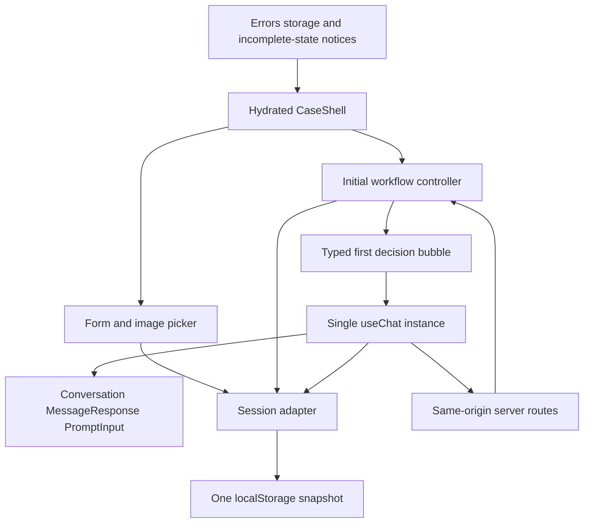
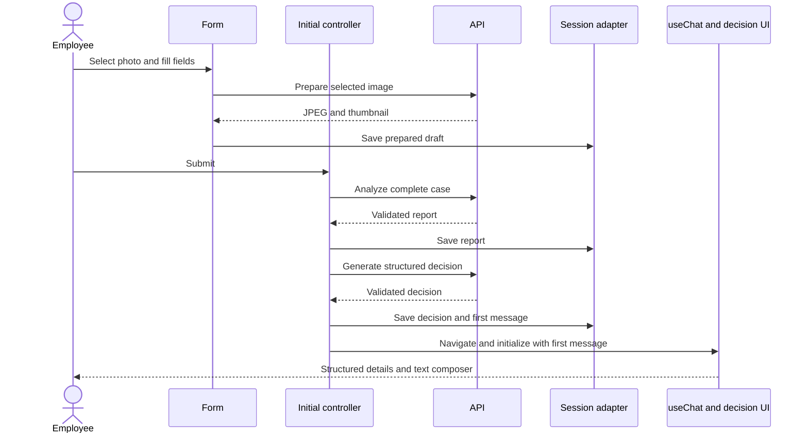
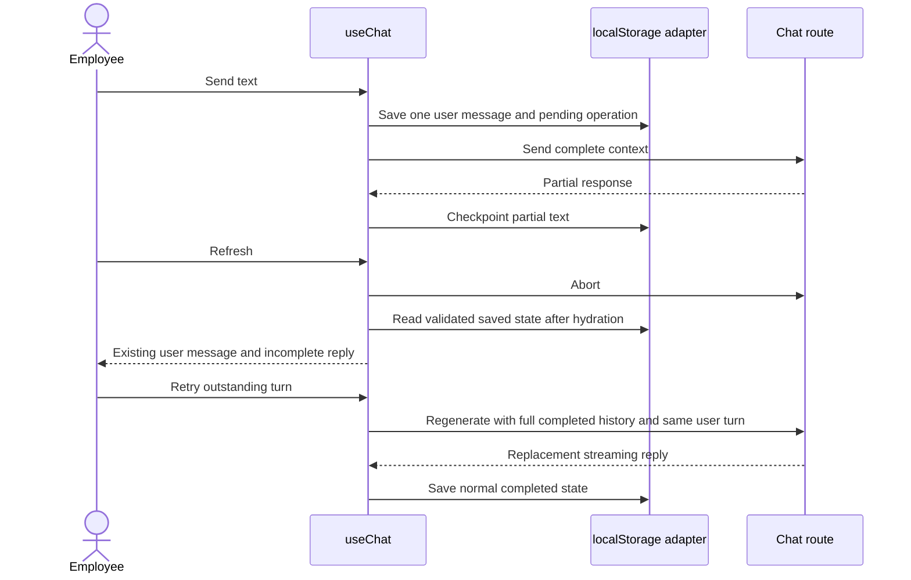
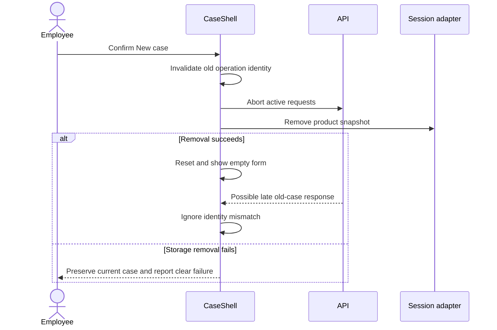

# ADR-003: Form, Decision Details, Streaming Chat and Browser Session

**Date:** 2026-09-30

**Status:** Accepted

**2026-10-02 requirement amendment:** The user's request to return to previous chats by ID supersedes the single retained-case and destructive New case statements below. Retain validated snapshots separately by UUID in this browser, using `/chat/<caseId>` for the exact selected case. Keep the existing snapshot schema and runtime context boundaries; no server database or cross-device recovery is introduced. Preserve and migrate the legacy active snapshot without deleting its only successful copy. New case requires confirmation, cancels and invalidates previous operations, saves the previous case where possible, and starts an empty case with a fresh UUID. Cancel changes nothing. Storage failure must preserve current in-memory data and must not claim successful archival. Missing or malformed route IDs must not fall back to another saved case. Legacy `/chat` may redirect to the active case's canonical ID address. Only opaque UUIDs belong in paths; equipment details, messages and credentials do not. Existing interruption, quota, debounce, full-history and one-editor isolation constraints continue to apply. Tests must cover exact-case restoration without replay, migration, confirmation, storage failure, wrong IDs and late callbacks.

**Relates to:** [Main architecture](000-main-architecture.md)

---

## 1. Scope

Define the browser journey, components, initial decision rendering, one useChat owner, localStorage representation and interruption/retry behavior. This record consumes ADR-002 contracts and does not add authentication, archive, export, image attachments in chat or decision approval.

---

## 2. Technology Documentation References

| Library | Context7 ID or official docs | Used for |
| --- | --- | --- |
| AI SDK React/useChat | `/vercel/ai`; [chatbot](https://ai-sdk.dev/docs/ai-sdk-ui/chatbot); [useChat](https://ai-sdk.dev/docs/reference/ai-sdk-ui/use-chat) | Streaming state, messages, callbacks, stop and retry |
| AI SDK persistence | [message persistence](https://ai-sdk.dev/docs/ai-sdk-ui/chatbot-message-persistence) | Initial messages, IDs and history restoration patterns adapted to browser storage |
| AI Elements | `/vercel/ai-elements`; [Conversation](https://elements.ai-sdk.dev/components/conversation); [Message](https://elements.ai-sdk.dev/components/message); [Prompt Input](https://elements.ai-sdk.dev/components/prompt-input) | Ready-made stream rendering and composer |
| shadcn/ui | `/shadcn-ui/ui` | Accessible form, notices, cards, collapsible summary and confirmation dialog |
| Next.js | `/vercel/next.js` | Client hydration and page/route separation |
| Zod | `/colinhacks/zod` | Browser form, DTO and persisted-snapshot validation |
| localStorage | [MDN](https://developer.mozilla.org/en-US/docs/Web/API/Window/localStorage) | Browser storage API and exception boundaries |
| Design reference | [existing guidelines](../design-guidelines.md) | Allegro assets and visual tokens |

---

## 3. Component Design

### Screens and State Owners

| Component/module | Responsibility |
| --- | --- |
| CaseShell | Client hydration, active case identity and navigation between / and /chat |
| CaseForm | Controlled native date inputs, shadcn selections/text areas and inline validation |
| EquipmentImagePicker | One selected image, backend preparation, thumbnail preview and replacement before Submit |
| InitialWorkflowController | Sequential API calls, 120-second deadline, successful checkpoints and invalidation |
| ProcessingSteps | Preparing image, analyzing condition and preparing decision, derived from actual operation state |
| CaseSummary | Submitted fields, explicit unknowns and thumbnail; collapsible on narrow screens |
| InitialDecisionDetails | Typed outcome, greeting, evidence, policy references, limitations, questions, next steps and separate resale result |
| CaseChat | Exactly one useChat instance and stable DefaultChatTransport for an active case |
| AI Elements view | Conversation, ConversationContent/ScrollButton, Message/MessageContent/MessageResponse and PromptInput text controls |
| SessionAdapter | Validated snapshots and checkpoint writes; no independent authoritative message array |
| Error/StorageNotice | Polish errors, retry state and explicit restoration limitations |
| NewCaseDialog | Confirm reset, abort active operations and clear only the product's storage key |

CaseShell owns form/stage/context state. In chat, useChat owns conversation state; the session adapter saves that state without becoming a second live chat store. No assistant-ui runtime, Redux, external persistence adapter or cloud thread service is introduced.

### Form and Image Preparation

Start with no selected scenario. Use PRD categories/status/remedy enums and bounded fields from ADR-002. Reason is required only for complaints; requested remedy is hidden and removed from return requests. A null delivery date requires the explicit Unknown choice.

Native date inputs provide the date picker. Use the employee browser's valid IANA time zone for both client validation and server calendar context. Dates are calendar strings, not midnight timestamps converted through UTC. Purchase/delivery constraints use the current calendar date in that zone.

Image selection performs local format/size screening, then calls the backend prepare route. Persist the prepared JPEG and thumbnail after success; do not persist the original 10 MB File or fetch a public storage URL. A pending preparation cannot be treated as a usable upload. The selected image can be removed/replaced before Submit, with old pending results ignored by operation identity.

When Submit is selected, validate all fields, focus the first invalid field and freeze the submitted form. The processing display uses genuine successful/current stages; if preparation already completed after image selection, show it as complete rather than pretending another compression call is running. Preserve data while awaiting analysis and decision.

Before initial completion, Return to form aborts the current operation, increments its identity and invalidates report/decision. Reuse the prepared image only if the image has not changed. After completion, the form is read-only; additional facts enter chat as employee statements.

### Initial Decision and First Chat Bubble

Validate the JSON decision response before navigating to /chat. Create one stable assistant UIMessage whose complete text is the deterministic Polish representation of every decision detail. No synthetic user message, empty assistant placeholder or extra LLM formatting request is needed.

The first bubble renders InitialDecisionDetails rather than reparsing Markdown. Show the greeting, preliminary outcome and all explanatory fields; a return shows eligibility and resale condition in distinct labeled sections. Include official policy links resolved by the server and a fixed employee-verification notice.

Retain the complete first message as text for future model context. Rendering a card does not remove its contents from history. The structured card remains labeled Initial assessment after follow-up text revises the recommendation; do not portray the immutable initial object as an automatically updated latest verdict.

### Streaming Conversation

Mount CaseChat only after hydration restores a valid case and initial messages. Key it by caseId. Initialize useChat with that ID and persisted UIMessage list, not an asynchronous empty conversation that triggers a new first answer.

DefaultChatTransport points to /api/chat. Its prepareSendMessagesRequest obtains current immutable case context and the full eligible message history on every send/retry. No transport default that sends only a last message may be used because the backend stores no history.

Render text parts through MessageResponse for streaming Markdown; the components provide the rendering/scrolling layer while useChat supplies incremental state. Disable raw HTML interpretation. Do not include attachment actions, paste/drop attachment handling, model selection, web search, tools, reasoning view, branch editing, export/download or approval buttons. The server independently rejects forbidden parts.

The composer is text-only. Validate before send, clear its input only after preserving the user message, and allow one pending send. AI Elements' submit control follows submitted/streaming/ready/error state. Show a stop action while pending; stopping preserves the user message and marks the response incomplete.

Every assistant bubble carries a fixed preliminary/employee-verification footer, including a streamed reply, so the notice does not depend on detecting whether the model remembered to emit a disclaimer. Do not display model names, token usage, prompt resources or reasoning in the product interface.

### Completion and Retry

Track application completion separately from text presence. A nonempty partial reply or HTTP 200 is not a completed decision. Normal useChat completion with no abort/disconnect/error plus a successful server terminal state marks the reply complete. A provider length cutoff, missing terminal event or timeout marks it incomplete.

For initial errors, retry only the failed stage using the saved image/report. For chat errors, keep the employee message, preserve earlier completed messages and use useChat regeneration for the outstanding turn rather than calling sendMessage again with the same text. Remove/exclude only the failed partial assistant placeholder from model input and replace it under the stable reply ID. Completed earlier replies are never overwritten by a retry.

No automatic request replay occurs on refresh or mount. New case and Return to form invalidate operation IDs before handling late callbacks; an old onFinish/onError cannot persist data into a new case.

### Brand and Accessibility

Map existing Allegro design tokens to copied component variables/styles. Use the saved logo/favicon/fonts with their original proportions. The reference is visual guidance, not a requirement to reproduce irrelevant storefront search, basket or account controls.

Use a desktop two-column summary/chat layout and a collapsed summary above chat at narrow widths. Verify 360 px and 1440 px widths. All labels/notices are Polish, labels are programmatically associated, invalid fields expose their errors, keyboard focus is visible and the New case dialog restores focus on cancellation. Live streaming must not announce every token to assistive technology; use polite pending/completion announcements.

---

## 4. Data Structures

### ActiveCaseSnapshot

Store one JSON value under hardware-service-copilot.active-case. Its schemaVersion is 1. Unknown versions or invalid shapes are unreadable sessions, not an invitation to merge partial fields.

| Field | Contents |
| --- | --- |
| schemaVersion | Integer 1 |
| caseId / revision | Stable UUID and increasing local revision |
| screen / stage | Form, preparation, analysis, decision or chat; pending/interrupted state explicit |
| draftForm / submittedForm | Editable draft or frozen validated form, including employee time zone |
| preparedImage | Full normalized JPEG data URL plus digest/dimensions and thumbnail; nullable before successful preparation |
| imageAnalysis | Validated report; nullable until completed |
| initialDecision | Validated object and policy/version metadata; nullable until completed |
| messages | Actual useChat UIMessage list including the complete initial assistant text |
| replyStates | Message ID → complete, streaming, failed or interrupted; no hidden reasoning |
| pendingOperation | Kind, operation ID, outstanding user/reply IDs and start time; nullable when idle |
| storageWarning | In-memory warning state; do not rely on a failed write to persist the warning |

Never store the API key, server prompts, full policy text, provider reasoning, tool payloads or original uploaded File. Chat HTTP bodies exclude prepared image data URLs and UI-only state; they retain the image evidence description instead.

### Browser State Transitions

Editable form → prepared image → submitted/analysis pending → validated report → decision pending → validated first decision/chat. An initial failure retains the last successful checkpoint. A stopped or refreshed operation becomes interrupted. Editing invalidates analysis/decision. New case clears all case-derived state.

Chat states use SDK status plus application completion metadata: submitted/streaming prevent a second send; error or interrupted exposes retry for the existing user turn; normal completion allows a new turn. A failed partial reply is visibly labeled incomplete until replaced by a retry.

### Snapshot Writes and Limits

Write form drafts with a 300 ms debounce. Write prepared image, report, initial decision, submitted user message and terminal state immediately. Checkpoint streaming text at most once every 500 ms; completion flushes immediately. On refresh, restoration uses the latest successful checkpoint, not a guarantee of the final unflushed token.

Write the full validated snapshot as a single localStorage value, so an individual update is not a collection of partially written keys. Precheck an estimated UTF-16 payload budget of 4,000,000 bytes; also catch actual setItem/getItem/removeItem failures because browser quota/permissions may be lower. This is a soft application budget, not a statement of every browser's quota.

When saving fails, keep the live case in memory and show a persistent Polish warning that refresh recovery is unavailable/outdated. Do not truncate history, silently drop the compressed image or lower analysis quality to force a save. A new failed save does not erase the last successfully retained snapshot.

Support one active editor tab per browser storage area. A storage event from another tab that clears/replaces the active case or changes its revision pauses editing and asks the employee to reload; do not merge independent conversations automatically. Five concurrent-case validation uses separate browser contexts.

---

## 5. Interface Contracts

### Page Boundaries

- / renders the form or its initial-processing state after client hydration.
- /chat renders only a valid locally restored/completed initial case. Without that case, show the recovery notice as applicable and return to /.
- Neither page encodes equipment data, prompt content or a reusable session token in the URL.

### HTTP Controller Boundaries

| Action | Endpoint | State committed on success |
| --- | --- | --- |
| Select/replace photograph | /api/images/prepare | Prepared JPEG/thumbnail; old analysis/decision invalidated |
| Submit case | /api/analysis | Frozen form and validated report |
| Obtain initial result | /api/decisions | Validated object, complete first assistant message and policy version |
| Send/retry text | /api/chat | Incremental useChat messages; completion state on terminal event |

The chat transport body has id (caseId), operationId, replyMessageId, trigger (send-message or regenerate-message), caseContext (form, timeZone, imageAnalysis and initialDecision) and messages. The server accepts only this allowlisted shape. prepareSendMessagesRequest must not leak the rest of the local snapshot into the request.

### Resume and Reset

On mount, read and validate the snapshot once before creating useChat. Normalize any persisted pending operation to interrupted; retain available partial text with the incomplete label. Resume only when the employee explicitly retries. A failed preparation that never returned JPEG bytes requires reselecting the original image; the notice explains that those bytes were never successfully saved.

New case asks for confirmation, aborts all active requests, clears controllers/messages and removes only the product storage key. Cancel changes nothing. If removal itself fails, show the failure instead of claiming the retained case was removed; keep the current case and offer retry after browser storage is available. No action clears unrelated browser storage.

When an unknown/corrupt snapshot cannot be restored, offer confirmed discard and a blank form. Do not partially recover a form from one case and messages from another. A missing server policy version preserves the visible old case but blocks further assessment until that version is restored or a new case is started.

---

## 6. Technical Decisions

### One Hook Owns the Conversation

**Status:** Accepted

**Date:** 2026-09-30

**Context:** Rendering components, refresh persistence and retries can otherwise create independent message stores and duplicate replies.

**Decision:** useChat owns messages; AI Elements reads them and the session adapter saves snapshots. Initialize after hydration with stable IDs.

**Rejected alternatives:** assistant-ui plus useChat as separate owners; manually appending streamed responses to another store.

**Consequences:** (+) One lifecycle and protocol. (-) Persistence/recovery is application code.

**Review trigger:** Multiple threads or advanced conversational branching is added.

### Keep the First Decision Structured and Subsequent Chat Textual

**Status:** Accepted

**Date:** 2026-09-30

**Context:** The user requested typed details initially and simpler streaming text afterwards.

**Decision:** Render a decision component in the first assistant bubble and preserve its full deterministic text in history. Later updates remain text and do not mutate that initial object.

**Rejected alternatives:** Parsing Markdown into categories; maintaining a new structured latest-decision call after every chat turn.

**Consequences:** (+) No additional model calls or fragile parsing. (-) Later assessments are read in the conversation rather than a synchronized verdict panel.

**Review trigger:** A future approval/decision dashboard needs typed updates on every turn.

### Persist Compressed Case State, Not Original Uploads or Server History

**Status:** Accepted

**Date:** 2026-09-30

**Context:** The selected localStorage solution must restore a photo and conversation without introducing a database. Browser quota may be insufficient.

**Decision:** Save one validated compressed-image snapshot with explicit write-failure notices and no automatic replay.

**Rejected alternatives:** Original image base64 can exceed quota immediately; server memory alone cannot restore after process loss; IndexedDB/database changes the user's chosen approach.

**Consequences:** (+) Small number of moving parts. (-) Large images/histories may become memory-only, with an honest warning.

**Review trigger:** Reliable large-session persistence or multi-device access becomes mandatory.

---

## 7. Diagrams

### Component Diagram

### Form to Populated Chat

### Refresh and Failed-Turn Retry

### New Case and Late Response

---

## 8. Testing Strategy

Write tests before form/controller changes. Unit/component tests may replace dependencies; integration uses real storage/stream parsing where applicable and replaces only the external LLM. E2E uses real browser storage, application routes and LLM calls.

| Scenario | Type | Input | Expected output | Edge cases |
| --- | --- | --- | --- | --- |
| Conditional form | Unit/component, E2E | Each scenario and invalid fields | Correct required/hidden fields, retained values, focus/error labels | Unknown delivery, future dates, whitespace-only complaint |
| First card/history | Unit/component, E2E | Valid initial object | All fields visible; one complete assistant message | Separate resale result; no empty bootstrap bubble |
| Streaming render | Integration, E2E | UI stream from real route | Incremental text, scrolling, pending controls and normal completion | Partial/error does not become complete |
| Browser restoration | Unit/component, E2E | Saved valid snapshot | Correct form/chat restored with no automatic request | Interrupted stage, corrupt/unknown version, quota exceptions |
| Retry | Unit/component, E2E | Failed/stopped turn | Existing user retained, one replacement reply | First follow-up failure and failure after earlier replies |
| Reset/tab conflict | Unit/component, E2E | New case or different-tab update | No cross-case merge or late response write | Removal failure and confirmation cancel |
| Brand/accessibility | Manual QA, E2E | 360/1440 px and keyboard | Polish operable UI matching existing reference | Long message, narrow summary, incomplete reply notice |

- TAC-003-01: Only one useChat instance owns a case conversation, initialized after snapshot hydration.
- TAC-003-02: The first decision's details and complete text survive refresh with no extra model generation.
- TAC-003-03: Chat retries retain one employee message and do not overwrite completed earlier replies.
- TAC-003-04: Only the selected policy identifier and evidence description, not browser policy text or image bytes, accompany chat.
- TAC-003-05: Save failures preserve live data and display the restoration limitation; reset failures are not reported as successful clearing.
- TAC-003-06: The chat has no attachment, export, model picker, reasoning or approval controls.
- TAC-003-07: Both required viewport sizes and keyboard flows pass real browser QA and the Allegro visual comparison.
