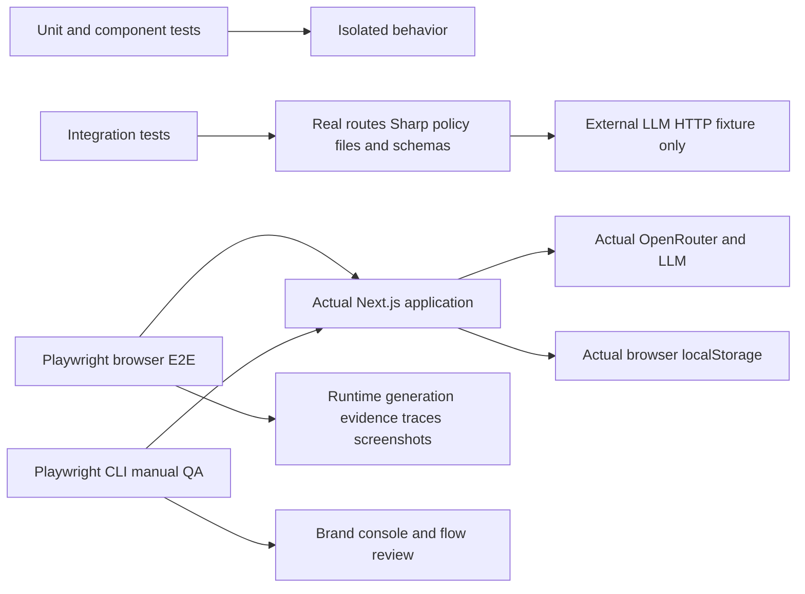
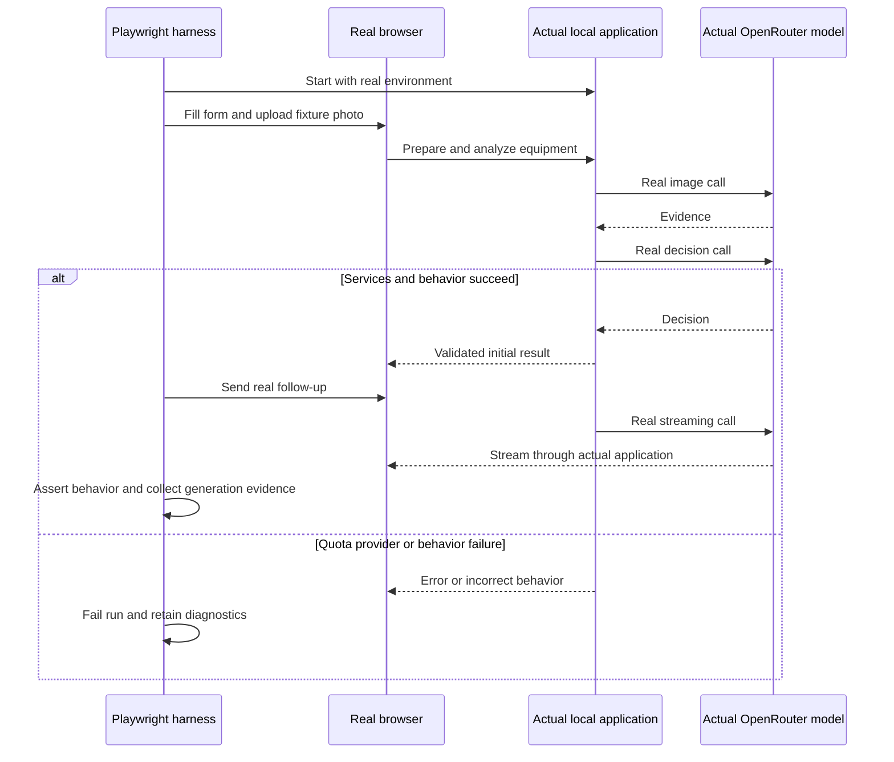

# ADR-004: TDD, Real LLM E2E and Manual Application Verification

**Date:** 2026-09-30

**Status:** Accepted

**Relates to:** [Main architecture](000-main-architecture.md)

---

## 1. Scope

Define verification for the entire PRD workflow, including generated-project startup, image processing, AI behavior, streaming, session recovery, accessibility and Allegro visual consistency. This is an implementation verification plan; writing the ADRs does not constitute an application test run.

**E2E mocks nothing. Every successful AI E2E journey calls the real OpenRouter endpoint and the real configured LLM through the actual application.** The user's explicit requirement supersedes any inherited chatbot template that substitutes models during tests.

---

## 2. Technology Documentation References

| Library | Context7 ID or official docs | Used for |
| --- | --- | --- |
| Vitest | `/vitest-dev/vitest`; [test environments](https://vitest.dev/guide/environment.html) | Unit and integration runners |
| React Testing Library | `/testing-library/react-testing-library` | Accessible component behavior tests |
| Playwright | `/microsoft/playwright`; [web server](https://playwright.dev/docs/test-webserver); [timeouts](https://playwright.dev/docs/test-timeouts) | Real app lifecycle and browser E2E |
| Playwright CLI | `/microsoft/playwright-cli`; [manual automation](https://github.com/microsoft/playwright-cli) | Independent manual QA sessions/screenshots |
| AI SDK | `/vercel/ai` | Structured output and real UI stream behavior |
| OpenRouter | `/openrouterteam/docs`; [streaming errors](https://openrouter.ai/docs/api-reference/streaming) | Real-service failure semantics and generation evidence |
| Design reference | [guidelines](../design-guidelines.md); [homepage](../../assets/homepage.png) | Required brand comparison |

---

## 3. Component Design

### Verification Layers and Responsibilities

| Layer | Dependencies | Responsibility |
| --- | --- | --- |
| Unit/service/component | External collaborators mocked; no network | Developer verifies schemas, formatting, state transitions, conditional UI and exceptional browser behavior |
| Integration | Only the external LLM HTTP boundary replaced | Developer verifies real Route Handler/service composition, files, Sharp, SDK/provider request conversion and response parsing |
| E2E | Nothing mocked | QA verifies browser → app → actual image/policy services → real OpenRouter/model → rendered result and storage |
| Manual QA | Nothing mocked | Implementer operates the running app using Playwright CLI and reviews screenshots/console/brand |

The unit layer isolates collaborators where applicable; schema/pure-function tests exercise their target behavior rather than mocking the behavior under test. Integration must not replace application routes, Sharp, policy files, contract validation or UI stream framing. Its provider HTTP fixture is configured in the test harness, not activated by a production test-mode switch.

### TDD Sequence

1. Select the affected PRD criteria and ADR contracts before implementation.
2. Write meaningful unit/integration or browser-flow assertions for the specified behavior.
3. Run new tests and confirm the failure concerns the missing/incorrect behavior, not a broken harness or absent credential.
4. Implement the minimum production change that satisfies the specification.
5. Run the complete verification suite for that changed scope; refactor only while green.
6. Start the application and complete manual QA on the real running flow before committing.

For initial scaffolding, establish test infrastructure first, then apply this loop to each product behavior. Missing infrastructure is work to perform, not an exception to TDD.

### Real E2E Harness

- Run the app from app with the real server environment and configured LLM_MODEL. Confirm the API key exists without printing it. A missing key/quota/access prerequisite makes the live suite fail with an explicit explanation; it must not silently skip or switch to fake output.
- Start the actual local dev server using Playwright webServer, waiting for 127.0.0.1:3000. Reuse only a verified matching running instance; a test-owned instance is preferred for repeatable runtime-log collection.
- Default to one test worker and zero automatic retries. This keeps live service load/cost controlled and avoids hiding failures. The five-case test deliberately uses five independent browser contexts in one controlled test.
- Use a 300-second per-journey test timeout. Use the application's explicit completion state with an initial-result wait bounded by its 120-second deadline plus a small assertion margin; do not infer completion from an arbitrary sleep or first token.
- Record screenshots at form, processing where observable, initial decision/chat, restored chat and error states. Capture trace on failure and application stdout metadata for provider-generation evidence.
- Do not expose secrets, complete prompts, image bytes or customer data in logs/artifacts. Test fixtures use demonstration equipment only.

### Prohibited E2E Shortcuts

No page/context request interception, route fulfillment/abort, HAR replay, mocked fetch, MSW, fake model, prerecorded response, deterministic test-provider switch, seeded fake assistant conversation or substituted application service is allowed in E2E. Browser UI actions, file selection and actual localStorage are real. Test input files are fixtures, not model/API mocks.

Cancellation is exercised through the application's Stop/Return to form/New case behavior or an actual browser refresh. Do not simulate a provider outage by intercepting browser traffic. If a deterministic provider-authentication failure is needed, run a separate real server with deliberately invalid credentials and observe the real upstream rejection; keep that separate from successful live runs. Other provider fault permutations belong in integration tests with the allowed external-boundary fixture.

### Model Nondeterminism

Do not assert an exact model sentence, token count or exact number/timing of chunks. Assert schema invariants, correct scenario/policy identity, required decision sections, independent resale field, Polish presentation and persisted context. A provider outage, invalid model output or an actual behavior violation remains a failed run; do not accept it as success because the model is nondeterministic.

Use fact-complete inputs when asserting a policy outcome. For ambiguous evidence, allow only the PRD's supported preliminary/clarification/verification categories with an explanation. Manual review checks whether the factual justification and policy use are supported; schema validity alone is not a quality pass.

---

## 4. Data Structures

### Fixtures and Evidence

| Artifact | Required contents |
| --- | --- |
| Hardware photos | A self-authored or properly licensed undamaged smartphone photo and visibly damaged smartphone photo, with provenance recorded |
| Image edge fixtures | Real decodable JPG/PNG/WebP, EXIF-rotated JPEG, transparent PNG, animated/corrupt content and byte/pixel-boundary inputs |
| Case builders | Relative calendar dates, consumer/business seller facts and scenario-specific reasons/remedies; no real customer records |
| Integration provider fixtures | Valid structured evidence/decision, malformed/truncated output, streaming chunks and external failure responses; never used by E2E |
| E2E evidence | Test outcome, browser screenshot/trace paths, model ID, successful upstream generation identifiers and case/operation IDs from safe runtime logs |
| Manual QA notes | Exercised steps, screenshots, console results, brand comparison and unresolved findings |

Success evidence must show that each initial case performed an image generation request and a decision generation request, and that the exercised follow-up performed another actual generation. Observing only browser HTTP 200, the presence of a bubble or a public model-catalog lookup is insufficient evidence of real LLM use.

Keep generated reports, screenshots/traces and temporary server logs under ignored verification-output directories. Selected review screenshots may be shared as task artifacts. These are verification artifacts, not an application session database.

---

## 5. Interface Contracts

### Required Verification Commands

Use the commands defined in ADR-001. Unit and integration suites have separate configurations/entry points from test:e2e. A real E2E suite must never import the integration provider fixture into the server bootstrap.

Before an implementation commit, run relevant unit/integration tests, lint, typecheck and build, then required real E2E and manual QA for the changed app flow. Tests must fail honestly on relevant errors/warnings. Do not broaden/repeat successful checks without a new change or unresolved concern.

### Manual QA Procedure

1. Start npm run dev in app with the real OpenRouter configuration.
2. Open the app using Playwright CLI; use snapshots and actual control references to operate it.
3. Submit both affected scenario flows with one real equipment image. Review the image description and initial decision details; ask a follow-up and inspect incremental text and final completion.
4. Exercise relevant alternatives: invalid input, explicit unknowns, cancel/retry, refresh and New case. Avoid generating extra live cases that do not validate changed behavior.
5. Take a screenshot of every screen touched and inspect it. Compare against assets/homepage.png, assets/homepage-desktop.png and docs/design-guidelines.md: brand colors, typography, spacing, primary controls and logo placement.
6. Check browser console, network failures, navigation, displayed facts and Polish text. Resolve unexpected errors/warnings before committing.
7. Record steps, screenshots, real-provider evidence and any limitations in the task summary.

A passing automated Playwright run does not replace this separate human-like CLI session.

### PRD Coverage Map

The ranges below cover every PRD criterion, AC-01 through AC-58. More detailed tests can split a row; they must preserve the same scope and mock boundaries.

| PRD criteria | Verification scenario | Layers |
| --- | --- | --- |
| AC-01–AC-03 | Exact scenario/category choices and explicit selection | Component, E2E |
| AC-04–AC-07 | Required identity/dates, future dates, Unknown and calendar ordering | Unit, component, integration, E2E |
| AC-08–AC-09 | Buyer/seller predefined status and Unknown | Component, E2E |
| AC-10–AC-13 | Complaint reason/remedy, optional return reason and no remedy leakage | Unit, component, integration, E2E |
| AC-14 | Associated field errors preserve valid entries/focus | Component, E2E |
| AC-15–AC-18 | Exactly one real accepted image, size boundary, replace and preview | Integration, E2E |
| AC-19–AC-20 | Backend JPEG preparation and honest compression failure | Integration; successful preparation also E2E |
| AC-21–AC-23 | Correct scenario image prompt and observation/hypothesis separation | Integration, real E2E and manual evidence review |
| AC-24–AC-25 | Actual stage progress and no repeated submission | Component, E2E |
| AC-26–AC-27 | Full selected policy only | Integration; real E2E confirms selected version identity |
| AC-28–AC-30 | First response structure, categories and separate resale assessment | Integration, component, real E2E |
| AC-31 | Visible use alone does not refuse an otherwise eligible return | Fact-complete real E2E, manual review |
| AC-32–AC-33 | Photo does not prove buyer cause or disprove functional complaint | Integration, real E2E and manual review |
| AC-34–AC-36 | Missing facts, refusal condition/evidence and photo limitations | Integration, real E2E and manual review |
| AC-37–AC-38 | Policy failure is operational; preliminary notice always visible | Integration, component, E2E notice check |
| AC-39–AC-40 | Text-only composer and rejection of blank input | Component, integration, E2E |
| AC-41–AC-44 | Full history, revised justification and preserved chronology | Integration, real E2E and manual review |
| AC-45–AC-46 | Scenario switch/new-case guidance and off-topic redirection | Real E2E, manual review |
| AC-47–AC-48 | Failed-turn retry preserves one employee message | Integration; real cancellation/retry E2E |
| AC-49–AC-51 | Refresh preserves case and marks interrupted operations | Component, real E2E |
| AC-52 | Browser storage failure warning | Component with storage exception; real-browser storage inspection/manual QA |
| AC-53–AC-54 | Confirmed reset/cancel and isolated new context | Component, E2E |
| AC-55–AC-58 | Polish output, both viewports, keyboard and absent execution controls | E2E, manual brand/accessibility QA |

---

## 6. Technical Decisions

### Keep E2E Entirely Real

**Status:** Accepted

**Date:** 2026-09-30

**Context:** The user explicitly requires no E2E mocks. Template test modes and replayed streams can otherwise produce false confidence.

**Decision:** Successful browser AI journeys use actual application services, OpenRouter credentials, provider endpoint and LLM; collect corresponding generation evidence.

**Rejected alternatives:** Mock-backed browser tests and recorded streams are lower-layer techniques, not E2E substitutes.

**Consequences:** (+) Validates actual integration/access/stream behavior. (-) Requires quota/network and exposes real provider variability and latency.

**Review trigger:** Only an explicit user-approved change to the testing requirement; do not revise it because a live run fails.

### Use Deterministic Integration Fault Coverage and Separate Manual QA

**Status:** Accepted

**Date:** 2026-09-30

**Context:** Exhaustively forcing provider faults in real E2E is unreliable, and automated screenshots can miss usability defects.

**Decision:** Cover deterministic external faults at the integration boundary; preserve real cancellation/recovery E2E and always operate the running changed flow manually with Playwright CLI.

**Rejected alternatives:** Intercepting E2E network responses; considering automated tests sufficient manual validation.

**Consequences:** (+) Honest layer boundaries and meaningful error coverage. (-) Manual review adds a required completion step.

**Review trigger:** Verification tooling changes, while retaining the user's no-mock E2E requirement.

---

## 7. Diagrams

### Verification Architecture and Data Flow

### Live E2E Success and Honest Failure

---

## 8. Testing Strategy

### Required Scenarios

| Scenario | Type | Input | Expected output | Edge cases |
| --- | --- | --- | --- | --- |
| Complaint journey | Real E2E | Damaged smartphone, consumer/business seller, recent dates and required reason/remedy | Real image/decision calls, populated initial details and follow-up | Cause remains hypothesis, incomplete photo evidence acknowledged |
| Return journey | Real E2E | Standard smartphone, recent receipt, consumer/business seller and known timely notification supplied in optional text | Eligibility/resale separated; real follow-up | No reason is also accepted by form validation |
| Cosmetic use and eligibility | Real E2E/manual | All applicable withdrawal facts plus reported/visible usage | No refusal solely because of use; condition assessed separately | No invented sale-as-new certification |
| Functional fault without visible damage | Real E2E/manual | Reported non-working equipment and clear intact exterior | Complaint is not rejected solely for lack of visible damage | Questions or human inspection are valid when justified |
| Clarification and changed information | Real E2E | Unknown material fact, then employee clarification | Supported questions/updated explanation, earlier history retained | Contradictory follow-up is addressed without fabricating evidence |
| Refresh completed case | Real E2E | Completed initial decision and follow-up | Same details/messages, no new provider call until Send | Direct /chat opening and same policy version |
| Interrupt and retry | Real E2E | Actual Stop or refresh during pending generation | Incomplete label, explicit retry, one user turn | Late callback ignored after reset |
| New case | Real E2E | Confirm/cancel reset | Cancel retains case; confirm removes local context | New case has no previous evidence/history |
| Five concurrent cases | Real E2E | Five separate browser contexts with different case facts/scenarios | No context leakage; real requests respect deadlines | Real rate/quota failure is recorded as failure, not hidden |
| Validation and input limits | Unit/integration/E2E | Empty, future date, oversize and corrupt inputs | Specific Polish field/action errors without lost valid data | No AI call for invalid submissions |
| External failure permutations | Integration | Only external LLM auth/rate/timeout/schema/stream fixtures | Typed errors, preserved checkpoints and correct incomplete state | HTTP 200 plus stream error is failure |
| Storage exceptions/versioning | Component | Full/blocked/corrupt/version-mismatched storage boundary | Honest notice and safe recovery/reset behavior | No truncation or cross-case merge |
| Brand and keyboard | Real E2E/manual | Required viewports, tab order and long reply | Operable Polish UI consistent with reference | Logo proportion, primary action, summary collapse and focus |

### Technical Acceptance Criteria

- TAC-004-01: New feature/bug behavior begins with a specification-derived failing test before production changes.
- TAC-004-02: Integration replaces only external LLM HTTP; all other relevant application services remain real.
- TAC-004-03: E2E contains no network/service/model interception or substituted conversation, and every successful AI journey records real provider-generation evidence.
- TAC-004-04: Missing credentials, depleted quota, provider failures or invalid results cannot produce a green skipped/mock-backed E2E report.
- TAC-004-05: Completed-case refresh causes zero new provider calls until the employee requests another assessment.
- TAC-004-06: Five independent concurrent cases produce no mixed scenario, policy, image report or history.
- TAC-004-07: All AC-01–AC-58 have verification coverage under the map above; exact wording of LLM prose is not used as a brittle oracle.
- TAC-004-08: Manual Playwright CLI QA includes every affected screen, real flow, console check and Allegro screenshot/token comparison before an implementation commit.
- TAC-004-09: A task summary distinguishes automated verification, actual live-provider execution and separate manual QA; it includes evidence paths and unresolved limitations.
