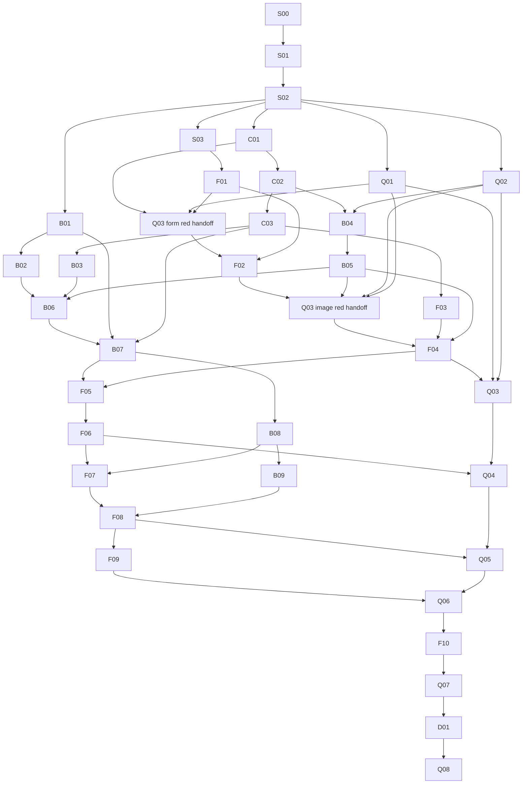

# Proof-of-Concept Implementation Plan — Hardware Service Decision Copilot

**Date:** 2026-09-30
**Status:** Ready for execution after a separate user instruction.
**Scope:** Fully working local PoC, including backend, frontend, tests, manual verification, focused commits and demo documentation. This document does not initialize or implement the app.

## 1. Authority, resolved context and execution assumptions

The functional source is [docs/PRD.md](PRD.md). The user-mentioned `docs/PRD-Product-Requirements-Document.md` does not exist; this plan uses the existing canonical PRD, without creating another conflicting specification. Architecture comes from [ADR-000](ADR/000-main-architecture.md), [ADR-001](ADR/001-project-initialization.md), [ADR-002](ADR/002-backend-ai-workflow.md), [ADR-003](ADR/003-frontend-session.md) and [ADR-004](ADR/004-verification.md). Brand requirements come from [design guidelines](design-guidelines.md), `assets/design-tokens.json`, `assets/homepage.png` and `assets/homepage-desktop.png`.

Read the applicable ancestor `C:/Users/labuser/AGENTS.md`, repository `AGENTS.md` and any subsequently introduced instructions covering an assigned file. Never inspect, index or search `course-materials/` unless a user names a specific file there. User-facing application text and progress communication are Polish; repository documents are English.

Confirmed execution choices, established from the accepted ADRs and the user's latest request, are: one shared repository with parallel work only on disjoint files, one local Node dev server at 127.0.0.1:3000 per verification lease, AI Elements/useChat, one configured OpenRouter model, unsigned localStorage, 120-second initial assessment and five independent concurrent cases. No deployment, database, auth, RAG, external business action or final approval UI. The user confirmed that this task creates only the plan and role definitions, and confirmed the English plan destination docs/IMPLEMENTATION-PLAN.md. The user also confirmed native Codex role definitions, one shared repository, the existing OpenRouter configuration and ADR limits, with no additional cost cap. The user confirmed that the final PoC includes the README, training demo script and manual QA evidence. All six clarification preferences are now confirmed. Application implementation requires a separate execution instruction.

The ancestor instructions authorize use of the existing user-level `OPENROUTER_API_KEY`. Inherit it into the server process without printing, logging, overwriting or copying secret files. If a newly launched process lacks it, read the named user environment variable into that process without emitting its value. `LLM_MODEL` uses the existing example's `openai/gpt-6-luna`. Do not inspect existing secret-bearing files. No `NEXT_PUBLIC_` secret, Gateway key, signing secret or additional configuration service.

Existing ADR research is the technical baseline; this plan introduces no new framework alternatives. Implementation agents must fetch current Context7 documentation for the particular API/CLI they use. Verified IDs: `/vercel/next.js`, `/vercel/ai`, `/vercel/ai-elements`, `/shadcn-ui/ui`, `/openrouterteam/docs`, `/lovell/sharp`, `/colinhacks/zod`, `/vitest-dev/vitest`, `/testing-library/react-testing-library`, `/microsoft/playwright`, `/microsoft/playwright-cli`. The additional Playwright @capacity/--grep/--grep-invert selection pattern was checked during plan authoring through Context7 `/microsoft/playwright` ([official annotations reference](https://playwright.dev/docs/test-annotations)). An exact supplied ID can be queried directly; otherwise resolve it first. Query one scoped concept at a time. Confirm compatibility with ADR-001 before changing versions; do not silently substitute older AI SDK examples.

## 2. Roles and orchestration boundary

The orchestrator manages task assignment, dependency gates, reviews, evidence and ownership. It does not implement, edit production code or perform Git mutations. Read-only status/diff review is permitted; every file change and Git mutation is delegated to a specialist.

| Requested specialization | Responsibility | Callable fallback when the exact role is absent |
| --- | --- | --- |
| fe-developer | Browser UX, brand, form, typed decision, useChat, localStorage and frontend unit/component tests | `frontend-nextjs-developer` with an explicit fe-developer task brief |
| be-developer | Scaffold/config ownership, shared contracts, services, resources, routes, integration tests and serialized verified commits | `worker` or `default` with the concise be-developer role and scoped task brief |
| qa-engineer | Real-photo fixtures, no-mock browser tests, independent manual verification, evidence and release checks | `e2e-qa-engineer` with the qa-engineer brief |

The user requested native Codex definitions in `.codex/agents/fe-developer.toml`, `be-developer.toml` and `qa-engineer.toml`. Each contains only name, description and concise developer_instructions; model, reasoning, permissions and tools inherit the session defaults. The current [official Codex subagent documentation](https://learn.chatgpt.com/docs/agent-configuration/subagents) supports project-local standalone definitions under `.codex/agents/`. Preserve existing `.codex/config.toml`; no global configuration or legacy mapping change is required.

After reloading configuration or starting a new session, verify that the three exact names are callable. Writing files does not change this session's already-exposed tool catalog. Prefer the requested exact native names when available; use the table's explicit specialization fallback only when absent. Do not claim native registration before verification. Existing specialized defaults that mention `frontend/` are overridden by task context: application code belongs in `app/`.

Use at most one active owner per specialization by default. With four available slots, the manager plus FE, BE and QA can work concurrently. Reuse the specialist for subsequent narrow tasks. Spawn with no inherited conversation; provide the common packet header, the current task packet, exact upstream artifact paths/version identifiers and only the listed specification sections. Do not send every PRD/ADR, all prior conversation or an implement-everything instruction. Budget approximately 2–5k tokens of task context initially; fetch additional relevant code only when needed.

## 3. Shared repository, ownership and commit protocol

### 3.1 Specification baseline

Currently `app/` contains a README only. Several already-authored specification and policy files are untracked. The modified `.agents/skills/write-prd/SKILL.md` is the user's work and must remain untouched and excluded.

Planning delivery is a documentation-only change: the four new plan/native-role files can receive a focused documentation commit after static review, if the orchestrator delegates it. No app exists to start or manually validate for that docs-only commit; explicitly report this scope exception rather than claiming an application pass.

S00 commits the reviewed authorized PRD, ADR and policy baseline before application work. Include plan/role files only if not already committed. Never use `git add .`, broad staging, stash, reset, clean or push. Do not include the modified skill or secrets. If an unrelated change touches a required source file, preserve it and report the conflict instead of discarding it.

### 3.2 Shared-directory leases and verified commits

All agents work in this repository, on the same current branch and working tree. Do not create worktrees or task branches, copy secret files, cherry-pick, patch-transfer or produce duplicate local/integration commits. Parallel work is permitted only on explicitly disjoint files. Dependencies must be completed and committed before consumers start.

The BE specialist is the delegated commit owner. Maintain a per-file ownership ledger and a global **verification/Git lease**. Before changed-scope verification, manual QA and a commit, all other agents stop mutations. Inspect the exact pending diff and dependency imports: the task may rely only on previously committed files or its explicitly accepted current-task files. Unrelated pending tests/code remain declared unfinished and unstaged. If they prevent typecheck/build/dev startup, defer the commit window until the other owner restores a compile-ready state; never revert, stash or secretly include those files.

The lease covers the entire red/green evidence review, relevant completed scope checks, real startup/manual QA, explicit staging and focused commit. The BE commit owner stages only agreed owned files and commits the verified tree after the implementing specialist and QA hand off their acceptance. Other writers resume only after the lease ends and the commit hash is recorded. This produces one verified commit for the completed increment; taskCommit and integratedCommit are the same hash.

A separate **port-3000 lease** identifies the running process, base/current commit and readiness URL. Only one dev/test server owns 127.0.0.1:3000. QA starts a test-owned real instance or reuses only a confirmed matching instance. Never kill an unknown server; stop only the lease holder's own process. Disjoint agents can write or run isolated unit tests while no global verification/commit freeze is active.

For paired QA red handoffs, QA writes its named browser spec in this shared root under a test-file lease before the corresponding product behavior. The developer owns separate production/unit files. Establish a healthy runner/known matching server and record the missing behavioral assertion; then pause QA mutations while the developer implements. The completed focused feature commit includes its explicitly accepted QA spec together with the developer's source/tests, after both are green and separate manual QA passes. Do not split a feature commit from pending red browser tests, and do not commit red-only work. A QA package spanning several increments has red/green checkpoints attached to those feature commits; its final standalone green commit may add only remaining accepted test coverage or the specified acceptance documentation. Scope each checkpoint to reachable behavior so an earlier increment never depends on a future UI.

Unit tests for a new module may require minimal compile-ready interfaces after test authoring; missing imports are setup failures, not behavioral red. A correct-server HTTP404 for a genuinely specified missing route can be valid route behavior red, but wrong-server HTTP 404 or dependency failure cannot.

### 3.3 Stable ownership

| Area | Single owner | Transfer rule |
| --- | --- | --- |
| Generated scaffold; package/lock; tsconfig; Next/ESLint/Vitest configuration; ignore rules | BE, S01–S02 | FE gets a short dependency-install lease for S03; BE reviews compatible lock and resumes ownership afterwards |
| Shared contracts and deterministic first-message formatter | BE, C01–C03 | Freeze contract revision v1 before consumers; a change is a new BE task with consumer review |
| Server modules, private policies/prompts and API route files | BE | FE/QA do not patch server code |
| Root layout/global CSS, public brand and browser feature components | FE | One FE owner; ownership transfers between completed FE packages |
| Browser storage/hooks/controllers, root form/chat page wiring | FE | No parallel second state owner |
| Playwright config, real fixtures and `app/tests/e2e/**` | QA | FE/BE report failures; QA changes assertions only when specification warrants it |
| Unit/component tests beside FE source | FE | QA reviews; does not silently rewrite FE production code |
| Server unit tests and `app/tests/integration/**` | BE | Only external LLM HTTP boundary can be replaced in integration |
| Evidence under ignored `app/verification-output/**` | Current verifier | Task/run subdirectories; metadata only |
| Final app README and demo runbook | BE, with FE/QA review | Documentation only; no executable workaround hidden in docs |

Do not use broad shared `app/tests/**` ownership. Exact filenames appear in each task. New filenames require ownership approval before editing.

### 3.4 Inter-agent handoff matrix

| Producer → consumer | be-developer | fe-developer | qa-engineer |
| --- | --- | --- | --- |
| be-developer | Frozen contract/service revisions; serialized integrated commits | DTO/error/formatter revisions and completed endpoints, no private prompt/key context | Real running route/flow, safe generation logs and fixture requirements |
| fe-developer | Protocol mismatches and narrow failing reproduction, no server edits | One state/layout owner with explicit transfers | Stable accessible controls, exact current flow and lifecycle expectations |
| qa-engineer | Licensed fixtures, real defect evidence and integration-boundary findings | Paired specification browser tests/red evidence and accessibility/brand findings | Single real Playwright configuration and final coverage/evidence ledger |

## 4. Common copy-ready task header and verification contracts

Attach this header to every specialist assignment, followed by exactly one task packet:

> You are acting as the packet's named specialist. You are not alone in this repository. Do not revert others or modify files outside your ownership. Work in the shared repository at the given committed base, holding only the packet's file leases. Read applicable AGENTS.md files, the packet's exact specification sections and relevant owned code/tests. Application code belongs in app/, not frontend/. Routine choices follow the supplied specifications and confirmed defaults. Report genuine unresolved blockers with evidence to the orchestrator rather than asking the user directly. State the expected observable behavior from the specification before code. For new behavior/bug fixes, establish a healthy test harness, write meaningful failing tests, record the expected behavior failure before production changes, implement the minimum green change, and refactor only while green. Missing imports, credentials, package installation or a broken runner are not a valid behavioral red. No red-only completed commit. Fetch scoped current Context7 docs for library/CLI details. Use approved process OpenRouter credentials without exposing them. Follow the verification/manual/commit protocol below. Return the specified result object and unlock only after integrated acceptance. Do not push, add scope or implement all tasks at once.

### 4.1 Command bundles

All npm commands use the shared repository's `app/` directory. Check the generated scripts before use.

| Bundle | Commands and meaning |
| --- | --- |
| STATIC | Exact file/link/section/coverage checks and `git diff --check`; no runtime claim |
| U(path) | `npm run test:unit -- <exact owned test paths>`, then the affected complete unit scope |
| I(path) | `npm run test:integration -- <exact owned integration paths>`; only external OpenRouter HTTP may be replaced |
| CHECK | `npm run lint`, `npm run typecheck`, `npm run build`; no errors or unresolved warnings |
| LIVE(path) | `npm run test:e2e -- <exact QA spec paths>` under the port lease with actual model access |
| MANUAL | Independently start `npm run dev`, verify 127.0.0.1:3000, operate the real app using Playwright CLI, inspect screenshots and console, then stop only the leased process |

Do not assume an obsolete `next lint` command. Setup follows ADR-001's official generator/selected component CLIs; retrieve exact current flags via Context7 rather than copying an unverified command from this plan. Playwright CLI control/screenshot syntax is likewise read from `/microsoft/playwright-cli` immediately before use.

For S01/S02, establish the generated scaffold/harness before product tests. Bootstrap is an honest prerequisite, not a fabricated missing-module red. Once the harness is healthy, introduce its first meaningful startup/configuration or smoke expectation before implementing the associated product behavior. Record this distinction.

The documented Next.js server-only boundary was checked through Context7 `/vercel/next.js` during planning ([official server/client component guide](https://nextjs.org/docs/app/getting-started/server-and-client-components#preventing-environment-poisoning)). S02 installs `server-only` explicitly and adds the boundary check.

All private server modules (policy registry/loader, prompt builder, provider, HTTP helpers, image services and AI services) use server-only import boundaries. Add static/build boundary checks that prevent browser imports and public leaks. Shared contracts stay browser-safe and import neither filesystem/provider nor server-only modules.

### 4.2 Mock boundaries and honest live failures

Unit/component tests isolate collaborators, not the behavior under test. Integration uses real routes, services, filesystem policy resources, Sharp, contracts, SDK/provider conversion and stream framing; replace **only the external LLM HTTP boundary** in the isolated integration harness. No production test-mode switch.

E2E mocks **nothing**: no intercepted requests, route fulfill/abort, HAR replay, fetch mocks, MSW, fake model, seeded fake assistant history, service substitution or mocked storage. Fixtures are actual input photographs, not responses. Use real application UI, storage, backend, OpenRouter and configured model. Default workers=1, retries=0, journey timeout=300s. Only Q07 deliberately creates five independent browser contexts in one controlled test.

A key-presence check/model catalog lookup does not prove quota or access. The first necessary live journey is the access gate; do not incur extra exploratory paid calls. Missing key, network, credits, model access, invalid output or unsuitable missing fixtures fails the verification prerequisite/run clearly; never skip to green or switch to fake output. Deterministic provider faults belong to integration. Browser cancellation uses actual Stop, Return to form, New case or refresh, never E2E network interception.

For a successful AI case, collect safe real-provider generation IDs for the image and decision calls, and an additional ID for each tested follow-up. Log only case/operation/stage/model/generation ID/timing/token metadata. No API key, full prompts, descriptions, raw messages, image data URLs or customer data in evidence. LLM assertions target schemas, grounded facts/policy identity and behavior, not exact prose/chunk count.

### 4.3 Manual QA, evidence and commits

Every task affecting runtime starts the real application before commit. Early shell/form tasks manually exercise only their available scope. Early backend tasks can invoke the actual endpoint from the real browser/Playwright CLI HTTP context and inspect the real shell; they do not require an unavailable full UI and do not ship a diagnostic product screen. Once the full flow exists, every changed journey must be operated end to end, including actual LLM calls when AI is affected.

UI changes require screenshots at 360 and 1440 CSS pixels, no horizontal page scrolling, keyboard/focus checks, Polish labels and screenshot comparison with `assets/homepage.png`, `assets/homepage-desktop.png` and brand tokens. Every affected screen is captured. Automated Playwright is not the separate manual CLI session. Unexpected console/errors/warnings block completion; explicit expected failure states are recorded as intentional.

Store red/green output, safe runtime logs, screenshots, failure traces and manual notes under ignored `app/verification-output/<task-id>/<run-id>/`. Evidence is not a product archive/database. Do not commit generated evidence by default. Committed fixture provenance contains no secrets and uses demonstration hardware only.

Each specialist returns:

| Field | Required value |
| --- | --- |
| taskId, role, repository, baseCommit | Exact identity and committed starting point |
| specBehavior, ACs, TACs, contractRevision | What was proven and consumed |
| changedFiles | Explicit owned source/test/resource paths |
| redEvidence | Tests, expected behavioral failure and run output; bootstrap/test-only exceptions explained honestly |
| greenEvidence | Scoped commands/results and affected complete suites |
| liveProviderEvidence | Actual generation IDs when AI exercised, or explicit scope-not-AI |
| manualEvidence | Independent CLI steps, screenshot paths, console and Allegro comparison |
| taskCommit | One verified committed hash in the shared repository; no duplicate integration commit |
| limitations, nextUnlockedTasks | No incomplete work hidden as done |

Each task's exact commit message appears below. Git integration may use the same focused message with the task ID in the body. Commit after all relevant gates pass, never before the manual step.

## 5. Phase waves and dependency matrix

There are **35 work packages in six phases**. Dependencies are direct prerequisites; indirect prerequisites follow transitively. `R` denotes an early QA red-test handoff before its paired FE implementation; QA remains unfinished/uncommitted until the feature is green. Matrix entries list completion prerequisites, while packets state earlier red-start conditions. Q03-form-R requires Q01/F01/C01 and precedes F02. Q03-image-R requires Q01/F02/B05/Q02 and precedes F04. These are QA evidence handoffs, not completion of Q03; each checkpoint commits only reachable accepted assertions.

| Phase | Goal and release gate | Parallel work available |
| --- | --- | --- |
| 1 — Baseline and bootstrap | S00–S03, Q01–Q02: reviewable tracked specifications, official scaffold, healthy runners, approved real-photo fixtures and stable copied components | QA fixtures/harness alongside non-overlapping setup work after S02; dependency installs remain serialized |
| 2 — Frozen contracts and foundations | C01–C03, B01–B05, F01–F03: shared revision v1, real private resources/provider/image preparation, branded form and persistence modules | BE server/contracts vs FE brand/form vs QA red browser specifications, with frozen upstream contracts |
| 3 — Initial assessment | B06–B07, F04–F06, Q03–Q04: real image → validated evidence → policy decision → populated chat, actual generation evidence | BE analysis/decision while FE image/controller prepared from frozen contracts |
| 4 — Chat and continuity | B08–B09, F07–F09, Q05–Q06: real streamed text, honest completion/retry, refresh/reset/tab conflict | BE protocol/error tests vs FE consuming completed endpoints; QA prepares next red specifications |
| 5 — Quality and capacity | F10, Q07: fixes through developer TDD, required widths/keyboard/brand, five real independent cases | Isolated FE/BE defect fixes; QA alone holds live capacity lease |
| 6 — Demo and final acceptance | D01, Q08: English runbook, all 58 AC/34 TAC evidence mapped, final clean real demo | Documentation review while no runtime mutations occur; final QA runs on frozen integration tree |

| Task | Role | Direct completion prerequisites | Unlocks / handoff |
| --- | --- | --- | --- |
| S00 | be-developer | Reviewed plan/specification baseline | S01 |
| S01 | be-developer | S00 | S02 |
| S02 | be-developer | S01 | S03, C01, B01, Q01, Q02 |
| S03 | fe-developer | S02 | F01 |
| C01 | be-developer | S02 | C02, F02 |
| C02 | be-developer | C01 | C03, B02, B04 |
| C03 | be-developer | C02 | F03, B03, B05, B07, B08, F06 |
| B01 | be-developer | S02 | B02, B07, B08 |
| B02 | be-developer | B01, C02 | B06, B07 |
| B03 | be-developer | C03 | B06, B07, B08 |
| B04 | be-developer | C02, Q02 | B05 |
| B05 | be-developer | B04, B03, C03 | F04, B06 |
| B06 | be-developer | B02, B03, B05, C03 | B07, F05 |
| B07 | be-developer | B01, B02, B03, B06, C03 | F05, B08 |
| B08 | be-developer | B07, C03, B02, B03 | F07, B09 |
| B09 | be-developer | B08 | F08, F09, Q07 |
| F01 | fe-developer | S03 | F02 |
| F02 | fe-developer | F01, C01, Q03-form-R | F04; Q03-image-R begins after B05/Q02 |
| F03 | fe-developer | C03 | F04 |
| F04 | fe-developer | F02, F03, B05, Q02, Q03-image-R | F05, Q03; Q04-R begins once B07 exists |
| F05 | fe-developer | F04, B06, B07, Q04-R | F06 |
| F06 | fe-developer | F05, C03 | F07, Q04; Q05-R begins once B08 exists |
| F07 | fe-developer | F06, B08, Q05-R | F08 |
| F08 | fe-developer | F07, B09 | F09, Q05; Q06-R begins |
| F09 | fe-developer | F08, F03, B09, Q06-R | Q06 |
| F10 | fe-developer | F09, Q06 | Q07 |
| Q01 | qa-engineer | S02 | Q03–Q08 |
| Q02 | qa-engineer | S02 | B04, Q03–Q08 |
| Q03 | qa-engineer | Q01, Q02, F04 | Form/image E2E proof; final completion follows paired feature green |
| Q04 | qa-engineer | Q01, Q02, F06, Q03 | Real initial journeys; quality findings to developers |
| Q05 | qa-engineer | Q04, F08 | Streaming/history/stop/retry proof |
| Q06 | qa-engineer | Q05, F09 | Restoration/reset/tab proof; F10 |
| Q07 | qa-engineer | Q06, F10, B09 | Five-case capacity proof; D01 |
| D01 | be-developer | Q07 | Final English demo/runbook; Q08 |
| Q08 | qa-engineer | D01, Q07, all developer packages integrated | Final acceptance only |

No task can create a cycle by demanding completed QA before the product that makes it pass. The R handoff is the exception: QA sends the written spec and healthy-runner behavioral red evidence, not a completed commit. The developer can proceed; QA reruns and commits its owned browser spec only after green.

The diagram includes the two Q03 red handoffs and principal completion edges; the table is authoritative for all direct dependencies. Safe parallelism requires disjoint files, committed shared contracts and no simultaneous port/Git lease.

## 6. Copy-ready work packages

### S00 — Track the reviewed specification baseline before application work

**Role:** be-developer. **Prerequisites/handoff:** Reviewed planning documents only; preserve all unrelated changes.

**Required context and coverage:** Existing `docs/PRD.md`; `docs/ADR/*.md`; `docs/policies/complaints.md`, `returns.md`; `assets/policy-sources/manifest.json` and the two source HTML files; planning/native-role files only if still untracked. Root and ancestor AGENTS; ADR-000 §1/3; ADR-004 §5.

**Owned paths:** Only those explicitly reviewed documentation/policy artifacts; no app code, skill or secret files.

**Expected behavior, failing tests and minimum green:** Inspect actual source filenames and manifest before explicit staging. Static checks must verify local links, both policy source hashes, correct English authored documents and complete ADR/plan coverage. This is documentation validation, not product TDD or runtime QA.

**Verification and separate manual QA:** STATIC only. Confirm the app remains a README-only prerequisite and no runtime behavior was tested. Return static evidence in the task record; do not create app/verification-output before the official generator, because extra app contents can prevent initialization. Runtime startup, screenshots and Allegro comparison are not applicable.

**Focused commit:** `Docs: track reviewed PoC specification baseline`.

**Return/unlocks:** Integrated baseline hash; preserved dirty-skill status; exact staged file list. Unlock S01. Return all common evidence fields.

### S01 — Generate the official minimal Next.js application

**Role:** be-developer. **Prerequisites/handoff:** S00; package/config lease held solely by BE.

**Required context and coverage:** ADR-001 §3 Initialization Sequence/version table and §5 commands; app/README.md; ADR-000 §3 repository structure. TAC-001-01/02/05; `/vercel/next.js` initialization lookup.

**Owned paths:** Generated `app/package.json`, `app/package-lock.json`, `app/tsconfig.json`, `app/next.config.*`, `app/eslint.config.*`, `app/postcss.config.*`, `app/next-env.d.ts`, `app/.gitignore`, `app/src/app/layout.tsx`, `app/src/app/page.tsx`, `app/src/app/globals.css`, existing README preservation.

**Expected behavior, failing tests and minimum green:** First perform generator bootstrap with TS/App Router/src/Tailwind/ESLint/npm/@alias/no nested Git. Preserve known README if generator rejects it. Establish a healthy generated build before verifying strict mode, script requirements and compatibility; do not label a missing runner/import as feature red. Disable unrequired experiments; no handwritten substitute or chatbot clone.

**Verification and separate manual QA:** CHECK where generated scripts exist; actual dev startup under lease; open real generated shell through CLI, screenshot shell/console. Before branding, explicitly record that generated demo visuals are not final Allegro QA. Do not claim functional PoC. Evidence uses the common task/run directory; capture every touched screen. UI changes additionally require both viewports and Allegro comparison. Exclude all unrelated files/features and respect the common packet header.

**Focused commit:** `Backend: initialize generated Next.js application`.

**Return/unlocks:** Generator/options/version and compatible lock evidence; no nested Git; shell startup. Unlock S02. Return all common evidence fields.

### S02 — Establish unit/integration runners and developer verification scripts

**Role:** be-developer. **Prerequisites/handoff:** S01.

**Required context and coverage:** ADR-001 §3 versions/§5 commands; ADR-004 §3 layers/TDD, §5 commands; TAC-001-02/03/05, TAC-004-01/02. `/vitest-dev/vitest`, `/testing-library/react-testing-library` scoped harness docs.

**Owned paths:** `app/package.json`, `app/package-lock.json`, `app/.gitignore`, `app/vitest.unit.config.ts`, `app/vitest.integration.config.ts`, `app/tests/setup-unit.ts`, `app/tests/setup-integration.ts`, `app/tests/unit/bootstrap.test.ts`, `app/tests/integration/bootstrap.test.ts`, `app/tests/unit/backend/server-boundary.test.ts`; script-only generated config changes if required.

**Expected behavior, failing tests and minimum green:** Install all ADR-001 runtime packages (AI SDK, React hook, OpenRouter provider, Zod and Sharp plus `server-only`) and the compatible unit/integration baseline, including jsdom 29.1.1 rather than incompatible latest. S03 alone adds CLI-selected UI dependencies under its temporary package lease. Set separate test environments/entry points and ignored verification-output. Verify runner health first; then write meaningful expectations for strict TS and required scripts/local bind before adding them. Integration bootstrap must not introduce fake production provider switches. Basic runner calibration is labeled infrastructure proof, not product acceptance.

**Verification and separate manual QA:** U(bootstrap) + I(bootstrap) + CHECK; actual npm run dev binds 127.0.0.1:3000; CLI shell/console and safe secret/public boundary inspection. No live call required until an AI route exists. Evidence uses the common task/run directory; capture every touched screen. UI changes additionally require both viewports and Allegro comparison. Exclude all unrelated files/features and respect the common packet header.

**Focused commit:** `Backend: establish scoped verification infrastructure`.

**Return/unlocks:** Healthy runner/scripts, output conventions and lock hash. Unlock frozen-contract work, resource work, S03 and QA infrastructure. Return all common evidence fields.

### S03 — Copy only selected UI primitives and AI Elements

**Role:** fe-developer. **Prerequisites/handoff:** S02; exclusive package/lock/component-config transfer lease.

**Required context and coverage:** ADR-001 §3 steps5–6/version baseline; ADR-003 §3 component responsibilities; TAC-001-05, TAC-003-06; `/shadcn-ui/ui`, `/vercel/ai-elements` scoped existing-project CLI docs.

**Owned paths:** `app/components.json`, `app/src/components/ui/{button,input,label,select,textarea,card,alert,alert-dialog,collapsible}.tsx`, `app/src/components/ai-elements/{conversation,message,prompt-input}.tsx`, CLI-required supporting files listed before edit, package/lock and `app/tests/unit/components-baseline.test.tsx`. Global CSS transfer only for CLI-required variable setup.

**Expected behavior, failing tests and minimum green:** Use official add operations; avoid all-component installation or second chat runtime. Healthy copied components compile before a meaningful accessibility expectation is introduced. Test an accessible enabled/disabled primary control and text composer contract rather than matching generated internals. Disable unused product features later in F07.

**Verification and separate manual QA:** U(components-baseline) + CHECK; real shell startup and CLI basic generated controls where actually mounted, otherwise shell-only manual scope. No diagnostic showcase screen added to product. Evidence uses the common task/run directory; capture every touched screen. UI changes additionally require both viewports and Allegro comparison. Exclude all unrelated files/features and respect the common packet header.

**Focused commit:** `Frontend: add selected form and streaming UI primitives`.

**Return/unlocks:** Copied component/dependency inventory and lock; return package ownership to BE; transfer CSS/components to F01/F07. Return all common evidence fields.

### C01 — Define exact form enums, calendar validation and typed errors

**Role:** be-developer. **Prerequisites/handoff:** S02; contract producer revision v1-form.

**Required context and coverage:** PRD §6 AC-01–14, §8 Functional; ADR-002 §3 input bounds, §4 Form/calendar, §5 Error Mapping. `/colinhacks/zod`. TAC-001-02.

**Owned paths:** `app/src/lib/contracts/form.ts`, `app/src/lib/contracts/calendar.ts`, `app/src/lib/contracts/errors.ts`, `app/tests/unit/backend/form-contracts.test.ts`, `app/tests/unit/backend/calendar.test.ts`, `app/tests/unit/backend/errors.test.ts`.

**Expected behavior, failing tests and minimum green:** Tests first against minimal compile-ready interfaces: exact enum choices, explicit scenario, whitespace/bounds, complaint/return requirements, nullable return remedy and no complaint-value leakage, genuine calendar dates and zone boundaries including local day near UTC rollover. Healthy assertions should reject invalid inputs before implementation; missing symbols are setup failures. Green strictly matches PRD, including explicit Unknowns; no invented stronger policy rules.

**Verification and separate manual QA:** U(exact C01 tests) + CHECK; real shell startup/console and browser bundle secret leak check; form UI not available yet, so do not claim field UX manual coverage. Evidence uses the common task/run directory; capture every touched screen. UI changes additionally require both viewports and Allegro comparison. Exclude all unrelated files/features and respect the common packet header.

**Focused commit:** `Backend: define validated case form and calendar contracts`.

**Return/unlocks:** Committed v1-form paths/schema identifiers; FE receives only enums, validation and error shape. Unlock C02/F02. Return all common evidence fields.

### C02 — Define prepared-image, evidence and decision schemas/invariants

**Role:** be-developer. **Prerequisites/handoff:** C01; v1-form frozen.

**Required context and coverage:** ADR-002 §4 PreparedImage, ImageAnalysis, InitialDecision and §3 output limits; PRD §11.2/11.3, AC-15/23/28–30/34–36; TAC-002-03.

**Owned paths:** `app/src/lib/contracts/image.ts`, `app/src/lib/contracts/analysis.ts`, `app/src/lib/contracts/decision.ts`, `app/src/lib/contracts/policy.ts`, `app/tests/unit/backend/image-contracts.test.ts`, `app/tests/unit/backend/analysis-contracts.test.ts`, `app/tests/unit/backend/decision-contracts.test.ts`.

**Expected behavior, failing tests and minimum green:** First red tests for JPEG-only prepared data URL/shape, list and string bounds, strict unknown-key rejection, outcome/resale enums, required explanatory fields/nullables and scenario-dependent shapes. Use valid/invalid objects, not fake model calls. Green supplies schemas for strict structured generation and separate server metadata; heading allowlist verification remains real registry service work. No new diagnosis/eligibility rule invented in schemas.

**Verification and separate manual QA:** U(exact C02 tests) + CHECK; real shell startup/public leak inspection. Private schema behavior is unit proof, not hypothetical user-flow QA. Evidence uses the common task/run directory; capture every touched screen. UI changes additionally require both viewports and Allegro comparison. Exclude all unrelated files/features and respect the common packet header.

**Focused commit:** `Backend: define image evidence and decision contracts`.

**Return/unlocks:** Committed v1-evidence/decision shape and example synthetic objects for unit/integration only. Unlock C03/B02/B03/B04. Return all common evidence fields.

### C03 — Freeze request, stream metadata, snapshot and first-message contracts

**Role:** be-developer. **Prerequisites/handoff:** C02; v1-contract freeze gate.

**Required context and coverage:** ADR-002 §4/5 all four request/error contracts and chat history; ADR-003 §4 snapshot/§5 transport; PRD AC-28/38/41/49–51. TAC-003-01/02/04, TAC-002-05.

**Owned paths:** `app/src/lib/contracts/requests.ts`, `app/src/lib/contracts/messages.ts`, `app/src/lib/contracts/session.ts`, `app/src/lib/contracts/first-message.ts`, `app/src/lib/contracts/index.ts`; `app/tests/unit/backend/request-contracts.test.ts`, `app/tests/unit/backend/message-contracts.test.ts`, `app/tests/unit/backend/session-contracts.test.ts`, `app/tests/unit/backend/first-message.test.ts`.

**Expected behavior, failing tests and minimum green:** Write red assertions for strict allowlisted DTOs, full eligible role/text history, stable IDs/terminal metadata, completed vs incomplete, schemaVersion: 1, no forbidden image/tool/reasoning parts in chat. Deterministic Polish formatter must include every initial detail and fixed notice without another LLM request. Preserve all history; failed partial is excluded from model input only. Never create a parallel live message store in contracts.

**Verification and separate manual QA:** U(exact C03 tests) + CHECK; real shell startup; browser-safe import boundary/static bundle inspection. No card/history UI claim yet. Evidence uses the common task/run directory; capture every touched screen. UI changes additionally require both viewports and Allegro comparison. Exclude all unrelated files/features and respect the common packet header.

**Focused commit:** `Backend: freeze browser and server workflow contracts`.

**Return/unlocks:** Contract revision v1 plus changed-path digest/commit shared to FE/QA; explicit formatter ownership remains BE. Unlock F03/F06/B07/B08. Changes later need a producer task/consumer review. Return all common evidence fields.

### B01 — Copy full immutable policy snapshots and validate registry

**Role:** be-developer. **Prerequisites/handoff:** S02.

**Required context and coverage:** Common §4.1 server-only requirement and ADR-002 §3 Request and Service Boundary; ADR-001 §3 Resource Placement; ADR-002 §3 Dynamic Prompts and Immutable Policies; `assets/policy-sources/manifest.json`, full source HTML; PRD AC-26/27/37. TAC-001-04, TAC-002-04.

**Owned paths:** `app/resources/policies/complaints.<sha256>.html`, `app/resources/policies/returns.<sha256>.html` using actual manifest digests; `app/src/server/policies/registry.ts`, `app/src/server/policies/policy-loader.ts`; `app/tests/unit/backend/policy-registry.test.ts`, `app/tests/integration/policy-resources.test.ts`.

**Expected behavior, failing tests and minimum green:** Red for wrong scenario/version, missing source, real temporary-file corruption/digest mismatch and incomplete content. Copy complete original HTML byte-for-byte, not docs/policies summaries; metadata/heading registry from source. Integration uses actual filesystem, not fs mocks. Old immutable versions remain supported; unavailable old version is a typed operational error.

**Verification and separate manual QA:** U(registry) + I(policy-resources) + CHECK; start real shell, verify private resources absent from public/bundles. No policy/debug endpoint or DOM HTML injection created merely for QA. Evidence uses the common task/run directory; capture every touched screen. UI changes additionally require both viewports and Allegro comparison. Exclude all unrelated files/features and respect the common packet header.

**Focused commit:** `Backend: load immutable full policy snapshots`.

**Return/unlocks:** Registry v1 with source URLs/timestamps/hashes/headings; full bytes verified. Unlock prompt builder and decision/chat policy consumers. Return all common evidence fields.

### B02 — Author four prompt resources and bounded scenario builder

**Role:** be-developer. **Prerequisites/handoff:** B01, C02.

**Required context and coverage:** Common §4.1 server-only requirement and ADR-002 §3 Request and Service Boundary; PRD §11.1–11.7 exactly; ADR-002 §3 Dynamic Prompts/Context Bounds; AC-21–23/26–27/31–36/41–46; TAC-002-04/08.

**Owned paths:** `app/resources/prompts/{complaint-image,return-image,complaint-decision,return-decision}.md`, `app/src/server/prompts/builder.ts`; `app/tests/unit/backend/prompt-selection.test.ts`, `app/tests/integration/prompt-context.test.ts`.

**Expected behavior, failing tests and minimum green:** Red tests for scenario selection, evidence stage excludes policy/eligibility, full selected HTML and no other policy, correct source/version, fact delimiters and entire history. Green preserves preliminary/evidence boundaries, missing facts/employee statements, no proved buyer cause/no visible-damage refusal, independent resale, Polish output and redirects. Bound assembled text to200,000 UTF-8 bytes without truncation/summarization; reject oversized context.

**Verification and separate manual QA:** U(prompt-selection) + I(prompt-context) + CHECK; real shell/privacy inspection; inspect builder output only in redacted test assertions, never full prompts in logs/artifacts. Evidence uses the common task/run directory; capture every touched screen. UI changes additionally require both viewports and Allegro comparison. Exclude all unrelated files/features and respect the common packet header.

**Focused commit:** `Backend: assemble scenario prompts with complete policy context`.

**Return/unlocks:** Four resource names and builder interface; private content provenance. Unlock B06/B07/B08. Return all common evidence fields.

### B03 — Create lazy provider, request bounds, deadlines and safe errors

**Role:** be-developer. **Prerequisites/handoff:** C03; use frozen request revision v1 for route helpers.

**Required context and coverage:** Common §4.1 server-only requirement and ADR-002 §3 Request and Service Boundary; ADR-002 §3 AI calls/deadlines, §5 Error Mapping/logging; ADR-001 §5 missing configuration; .env.example variable names only; TAC-000-01/03, TAC-002-02/06/08. `/vercel/ai`, `/openrouterteam/docs`, `/vercel/next.js` scoped docs.

**Owned paths:** `app/src/server/ai/provider.ts`, `app/src/server/ai/configuration.ts`, `app/src/server/ai/deadline.ts`, `app/src/server/ai/diagnostics.ts`, `app/src/server/http/request-reader.ts`, `app/src/server/http/errors.ts`; `app/tests/unit/backend/provider-config.test.ts`, `app/tests/unit/backend/deadline.test.ts`, `app/tests/unit/backend/safe-errors.test.ts`; `app/tests/integration/request-boundaries.test.ts`, `app/tests/integration/provider-adapter.test.ts`.

**Expected behavior, failing tests and minimum green:** Behavior red: missing credential typed error only on call (build/shell healthy), explicit configured OpenRouter chat factory/model/endpoint, no bare-ID Gateway, no automatic retries/fallback. Real streaming body readers enforce byte limits regardless of headers, reject unexpected keys and map safe Polish errors/no-store. Integration replaces external HTTP only and inspects actual provider serialization. Deadlines abort collaborators; logs only allowed actual upstream generation ID/token metadata, never fabricated IDs; reasoning excluded. No live charge for a private module not yet routed.

**Verification and separate manual QA:** U(exact B03 tests) + I(request-boundaries/provider-adapter) + CHECK; real shell starts without AI key; actual public shell/log boundary inspection. No claim account access proven. Evidence uses the common task/run directory; capture every touched screen. UI changes additionally require both viewports and Allegro comparison. Exclude all unrelated files/features and respect the common packet header.

**Focused commit:** `Backend: add bounded OpenRouter request infrastructure`.

**Return/unlocks:** Provider/helper/error v1; no secret values in return. Route tasks perform the first actual live call. Unlock B06/B07/B08 and request wiring. Return all common evidence fields.

### B04 — Implement real bounded Sharp preparation service

**Role:** be-developer. **Prerequisites/handoff:** C02, Q02; fixtures committed.

**Required context and coverage:** Common §4.1 server-only requirement and ADR-002 §3 Request and Service Boundary; PRD AC-15–20; ADR-002 §3 Image Preparation; `/lovell/sharp` input/orientation/resize/output. TAC-002-01.

**Owned paths:** `app/src/server/images/prepare-image.ts`, `app/src/server/images/validate-prepared-image.ts`; `app/tests/unit/backend/image-preparation.test.ts`, `app/tests/integration/sharp-preparation.test.ts`.

**Expected behavior, failing tests and minimum green:** Red assertions execute real Sharp for JPG/PNG/WebP, EXIF rotation, transparency/metadata, corrupt/animated/multipage, 10,000,000-byte and 64-megapixel guards, no enlargement/crop, 2048-pixel JPEG at quality 85 and 512-pixel thumbnail at quality 70, 4,000,000-byte output limit/digest. Unit collaborators isolated; integration real Sharp/files. Green never forwards original or stores public image, strips EXIF/GPS and validates prepared JPEG/digest for later analysis.

**Verification and separate manual QA:** U(image-preparation) + I(sharp-preparation) + CHECK; real shell startup and absence of publicly persisted uploads. Service is private; endpoint/browser photo exercise occurs B05, not claimed now. Evidence uses the common task/run directory; capture every touched screen. UI changes additionally require both viewports and Allegro comparison. Exclude all unrelated files/features and respect the common packet header.

**Focused commit:** `Backend: prepare bounded metadata-free equipment images`.

**Return/unlocks:** PreparedImage v1 service and real fixture outputs; unlock B05. If owner chooses a single focused service+route increment before execution, update matrix/coverage first rather than silently merging commits. Return all common evidence fields.

### B05 — Expose real multipart image-preparation route

**Role:** be-developer. **Prerequisites/handoff:** B04, B03, C03; add these prerequisites to route gate even if services were authored earlier.

**Required context and coverage:** ADR-002 §5 POST /api/images/prepare; AC-15–20; TAC-002-01; request/errors from B03; `/vercel/next.js` multipart Node Route Handler docs.

**Owned paths:** `app/src/app/api/images/prepare/route.ts`; `app/tests/integration/image-route.test.ts`.

**Expected behavior, failing tests and minimum green:** Write route integration assertions for exactly one file, decoded format, maximum multipart body 10,065,536 bytes including overhead, actual file size 10,000,000 bytes, streamed bounds, 30-second deadline, valid PreparedImage and safe typed failures. A healthy correct-server 404 for the specified missing route can establish route behavior red; wrong server or missing imports cannot. Implement the real Node route, Sharp service, no-store headers and errors, never a fake response or diagnostic route.

**Verification and separate manual QA:** I(image-route) + affected I(sharp/request-boundaries) + CHECK; CLI actual browser HTTP upload to real route, inspect real JPEG/thumbnail metadata and invalid upload; shell/console screenshot. No LLM needed. Evidence uses the common task/run directory; capture every touched screen. UI changes additionally require both viewports and Allegro comparison. Exclude all unrelated files/features and respect the common packet header.

**Focused commit:** `Backend: expose validated image preparation endpoint`.

**Return/unlocks:** Working route commit and DTO/error examples; unlock F04/B06. QA uses real image route; no response mocks. Return all common evidence fields.

### B06 — Generate validated multimodal evidence through the real analysis route

**Role:** be-developer. **Prerequisites/handoff:** B02, B03, B05, C03.

**Required context and coverage:** PRD §11.4/11.5, AC-04–07, AC-10–13 and AC-19/21–23; ADR-002 §3 AI calls/§4 ImageAnalysis/§5 analysis; TAC-000-01, TAC-002-01/02/06. `/vercel/ai` structured output/file parts.

**Owned paths:** `app/src/server/ai/analyze-image.ts`, `app/src/server/cases/form-fingerprint.ts`, `app/src/app/api/analysis/route.ts`; `app/tests/unit/backend/analysis-identity.test.ts`, `app/tests/integration/analysis-route.test.ts`.

**Expected behavior, failing tests and minimum green:** Write real route integration red for invalid/valid form enums, required/blank model, complaint reason/remedy, optional return reason, nullable return remedy, real calendar dates/local time zone, future/ordered dates and deliveryDate=null as Unknown. Invalid fields return associated safe field errors and cause zero external LLM calls. Also assert prepared JPEG revalidation, digest/form/scenario fingerprint, current image/jpeg file part and scenario prompt, no policy/decision instructions in image analysis, strict output/metadata/list bounds and the 60-second stage deadline clipped to the total remaining budget. Enforce maximum JSON body 6,000,000 bytes. Use the actual SDK/provider with only external HTTP fixtures in integration. Implement generateText + Output.object with current instructions, low reasoning effort, 8192 output tokens, excluded reasoning and the configured model.

**Verification and separate manual QA:** U(analysis-identity) + I(analysis-route) + CHECK; actual CLI/browser HTTP request with valid prepared real photo and case to real OpenRouter (first required access gate), inspect Polish evidence/bounds and collect generation ID. Do not claim decision/chat UI. Evidence uses the common task/run directory; capture every touched screen. UI changes additionally require both viewports and Allegro comparison. Exclude all unrelated files/features and respect the common packet header.

**Focused commit:** `Backend: analyze prepared equipment images with validated evidence`.

**Return/unlocks:** ImageAnalysis v1 with server identity and real generation evidence; unlock B07/F05. Return all common evidence fields.

### B07 — Generate and validate the initial policy decision route

**Role:** be-developer. **Prerequisites/handoff:** B01, B02, B03, B06, C03.

**Required context and coverage:** PRD AC-26–38, §11.6/11.7; ADR-002 §4 InitialDecision/§5 decisions; TAC-002-03/04/08. `/vercel/ai` strict object generation.

**Owned paths:** `app/src/server/ai/initial-decision.ts`, `app/src/server/policies/validate-references.ts`, `app/src/app/api/decisions/route.ts`; `app/tests/integration/decision-route.test.ts`, `app/tests/unit/backend/policy-references.test.ts`.

**Expected behavior, failing tests and minimum green:** Write red for stale report/form/scenario, missing/mismatched policy versions, unknown heading IDs, malformed fields/resale shape and complete selected policy only. Explicitly test refusal supporting condition plus supplied fact, questions for additional-information outcomes, a named check for human verification, and complaint-null versus required return resale fields. Validate actual pinned heading references. Enforce JSON body 65,536 bytes; medium reasoning effort, 12288 output tokens, 90-second stage deadline clipped to remaining total budget. Append trusted source/version metadata on the server and use C03's formatter without an extra LLM call. Policy failures are operational errors, never invented refusals.

**Verification and separate manual QA:** U(policy-references) + I(decision-route) + CHECK; actual browser HTTP decision call after successful real analysis using full policy; inspect required fields/separate resale/uncertainty and generation ID. If existing UI permits, run actual initial path; no fabricated first bubble until F06. Evidence uses the common task/run directory; capture every touched screen. UI changes additionally require both viewports and Allegro comparison. Exclude all unrelated files/features and respect the common packet header.

**Focused commit:** `Backend: generate structured policy-based preliminary decisions`.

**Return/unlocks:** InitialDecision v1 and real decision-generation evidence; unlock F05/B08. Return all common evidence fields.

### B08 — Stream full-context text chat using the standard UI protocol

**Role:** be-developer. **Prerequisites/handoff:** B07, C03, B02, B03.

**Required context and coverage:** PRD AC-38–46; ADR-002 §3 current API/§5 chat; ADR-003 §5 request shape; TAC-002-04/05/07. `/vercel/ai` streamText, UI message conversion/adaptation.

**Owned paths:** `app/src/server/ai/chat.ts`, `app/src/server/cases/chat-history.ts`, `app/src/app/api/chat/route.ts`; `app/tests/unit/backend/chat-history.test.ts`, `app/tests/integration/chat-route.test.ts`.

**Expected behavior, failing tests and minimum green:** Red for complete initial/prior/outstanding-user history, strict roles/text only, no image/tool/reasoning parts or top-level browser-supplied system/developer fields, same immutable selected policy,200,000-byte text / 300,000-byte request body / 40-turn limits. Real external fixture stream passes through actual SDK/provider and standalone UI adapter, not custom raw SSE. Green explicit streamText result.stream → toUIMessageStream → createUIMessageStreamResponse; stable reply ID/terminal metadata, only normal stop complete; length/error/abort/missing terminal are already incomplete in B08, not deferred to B09. No automatic replay. Ordinary employee text is not keyword-filtered for instructions; it is untrusted factual conversation, never top-level authority.

**Verification and separate manual QA:** U(chat-history) + I(chat-route) + CHECK; actual CLI/browser chat request with real completed case, full history and new text; inspect real streaming UI protocol/no reasoning/modeldebug and generation ID. If FE mounted, actual composer journey. Evidence uses the common task/run directory; capture every touched screen. UI changes additionally require both viewports and Allegro comparison. Exclude all unrelated files/features and respect the common packet header.

**Focused commit:** `Backend: stream full-context policy chat with safe completion metadata`.

**Return/unlocks:** UI stream protocol v1, completion/error shape and real follow-up ID; unlock F07/B09. Return all common evidence fields.

### B09 — Harden cross-route failure, cancellation and case isolation

**Role:** be-developer. **Prerequisites/handoff:** B08 and all four route commits; FE lifecycle observations are optional and nonblocking; B09 does not require F07/F08 completion.

**Required context and coverage:** ADR-002 §3 deadlines/retry/concurrency/§5 error/terminal semantics; ADR-004 §8 external failures; AC-20/25/37/47–48/51; TAC-002-06/07/08.

**Owned paths:** `app/src/server/ai/deadline-lifecycle.ts`, existing B03 deadline/errors and B06–B08 services/routes only under explicit ownership; `app/tests/integration/failure-lifecycle.test.ts`, `app/tests/integration/case-isolation.test.ts`.

**Expected behavior, failing tests and minimum green:** Red integration permutations for auth/rate/quota/timeout/truncated object, provider HTTP-200 stream errors, length cutoff/missing terminal, cancellation propagation, late results and unavailable pinned policy. Real independent case inputs must not share mutable provider context/history. No server DB/globalcase store/queue or production test-mode. Green safe statuses/events and no silent retry/truncation or success after abort.

**Verification and separate manual QA:** I(failure-lifecycle/case-isolation) + affected complete route suites + CHECK; actual UIStop/refresh when available or real aborted browser request, followed by necessary real retry; inspect safe logs/no unhandled abort. Do not intercept E2E to manufacture outage; record real IDs for successful AI calls. Evidence uses the common task/run directory; capture every touched screen. UI changes additionally require both viewports and Allegro comparison. Exclude all unrelated files/features and respect the common packet header.

**Focused commit:** `Backend: harden AI cancellation errors and case isolation`.

**Return/unlocks:** Failure/retry protocol freeze and findings handed to F08/F09/QA; unlock lifecycle UI and final capacity verification. Return all common evidence fields.

### F01 — Apply existing Allegro brand to the application shell

**Role:** fe-developer. **Prerequisites/handoff:** S03; FE owns layout/CSS/public brand after transfer.

**Required context and coverage:** PRD §9.1/AC-55–58; ADR-003 §3 Brand and Accessibility; design guidelines Colors/Typography/Spacing/Components/Logo usage, asset tokens/screenshots. TAC-003-07.

**Owned paths:** `app/src/app/layout.tsx`, `app/src/app/globals.css`, `app/src/components/app-header.tsx`, `app/src/components/app-header.test.tsx`, `app/public/brand/**` exact existing logo/favicon/font copies.

**Expected behavior, failing tests and minimum green:** Behavior red for accessible product identity/local assets/visible primary action; green Polish shell with original logo proportions, local fonts, orange40px Open Sans action, white/light-gray surfaces. Do not mirror every CSS implementation value in tests or reproduce storefront/account/cart controls. Missing unverified semantic error color is not an excuse to invent a brand requirement; keep readable labeled validation states.

**Verification and separate manual QA:** U(app-header) + CHECK + MANUAL; screenshots F01-shell-360/1440, inspect logo/font/canvas/button/focus/console against actual reference; no live call needed. Evidence uses the common task/run directory; exclude unrelated files/features and respect the common packet header.

**Focused commit:** `Frontend: apply Allegro brand to application shell`.

**Return/unlocks:** Stable shell/CSS/public brand inventory; unlock F02. Return all common evidence fields.

### F02 — Build the complete conditional validated case form

**Role:** fe-developer. **Prerequisites/handoff:** F01, C01 and Q03-form-R, with the healthy Q01 harness; no future image assertions are required for this checkpoint.

**Required context and coverage:** PRD §4.1/4.2, AC-01–14, §8Functional/§9.1; ADR-003 §3 Form; C01v1-form. `/shadcn-ui/ui` only form APIs used.

**Owned paths:** `app/src/features/case-form/case-form.tsx`, `app/src/features/case-form/case-form.test.tsx`, `app/src/features/case-form/form-labels.ts`, `app/src/features/case-form/form-validation-view.tsx`, `app/src/app/page.tsx` for the actual reachable form mount under the FE page lease.

**Expected behavior, failing tests and minimum green:** Red component assertions: exact choices, no selected scenario, whitespace/bounds, date/calendar/Unknown, complaint reason/remedy, optional return reason, switching sets Return requestedRemedy to null and removes the complaint value from model facts, invalid errors/focus preserve valid values. Green controlled form receives image state/onValidSubmit without taking ownership of transport/storage. Native date pickers, explicit IANA local date semantics and no personal-data request.

**Verification and separate manual QA:** U(case-form) + CHECK + MANUAL; actual available form both scenarios, selections, invalid submission/keyboard/focus; 360/1440 screenshots and console. No claim assessment is possible before endpoints/wiring. Evidence uses the common task/run directory; exclude unrelated files/features and respect the common packet header.

**Focused commit:** `Frontend: add conditional validated case form`.

**Return/unlocks:** Controlled form interface and DTO v1; unlock F04/Q03 image portion. Return all common evidence fields.

### F03 — Implement validated snapshot storage and honest failures

**Role:** fe-developer. **Prerequisites/handoff:** C03; snapshot v1 frozen.

**Required context and coverage:** PRD §4.5/AC-49–52; ADR-003 §4snapshot/writes/limits/§5resume; TAC-003-05.

**Owned paths:** `app/src/features/session/session-adapter.ts`, `app/src/features/session/session-adapter.test.ts`, `app/src/features/session/storage-notice.tsx`, `app/src/features/session/storage-notice.test.tsx`.

**Expected behavior, failing tests and minimum green:** Red roundtrip/pending→interrupted/corrupt/version/read/write/remove error/timing tests. Green one key hardware-service-copilot.active-case;300 ms draft debounce, 500 ms stream checkpoints and immediate terminal writes;4,000,000-byte UTF-16 soft limit and real exceptions; retain live data and previous successful snapshot, persistent Polish restoration warning. Never original File/secret/prompts/policy/reasoning or silent history/image dropping. Adapter saves useChat state later, not a second authoritative message store.

**Verification and separate manual QA:** U(session-adapter/storage-notice) + CHECK + MANUAL real shell/current draft storage if wired, otherwise shell-only scope. Real chat refresh belongs F09; unit exceptions are not fake E2E proof. Evidence uses the common task/run directory; exclude unrelated files/features and respect the common packet header.

**Focused commit:** `Frontend: add validated active-case browser storage`.

**Return/unlocks:** Typed adapter outcomes/timing and snapshot v1; unlock F04/F09. Return all common evidence fields.

### F04 — Connect one image selection to real backend preparation

**Role:** fe-developer. **Prerequisites/handoff:** F02, F03, B05, Q02 and Q03-image-R; only reachable image assertions are accepted in this checkpoint.

**Required context and coverage:** PRD AC-15–20, §9.1 photograph UI; ADR-003 image preparation; B05 PreparedImage/error v1.

**Owned paths:** `app/src/features/case-form/equipment-image-picker.tsx`, `app/src/features/case-form/equipment-image-picker.test.tsx`, `app/src/features/case-workflow/image-preparation-client.ts`, `app/src/features/case-workflow/image-preparation-client.test.ts`; form/shell wiring under transferred FE lease.

**Expected behavior, failing tests and minimum green:** Red for single file/type/size/pending/replace/remove/stale result/preparation error; green select calls actual prepare route, persists normalized JPEG/thumbnail, preview, no original saved, submit blocked until usable image. Abort/operation identity ignores old selection responses; preserve form on failure. Unit client replacement allowed, never call it integration/E2E.

**Verification and separate manual QA:** U(picker/preparation-client) + CHECK + MANUAL real Sharp uploads, preview/replacement/corrupt/size guidance, keyboard and both widths. Q03 real browser checks green before paired verified commit. Evidence uses the common task/run directory; exclude unrelated files/features and respect the common packet header.

**Focused commit:** `Frontend: connect image preparation and preview`.

**Return/unlocks:** Prepared-image checkpoint/interface and genuine errors; unlock F05/Q03/Q04 red-start. Return all common evidence fields.

### F05 — Add sequential initial workflow, checkpoints and cancellation

**Role:** fe-developer. **Prerequisites/handoff:** F04, B06, B07; Q04-R ready after real form/image/backend prerequisites.

**Required context and coverage:** PRD AC-20/24–25/37/51, §4.4/§9.2; ADR-003 processing/retry/return-edit; ADR-002 deadlines v1.

**Owned paths:** `app/src/features/case-workflow/initial-workflow-controller.ts`, `app/src/features/case-workflow/initial-workflow-controller.test.ts`, `app/src/features/case-workflow/processing-steps.tsx`, `app/src/features/case-workflow/processing-steps.test.tsx`, `app/src/features/case-workflow/initial-api-client.ts`, `app/src/features/case-workflow/initial-api-client.test.ts`; `app/src/features/case-shell/case-shell.tsx`, `app/src/features/case-shell/case-shell.test.tsx`, `app/src/app/page.tsx` only live form/processing wiring.

**Expected behavior, failing tests and minimum green:** Red unit behavior: analyze→decision order, saved report survives decision failure, retry only the failed stage, single submit, 120-second total deadline, actual completed prep stage, abort/edit/late-response invalidation. Green pure controller returns validated result and stage state. Until F06 mounts result UI, keep submitted workflow controller unwired from a success navigation action; do not leave a blank destination, fake decision or terminal processing screen. F06 activates complete success wiring in its increment.

**Verification and separate manual QA:** U(controller/steps/client/shell) + CHECK + MANUAL available form/image and processing/error/cancel only where genuinely wired; controller successful result proven with real backend HTTP when needed, not claimed first-bubble UX. Full first bubble is F06. Evidence uses the common task/run directory; exclude unrelated files/features and respect the common packet header.

**Focused commit:** `Frontend: add initial assessment workflow and checkpoints`.

**Return/unlocks:** Validated result/controller interface and honest stage/cancel behavior; unlock F06. Return all common evidence fields.

### F06 — Render full initial decision and activate populated-chat navigation

**Role:** fe-developer. **Prerequisites/handoff:** F05, C03; Q04 scoped browser red in shared repository test/source leases.

**Required context and coverage:** PRD AC-28–30/38/50, §9.3; ADR-003 §3 Initial Decision and First Chat Bubble / Case Summary, §5 Page Boundaries; C03 formatter and B07 decision v1.

**Owned paths:** `app/src/features/case-chat/initial-decision-details.tsx`, `app/src/features/case-chat/initial-decision-details.test.tsx`, `app/src/features/case-chat/case-summary.tsx`, `app/src/features/case-chat/case-summary.test.tsx`, `app/src/app/chat/page.tsx`; F05 CaseShell/page success wiring under FE ownership transfer. Formatter remains BE-owned.

**Expected behavior, failing tests and minimum green:** Red for all fields/outcomes, return eligibility/resale separate, unknown summary, one assistant seed/full deterministic text, no extra formatting call/placeholder/synthetic user, invalid/missing case navigation. Green successful Submit activates actual two-model workflow then routes to fully populated card/chat shell. Initial card clearly immutable after later revisions; fixed preliminary notice/official resolved links; narrow collapsible summary.

**Verification and separate manual QA:** U(decision-details/summary/shell) + CHECK + LIVE(Q04 initial spec) + MANUAL both real Complaint/Return form→photo→analysis→decision→card; two actual generation IDs per case;360/1440 screenshots/console/brand. Composer becomes available F07, so do not claim follow-up yet. Evidence uses the common task/run directory; exclude unrelated files/features and respect the common packet header.

**Focused commit:** `Frontend: display validated initial decision and populated chat`.

**Return/unlocks:** One complete seeded UIMessage plus immutable caseContext; unlock F07/Q04. Return all common evidence fields.

### F07 — Connect text-only useChat streaming and full-history transport

**Role:** fe-developer. **Prerequisites/handoff:** F06, B08; Q05-R scoped normal-stream tests.

**Required context and coverage:** PRD AC-38–41/43/55/57/58; ADR-003 §3 Streaming Conversation / §5 chat body; `/vercel/ai` useChat/DefaultChatTransport and `/vercel/ai-elements` selected rendering.

**Owned paths:** `app/src/features/case-chat/case-chat.tsx`, `app/src/features/case-chat/case-chat.test.tsx`, `app/src/features/case-chat/chat-transport.ts`, `app/src/features/case-chat/chat-transport.test.ts`, `app/src/features/case-chat/chat-message-view.tsx`, `app/src/features/case-chat/chat-message-view.test.tsx`; copied Elements only by explicit transfer.

**Expected behavior, failing tests and minimum green:** Write failing component/unit assertions for one hook mounted after hydration and keyed by case ID, seeded messages, the allowlisted full-history request without image bytes, blank/over-4000-character rejection, one pending send, preserved user input and incremental text with raw HTML disabled. Implement one useChat owner and stable transport, AI Elements Conversation/MessageResponse/text PromptInput, and truthful completion metadata. Add the fixed verification footer. Disable attachments, file paste/drop, tools, model selection, reasoning, export and approval controls. Do not create a second live message array.

**Verification and separate manual QA:** U(chat/transport/view) + CHECK + LIVE(Q05 normal subset). Independently operate a real full-context follow-up with Playwright CLI, inspect progressive text, scrolling, keyboard sending and console at 360/1440. Record the actual follow-up generation ID and screenshots. Interruption controls are completed in F08; B08 already provides safe incomplete terminal semantics.

**Focused commit:** `Frontend: connect text-only streaming case chat`.

**Return/unlocks:** Current transport/UI protocol compatibility and accessible controls; unlock F08/Q05 retry red-start. Return all common evidence fields.

### F08 — Classify incomplete replies and retry the existing turn

**Role:** fe-developer. **Prerequisites/handoff:** F07, B09; Q05-R stop/retry assertions.

**Required context and coverage:** PRD AC-47–48/51; ADR-003 Completion and Retry; B09 terminal/operation v1.

**Owned paths:** `app/src/features/case-chat/reply-lifecycle.ts`, `app/src/features/case-chat/reply-lifecycle.test.ts`, `app/src/features/case-chat/reply-status.tsx`, `app/src/features/case-chat/reply-status.test.tsx`; existing chat/transport files only under explicit FE transfer.

**Expected behavior, failing tests and minimum green:** Write failing tests distinguishing normal completion from abort, disconnect, error, output-length cutoff and missing terminal metadata. HTTP 200 or partial text must not become success. Cover retry on the first and a later turn, plus late callbacks for an obsolete case/operation. Implement Stop preserving the user and prior completed replies, a visibly incomplete partial reply and explicit regeneration replacing the same assistant placeholder. Exclude failed partial text from model input; do not duplicate the employee message or overwrite earlier replies.

**Verification and separate manual QA:** U(lifecycle/status/affected chat) + CHECK + LIVE(Q05 full). Separately use actual Stop after real streaming starts, then Retry. Inspect one user message, one replacement assistant reply and unchanged earlier history. Capture actual generation IDs, every affected screen at 360/1440 and console. No intercepted-network outage.

**Focused commit:** `Frontend: preserve incomplete replies and retry safely`.

**Return/unlocks:** Safe completion/retry state integrated; unlock F09/Q05/Q06 red-start. Return all common evidence fields.

### F09 — Wire hydration, refresh, confirmed reset and tab conflicts

**Role:** fe-developer. **Prerequisites/handoff:** F08, F03, B09; Q06-R tests.

**Required context and coverage:** PRD §4.5/4.6, AC-49–54; ADR-003 §4 Snapshot Writes, §5 Resume and Reset / tab conflict / policy version; TAC-003-01/02/05.

**Owned paths:** `app/src/features/session/use-active-case.ts`, `app/src/features/session/use-active-case.test.ts`, `app/src/features/session/session-recovery.tsx`, `app/src/features/session/session-recovery.test.tsx`, `app/src/features/session/new-case-dialog.tsx`, `app/src/features/session/new-case-dialog.test.tsx`; CaseShell/chat persistence wiring under FE transfer.

**Expected behavior, failing tests and minimum green:** Write failing tests for completed/pending/draft restoration without automatic API replay; confirmed discard of corrupt/unknown schema; quota notice; reset cancellation, success and remove failure; unrelated storage keys; tab revision conflict; stale callbacks; and an unavailable pinned policy retaining the visible case. Hydrate once before mounting useChat, wire checkpoint/immediate writes and explicit interrupted retry. Confirmed reset invalidates and aborts operations, removes only the product key and opens a blank form only after removal succeeds. Preserve the current case on failure. A conflicting tab pauses editing and asks reload; never merge sessions.

**Verification and separate manual QA:** U(session hook/recovery/dialog/affected chat) + CHECK + LIVE(Q06). Independently refresh a real completed case and confirm zero new generation IDs, interrupt a pending request through refresh and explicitly retry, cancel/confirm New case, inspect the blank form and exercise a real second tab. Use actual storage. Capture all affected screens at 360/1440, brand comparison and console.

**Focused commit:** `Frontend: restore active cases and isolate new-case reset`.

**Return/unlocks:** Complete continuity semantics and QA findings; unlock Q06/F10. Return all common evidence fields.

### F10 — Resolve responsive, accessibility and brand regression findings

**Role:** fe-developer. **Prerequisites/handoff:** F09, Q06; QA owns findings, FE owns runtime fixes.

**Required context and coverage:** PRD AC-55–58; ADR-003 Brand/TAC-003-07; design-guidelines/screenshots plus exact defect repro only.

**Owned paths:** Defect-specific FE source/component test paths listed by orchestrator before each fix; no blanket repo edits. `app/src/features/case-chat/accessibility.test.tsx` for cross-component accessibility behavior if needed.

**Expected behavior, failing tests and minimum green:** For each actual defect, write its failing regression before a minimal fix. Verify associated labels, keyboard focus and dialog focus return; polite pending/completion announcements rather than every token; 360/1440 layout without horizontal overflow; long messages, summaries and notices; and brand logo, controls, spacing and fonts. If already correct, acceptance can immediately pass without a fabricated failure. Split unrelated fixes into focused tested/verified commits; do not introduce tests that merely mirror CSS.

**Verification and separate manual QA:** U(exact regression paths) + affected complete frontend scope + CHECK + relevant LIVE. Independently exercise full real Complaint and Return journeys, follow-up chat, refresh and New case at both widths. Capture every affected screen, inspect console and compare Allegro references. QA independently approves fixes.

**Focused commit:** `Frontend: complete responsive accessible case workflow`.

**Return/unlocks:** No unresolved owned UI defects; exact regression/evidence list. Unlock Q07. Return all common evidence fields.

### Q01 — Establish one real Playwright harness and evidence collection

**Role:** qa-engineer. **Prerequisites/handoff:** S02; exclusive E2E config/port lease.

**Required context and coverage:** ADR-004 §3 Real Harness/Prohibited Shortcuts, §4/5 evidence; ADR-001 scripts; `/microsoft/playwright` webServer/timeouts, `/microsoft/playwright-cli` manual. TAC-004-03/04/09.

**Owned paths:** `app/playwright.config.ts`, `app/tests/e2e/helpers/runtime-evidence.ts`, `app/tests/e2e/helpers/app-readiness.ts`, `app/tests/e2e/helpers/harness.spec.ts`; package/lock changes only delegated BE config lease.

**Expected behavior, failing tests and minimum green:** Bootstrap browser installation and the runner honestly. Then check the actual shell, local binding, readiness and detection of an incorrect server. Configure one worker, zero retries, 300-second journey timeout, 127.0.0.1:3000, test-owned server lifecycle and ignored safe evidence. Never fake credentials/model or enable a production test-provider flag. A missing credential fails the prerequisite; it is not a skipped success. Catalog capability checks do not prove access. The first required live journey provides the access gate.

**Verification and separate manual QA:** LIVE(harness.spec.ts) real shell only + CHECK for owned TS; independent MANUAL CLI shell/console. Harness proof is not AI acceptance. Audit no mocking imports/interception and safe artifact paths. Evidence uses the common task/run directory; exclude unrelated files/features and respect the common packet header.

**Focused commit:** `QA: establish real-stack browser verification harness`.

**Return/unlocks:** One Playwright config/helpers/artifact contract and runtime-access prerequisite policy; unlock live specifications. Return all common evidence fields.

### Q02 — Acquire real demonstration photos and committed fixture provenance

**Role:** qa-engineer. **Prerequisites/handoff:** S02; before B04.

**Required context and coverage:** ADR-004 §4 Fixtures / §8 Required Scenarios; PRD image/evidence constraints; `/lovell/sharp` only fixture validation if used.

**Owned paths:** `app/tests/fixtures/images/{intact-smartphone.jpg,damaged-smartphone.jpg,ambiguous-smartphone.jpg,exif-rotated.jpg,transparent.png,valid.webp,animated.webp,corrupt.bin,oversize.jpg,pixel-limit.png}`, `app/tests/fixtures/provenance.json`, `app/tests/unit/qa/fixture-provenance.test.ts`. Exact filenames may be reduced only with equivalent coverage and explicit review.

**Expected behavior, failing tests and minimum green:** Obtain self-authored or clearly licensed actual hardware photographs. Record source, license/permission, capture/retrieval date, SHA-256 and expected visible condition. Use a genuinely ambiguous view/framing for the unclear-photo case. Negative format/size/pixel fixtures may be generated input files, never vision responses. Establish the runner, then assert provenance, hashes and decodability before adding missing/corrected fixture data. Existing valid fixtures may pass immediately. Missing rights or suitable photos is a real prerequisite blocker; do not substitute unrelated scenery or generated fake model evidence.

**Verification and separate manual QA:** U(fixture-provenance) + CHECK. Inspect real fixture content and metadata. Exercise the actual browser chooser/preview when preparation UI exists; beforehand only real file inspection and shell startup are available. Do not claim multimodal quality before the live route is exercised.

**Focused commit:** `QA: add licensed hardware photos and boundary fixtures`.

**Return/unlocks:** Fixture provenance/hashes and image roles to BE/FE; unlock B04/Q03–Q08. Return all common evidence fields.

### Q03 — Pair real browser form/image specifications with frontend increments

**Role:** qa-engineer. **Prerequisites/handoff:** Q03-form-R starts after Q01/F01/C01 and before F02 behavior. Q03-image-R starts after Q01/F02/B05/Q02 and before F04 behavior. Completion follows Q01, Q02 and F04; each checkpoint covers only currently reachable controls.

**Required context and coverage:** PRD AC-01–20/55–57; ADR-004 layer boundaries; F02/F04 scoped DTO/control handoffs.

**Owned paths:** `app/tests/e2e/form-validation.spec.ts`, `app/tests/e2e/image-preparation.spec.ts`, `app/tests/e2e/helpers/case-input.ts`. Shared repository QA-only test-file lease for each paired increment.

**Expected behavior, failing tests and minimum green:** Establish a healthy matching app, fixture set and runner. Write scoped browser assertions before the missing form/image behavior, recording the expected observable failure. Cover explicit scenario/exact choices/calendar dates/Unknown/conditional reason and remedy/error preservation/keyboard, then real single-image selection, replacement, size/type/decode rejection and preview. Invalid-input checks need no LLM call or live case per field. After paired FE/BE implementation, run the real assertions unchanged. Tests remain uncommitted until green; never weaken them to hide a product defect.

**Verification and separate manual QA:** LIVE(form-validation.spec.ts and image-preparation.spec.ts), actual chooser/storage/backend, no interception; CHECK for helper code. Independently operate form/image flows with CLI at 360/1440, capturing screens, console and brand comparison. QA tests enter the corresponding verified feature commit; remaining standalone green coverage may receive the packet's QA commit message.

**Focused commit:** `QA: verify real form validation and image preparation`.

**Return/unlocks:** Paired red→green evidence plus verified green specification commit(s); unlock Q04. Include accepted QA tests in the paired feature's single verified commit under the BE Git lease. Return all common evidence fields.

### Q04 — Prove real Complaint and Return initial assessments and model guardrails

**Role:** qa-engineer. **Prerequisites/handoff:** Early red start once F04 + B07 are ready; completion Q01,Q02,Q03,F06.

**Required context and coverage:** PRD AC-21–38; ADR-004 Required Scenarios/Nondeterminism; actual B06/B07 metadata and F06 card controls.

**Owned paths:** `app/tests/e2e/initial-assessment.spec.ts`, `app/tests/e2e/assessment-quality.spec.ts`, `app/tests/e2e/helpers/assessment-observations.ts`.

**Expected behavior, failing tests and minimum green:** Author scoped initial-flow/card assertions before F06 activates that observable journey. Green proves real photo → analysis → decision → first bubble with two actual generation IDs per case, correct scenario/policy identity, complete typed fields and human quality review. Reuse a small set of meaningful cases: damaged complaint, intact exterior with reported functional fault, fact-complete eligible Return with visible use, and a material Unknown. Supply notification/date/customer-status facts explicitly in test inputs; the model must not invent them. Assert grounded behavior rather than exact wording or chunks, and never treat schema validity as proof of cause or functionality.

**Verification and separate manual QA:** LIVE(initial-assessment.spec.ts and assessment-quality.spec.ts). Independently review both scenarios, required sections, uncertainty, policy references and separate resale/eligibility at 360/1440. Record safe actual generation IDs. Provider/quality failure fails the run. BE integration proves full source bytes/context; E2E proves the selected version and actual result, without exposing prompts in the UI.

**Focused commit:** `QA: verify live initial assessments and evidence boundaries`.

**Return/unlocks:** Real initial generation IDs/quality findings mapped ACs; defects go owning developer with regression first; unlock Q05. Return all common evidence fields.

### Q05 — Prove real streaming, full history and cancellation retry

**Role:** qa-engineer. **Prerequisites/handoff:** Early red start once F06 + B08 are ready before F07/F08; completion Q04,F08.

**Required context and coverage:** PRD AC-38–48/51; ADR-003 streaming/retry, ADR-004 real chat/cancellation; B08/B09 protocol v1.

**Owned paths:** `app/tests/e2e/chat-streaming.spec.ts`, `app/tests/e2e/chat-retry.spec.ts`, `app/tests/e2e/helpers/chat-actions.ts`.

**Expected behavior, failing tests and minimum green:** Bootstrap the case through actual initial calls, never fake seeded history. Before F07/F08, assert normal text composition/progressive reply/one pending send, then real Stop/incomplete/explicit Retry. Green includes a real follow-up generation ID, full form/evidence/first assessment/prior history, blank rejection and text-only controls. Check explanation after a material new fact, chronology, off-topic and scenario-switch redirection, and one user/one replacement after retry. Stop or refresh actual pending work; never intercept routes or mock network.

**Verification and separate manual QA:** LIVE(chat-streaming.spec.ts and chat-retry.spec.ts). Independently operate actual follow-ups, Stop, Retry, long reply and keyboard sending at both widths; inspect console and safe generation IDs. Deterministic stream faults stay in integration and are never presented as live E2E.

**Focused commit:** `QA: verify live streaming history and reply retries`.

**Return/unlocks:** Verified green chat/retry specification commits and factual quality review; unlock Q06. Return all common evidence fields.

### Q06 — Prove actual refresh/reset/tab continuity without new AI calls

**Role:** qa-engineer. **Prerequisites/handoff:** Early red start after F08 before F09; completion Q05,F09.

**Required context and coverage:** PRD AC-49–54; ADR-003 snapshot/resume/reset/tab; TAC-004-05, TAC-003-05.

**Owned paths:** `app/tests/e2e/session-continuity.spec.ts`, `app/tests/e2e/new-case.spec.ts`, `app/tests/e2e/tab-conflict.spec.ts`.

**Expected behavior, failing tests and minimum green:** Before F09, assert restored card/history without automatic generation, interrupted request/explicit retry, and cancel/confirm isolated reset. Green uses actual reload/storage, preserves case/first text/pinned policy/history and shows zero new generations until Send. A pending refresh becomes incomplete; a real second tab revision pauses editing; a new case contains no prior facts. Deterministic quota/exception branches belong in component tests, not fake E2E storage. Attempt actual browser quota/manual checks only when safely reproducible.

**Verification and separate manual QA:** LIVE(session-continuity.spec.ts, new-case.spec.ts, tab-conflict.spec.ts). Independently reload, stop, cancel/confirm reset and exercise two real tabs. Compare safe generation logs before/after refresh; each explicit AI retry has a real ID. Capture 360/1440 screens, console and brand comparison; no hidden automatic sends.

**Focused commit:** `QA: verify real browser session restoration and reset`.

**Return/unlocks:** Continuity proof and exact accessibility/brand defects to F10; unlock F10/Q07 after fixes. Return all common evidence fields.

### Q07 — Validate five independent real concurrent cases

**Role:** qa-engineer. **Prerequisites/handoff:** Q06,F10,B09; dedicated port/capacity lease.

**Required context and coverage:** ADR-002 concurrency/deadlines and ADR-004 five-case; TAC-004-06; no increased global test workers.

**Owned paths:** `app/tests/e2e/concurrent-cases.spec.ts`, `app/tests/e2e/helpers/concurrent-cases.ts`.

**Expected behavior, failing tests and minimum green:** This is test-only capacity acceptance; immediate green is valid if behavior already satisfies the specification. Never fabricate a red. Assert five distinct cases/forms/scenarios/policy versions/reports/messages and no context leakage within deadlines. If a real defect appears, send its healthy failing regression to FE/BE before their fix. One @capacity-tagged test opens five separate browser contexts and runs five actual case workflows plus necessary follow-ups. Do not serialize every AI request globally. Real quota/rate failures remain failed capacity verification, never mocks, skipped green or a reduced case count.

**Verification and separate manual QA:** Run `npm run test:e2e -- --grep "@capacity"` with workers=1 and retries=0. Record ten actual initial generation IDs plus tested follow-up IDs and deadline/isolation metadata. Independently operate a representative real flow and inspect all five case screenshots/console. Avoid unnecessary repeated load runs after passing.

**Focused commit:** `QA: verify five concurrent real assessment cases`.

**Return/unlocks:** Measured outcomes, deadlines, isolation and actual generation evidence; explicit quota/rate limitations if failure occurs. Unlock D01 only after acceptance passes. Return all common evidence fields.

### D01 — Write verified local setup and Polish demo runbook in English

**Role:** be-developer. **Prerequisites/handoff:** Q07; frozen, committed feature tree; FE/QA review required.

**Required context and coverage:** ADR-001 commands/environment, PRD scope, accepted QA evidence; no extra architecture choices.

**Owned paths:** `app/README.md`, `docs/DEMO-RUNBOOK.md`; update only relevant checklist sections preserving course README context.

**Expected behavior, failing tests and minimum green:** Document actual npm commands, runtime versions, app working directory, authorized process environment and secret-handling boundary, fixture provenance and both demonstration scenarios. Explain initial typed assessment, streaming chat, stop/retry, refresh and New case, preliminary limits and absent approval/business actions. Cite verified behavior; distinguish unit/integration/live/manual evidence. Static validation compares referenced files/scripts/commands with the real app. Documentation is not a product behavior and needs no invented red.

**Verification and separate manual QA:** STATIC plus read-only command/script review. Execute the documented demo through the real app with actual LLM calls in a separate CLI session, screenshots and console review. A discrepancy becomes an owning developer's regression/fix before documentation claims success. Do not change runtime merely to match prose.

**Focused commit:** `Docs: document verified local PoC and demo flow`.

**Return/unlocks:** English README/runbook and reviewed actual demo instructions; unlock Q08. Return all common evidence fields.

### Q08 — Run final acceptance and publish criterion-by-criterion evidence ledger

**Role:** qa-engineer. **Prerequisites/handoff:** D01,Q07 and every developer package committed green; release freeze.

**Required context and coverage:** all 58 PRD ACs; all 34 ADR TACs; this plan's coverage tables; ADR-004 manual/no-mock rules.

**Owned paths:** `app/tests/e2e/release-acceptance.spec.ts` (only missing cross-flow regression assertions, not duplicated LLM journeys), `docs/POC-ACCEPTANCE.md`. Evidence ignored under verification-output/Q08.

**Expected behavior, failing tests and minimum green:** This acceptance/test-only task introduces no fake behavioral red. Reuse feature tasks' honest red evidence; any new gap receives a failing regression and the owning developer's fix before acceptance. The ledger lists each AC/TAC, layer, exact test, run, commit, manual screenshots and pass/fail rather than unverified ranges. The frozen tree has no unresolved errors/warnings, leaked credentials/reasoning or mock provider switches, and no business-action/out-of-scope controls.

**Verification and separate manual QA:** Complete affected U/I + CHECK, then `npm run test:e2e -- --grep-invert "@capacity"` for the complete non-capacity acceptance suite with workers=1, retries=0 and actual OpenRouter. Q07 tags its single controlled test @capacity; run it with `npm run test:e2e -- --grep "@capacity"`. Reuse its already-current result only if no subsequent runtime/contract/fixture change invalidates the tested commit; otherwise rerun the capacity test before accepting release. Independent MANUAL full Complaint and Return plus chat/refresh/reset at 360/1440 screenshots/brand/keyboard/console; run the English demo instructions. Missing key/quota/fixtures fail release rather than skip. Evidence uses the common task/run directory; exclude unrelated files/features and respect the common packet header.

**Focused commit:** `QA: record verified proof-of-concept acceptance`.

**Return/unlocks:** Final ledger with all 92 criterion rows, verified commit hashes, actual generation evidence and automated-versus-manual distinction. The orchestrator reports completion only after all required gates pass; otherwise it reports precise remaining failures/blockers. Return all common evidence fields.

## 7. Criterion-by-criterion coverage contract

There are 58 explicit PRD rows and 34 explicit ADR technical rows below. This is assignment coverage, not a claim that tests already pass. Q08 fills actual spec/test names, run IDs, integrated commits, generation evidence and manual screenshots in the final ledger. If a listed test is not yet authored, its owning package must create it before accepting that behavior.

Layer legend: U = isolated unit; C = frontend component; I = real application integration with only external LLM HTTP replaced; E = no-mock real E2E; M = separate real Playwright CLI/manual review; Build = lint/typecheck/build/bundle checks; STATIC = documentation/config/source checks. Browser specs live under `app/tests/e2e/`, backend integration under `app/tests/integration/`; component/unit exact files are specified in packets. Some backend-only faults are deliberately I/C/M rather than a contrived E2E provider outage.

### 7.1 PRD acceptance criteria

| Criterion | Owning packages | Layers | Principal test/evidence | Required observation |
| --- | --- | --- | --- | --- |
| AC-01 | C01,F02,Q03 | U/C, E, M | form-validation.spec.ts | Exactly Complaint/Return, Polish labels. |
| AC-02 | C01,F02,Q03 | U/C, E | form-validation.spec.ts | Explicit scenario required; no initial selection. |
| AC-03 | C01,F02,Q03 | U/C, E, M | form-validation.spec.ts | All seven exact Polish category choices. |
| AC-04 | C01,B06,F02,Q03 | U/C, I, E | analysis-route.test.ts; form-validation.spec.ts | Required category/model/valid purchase calendar date. |
| AC-05 | C01,B06,F02,Q03 | U/C, I, E | analysis-route.test.ts; form-validation.spec.ts | Future purchase rejected using employee local day. |
| AC-06 | C01,B06,F02,Q03 | U/C, I, E | analysis-route.test.ts; form-validation.spec.ts | UI requires delivery date or explicit Unknown; server DTO deliveryDate=null is valid Unknown. |
| AC-07 | C01,B06,F02,Q03 | U/C, I, E | analysis-route.test.ts; form-validation.spec.ts | Delivery before purchase/future rejected. |
| AC-08 | C01,F02,Q03 | U/C, E | form-validation.spec.ts | Exact buyer options including Unknown. |
| AC-09 | C01,F02,Q03 | U/C, E | form-validation.spec.ts | Exact seller options including Unknown. |
| AC-10 | C01,B06,F02,Q03 | U/C, I, E | analysis-route.test.ts; form-validation.spec.ts | Whitespace-only complaint reason blocked. |
| AC-11 | C01,B06,F02,Q03 | U/C, I, E | analysis-route.test.ts; form-validation.spec.ts | Return reason may be empty. |
| AC-12 | C01,B06,F02,Q03 | U/C, I, E | analysis-route.test.ts; form-validation.spec.ts | Complaint remedy required with exact options. |
| AC-13 | C01,B06,F02,Q03 | U/C, I, E | analysis-route.test.ts; form-validation.spec.ts | Return DTO requestedRemedy=null is valid; complaint value excluded from model facts. |
| AC-14 | F02,Q03 | C, E, M | form-validation.spec.ts | Associated Polish errors preserve valid values/focus. |
| AC-15 | C02,B04,B05,F04,Q03 | U/C, I, E | image-preparation.spec.ts | One actual decodable accepted image; invalid/multiple refused. |
| AC-16 | B04,B05,F04,Q03 | U/C, I, E | image-preparation.spec.ts | 10,000,000-byte boundary before AI. |
| AC-17 | F04,Q03 | C, E, M | image-preparation.spec.ts | Replacement leaves one active photo and ignores late old result. |
| AC-18 | F04,Q03 | C, E, M | image-preparation.spec.ts | Current real thumbnail preview. |
| AC-19 | B04,B05,B06,Q04 | I, E, M | initial-assessment.spec.ts | Real prepared JPEG sent, compression parameters proven integration. |
| AC-20 | B04,B05,B09,F04,F05 | I, C, M | image-route.test.ts; picker tests | Compression failure prevents AI; safe retry/error preserves form. |
| AC-21 | B02,B06,Q04 | I, E, M | analysis-route.test.ts; initial-assessment.spec.ts | Complaint image prompt; real generation identity. |
| AC-22 | B02,B06,Q04 | I, E, M | analysis-route.test.ts; initial-assessment.spec.ts | Return image prompt; real generation identity. |
| AC-23 | C02,B02,B06,Q04 | I, E, M | assessment-quality.spec.ts | Observations vs hypotheses/limits and no eligibility in image stage. |
| AC-24 | F04,F05,F06,Q04 | C, E, M | initial-assessment.spec.ts | Actual preparation/analysis/decision stage, no timer fiction. |
| AC-25 | F05,F06,Q04 | C, E | initial-assessment.spec.ts | Double Submit does not duplicate case/first bubble. |
| AC-26 | B01,B02,B07,B08,Q04 | I, E | policy-resources.test.ts; prompt-context.test.ts; initial-assessment.spec.ts | Complete complaint source hash/context only; E2E verifies identity. |
| AC-27 | B01,B02,B07,B08,Q04 | I, E | policy-resources.test.ts; prompt-context.test.ts; initial-assessment.spec.ts | Complete return source hash/context only; E2E verifies identity. |
| AC-28 | C02,C03,B07,F06,Q04 | U/C, I, E, M | initial-assessment.spec.ts | Greeting, preliminary result, justification, policy, limits, next steps. |
| AC-29 | C02,B07,F06,Q04 | U/C, I, E | initial-assessment.spec.ts | Exactly allowed preliminary categories, Polish UI. |
| AC-30 | C02,B07,F06,Q04 | U/C, I, E, M | assessment-quality.spec.ts | Eligibility and resale independent labeled fields. |
| AC-31 | B02,B07,Q04 | I, E, M | assessment-quality.spec.ts | Fact-complete used eligible return not refused solely for use. |
| AC-32 | B02,B06,B07,Q04 | I, E, M | assessment-quality.spec.ts | No buyer responsibility proved solely by photo. |
| AC-33 | B02,B07,Q04 | I, E, M | assessment-quality.spec.ts | Intact exterior does not disprove reported functional fault. |
| AC-34 | B02,B07,Q04 | I, E, M | assessment-quality.spec.ts | Material Unknown named and relevant clarification requested. |
| AC-35 | C02,B02,B07,Q04 | I, E, M | decision-route.test.ts; assessment-quality.spec.ts | Refusal supported by specific policy condition and supplied fact. |
| AC-36 | B02,B06,B07,Q04 | I, E, M | assessment-quality.spec.ts | Ambiguous photo no definitive function/sale-as-new claim. |
| AC-37 | B01,B07,B09,F05 | I, C, M | policy-resources.test.ts; decision-route.test.ts; controller tests | Missing/corrupt policy operational error, no invented verdict. |
| AC-38 | C03,B07,B08,F06,F07,Q05 | U/C, I, E, M | chat-streaming.spec.ts | Fixed preliminary/employee verification notice on assistant replies. |
| AC-39 | C03,B08,F07,Q05 | U/C, I, E | chat-streaming.spec.ts | Text only; no attachment/drop/paste-file control or request parts. |
| AC-40 | C03,B08,F07,Q05 | U/C, I, E | chat-streaming.spec.ts | Blank input adds no message/call. |
| AC-41 | B02,B08,F07,Q05 | I, E, M | chat-route.test.ts; chat-streaming.spec.ts | Full form/evidence/pinned policy/first decision/prior eligible history. |
| AC-42 | B02,B08,Q05 | I, E, M | chat-streaming.spec.ts | Revision explains effect of supplied new material information. |
| AC-43 | F07,F08,Q05 | C, E, M | chat-streaming.spec.ts; chat-retry.spec.ts | Chronological earlier completed messages retained. |
| AC-44 | B02,B08,Q05 | I, E, M | chat-streaming.spec.ts | Follow-up employee statement never independent image verification. |
| AC-45 | B02,B08,Q05 | I, E, M | chat-streaming.spec.ts | Scenario switch asks New case, no mixed policy. |
| AC-46 | B02,B08,Q05 | I, E, M | chat-streaming.spec.ts | Brief off-topic redirection. |
| AC-47 | B09,F08,Q05 | I, C, E, M | chat-retry.spec.ts | Real stopped/failed reply retains employee and exposes retry. |
| AC-48 | B08,F08,Q05 | I, C, E, M | chat-retry.spec.ts | Regenerate produces one user/one replacement; earlier replies unchanged. |
| AC-49 | C03,F03,F09,Q06 | U/C, E, M | session-continuity.spec.ts | Latest successfully saved draft/photo/report/card/history restored. |
| AC-50 | F06,F09,Q06 | C, E, M | session-continuity.spec.ts | Same first response, zero new provider generation on restoration. |
| AC-51 | B09,F08,F09,Q05,Q06 | I, C, E, M | chat-retry.spec.ts; session-continuity.spec.ts | Pending after Stop/refresh explicitly incomplete with retry. |
| AC-52 | F03,F09,Q06 | C, M | session-adapter.test.ts; storage-notice.test.tsx | Quota/blocked read/write warning and live data preserved; no E2E storage mock. |
| AC-53 | F09,Q06 | C, E, M | new-case.spec.ts | Confirmed reset clears only product key and opens empty case. |
| AC-54 | F09,Q06 | C, E, M | new-case.spec.ts | Cancel unchanged case/history and restored focus. |
| AC-55 | F01–F10,Q03–Q08 | C, E, M | all relevant browser specs | All product/validation/progress/assistant text Polish. |
| AC-56 | F01,F06,F10,Q08 | C, E, M | release-acceptance.spec.ts | 360/1440 operable, no horizontal page scroll. |
| AC-57 | F02,F04,F07,F09,F10,Q08 | C, E, M | release-acceptance.spec.ts | Keyboard and visible focus through full available journey. |
| AC-58 | F01,F06,F07,F10,Q08 | C, E, M | release-acceptance.spec.ts | No final approval/refund/claim/repair execution controls. |

### 7.2 ADR technical acceptance criteria

| Criterion | Owning packages | Layers | Required proof |
| --- | --- | --- | --- |
| TAC-000-01 | B03,B06,B07,B08,Q04,Q05 | I,E | Configured OpenRouter model only, actual generation metadata. |
| TAC-000-02 | S01,S02,Q08 | Build,M | Local app works with no DB/auth/bot/Gateway service. |
| TAC-000-03 | B03,B08,F07,Q08 | Build,I,E,M | No API credential/reasoning in browser bundle/network/artifacts. |
| TAC-000-04 | Q04,Q05,Q07,Q08 | E | Real image/decision/follow-up generation IDs, no mock success. |
| TAC-000-05 | Q08 | STATIC | 58 PRD rows linked to verification evidence. |
| TAC-001-01 | S01 | STATIC,Build | Official app/src/app generation; no nested Git. |
| TAC-001-02 | S01,S02,Q08 | STATIC,Build | Strict TS, lint/typecheck/build clean. |
| TAC-001-03 | S02,B03,Q01,Q08 | Build,E,M | Local dev with only documented OpenRouter variables for AI. |
| TAC-001-04 | B01,B02,Q08 | I,Build | Both full private policy versions and four readable private prompts. |
| TAC-001-05 | S01,S02,S03,Q08 | STATIC,Build | Compatible AI SDK/provider majors locked; no force/legacy-peer bypass. |
| TAC-002-01 | B04,B05,B06,Q04 | I,E | Backend JPEG bytes, never original/client URL. |
| TAC-002-02 | B03,B06,B08,Q04 | I,E | Configured /api/v1/chat/completions, no Gateway fallback. |
| TAC-002-03 | C02,B07,F06,Q04 | I,C,E | Validate schema/scenario/heading references before display. |
| TAC-002-04 | B01,B02,B07,B08,Q04,Q05 | I,E | Full selected immutable source and no other policy each decision/chat. |
| TAC-002-05 | C03,B08,F07,Q05 | I,C,E | All eligible history; no reasoning/image payload. |
| TAC-002-06 | B03,B09,F05,F08,Q05 | U,I,E | Upstream deadline/abort; never completed after failure. |
| TAC-002-07 | B08,B09,F08,Q05 | I,C,E | Postheaders/HTTP200 failure remains incomplete. |
| TAC-002-08 | B02,B07,B08,B09,F06,Q08 | I,E,M | Unsigned facts/provider problems no final approval or verified-evidence claim. |
| TAC-003-01 | C03,F07,F09,Q06 | C,E | One useChat case owner, mounted after hydration. |
| TAC-003-02 | C03,F06,F09,Q06 | U,C,E | Complete first object/text restored, zero extra generation. |
| TAC-003-03 | F08,Q05 | C,E | Retry one employee, no completed-reply overwrite. |
| TAC-003-04 | C03,F07,Q05 | U,C,E | Evidence/version context, no browser full policy/image bytes. |
| TAC-003-05 | F03,F09,Q06 | C,M | Write failure preserves live data; remove failure not reported as success. |
| TAC-003-06 | S03,F07,Q05,Q08 | C,E,M | No attachments/export/model/reasoning/approval features. |
| TAC-003-07 | F01,F10,Q08 | E,M | Both widths/keyboard and Allegro screenshot comparison. |
| TAC-004-01 | All developer feature/bug packages,Q08 | U,C,I,E | Healthy specification-derived behavioral red before substantive production behavior. |
| TAC-004-02 | S02,BE integration packages,Q08 | I,STATIC | Only external LLM HTTP replaced; real files/Sharp/routes/contracts/stream. |
| TAC-004-03 | Q01,Q03–Q08 | E,STATIC | No network/service/model/storage substitutions; actual generation evidence. |
| TAC-004-04 | Q01,Q04,Q08 | E | Credentials/quota/provider/schema failures fail honestly, not skip-green. |
| TAC-004-05 | F09,Q06 | C,E | Completed refresh zero new generations until employee requests. |
| TAC-004-06 | B09,Q07 | I,E | Five contexts no mixed scenario/policy/evidence/history. |
| TAC-004-07 | Q08 | STATIC,E,M | All58 ACs; robust grounded behavior rather than exact LLM prose. |
| TAC-004-08 | All runtime packages,Q08 | M | Separate Playwright CLI flow/screenshots/console/brand before implementation commit. |
| TAC-004-09 | All packages,Q08 | STATIC | Result fields distinguish automated/live/manual plus evidence/limitations. |

## 8. Readiness, defects and stop conditions

A phase releases only after every prerequisite is integrated and its evidence reviewed. The manager tracks task status as not-started, red-ready, in-progress, local-green, integrated-green or failed/blocked. Red-ready is a handoff, never completed/committed feature work. No production defect is fixed by QA or by the manager: assign its exact failing regression/source ownership to FE or BE, rerun the changed scope and affected live flow, integrate under leases, then let QA reverify.

Unknown external prerequisites do not require another permission loop when already authorized: existing credential use and real LLM testing are part of this task's eventual implementation scope. Genuine missing fixture rights, provider access/credits, unavailable pinned dependencies, contradictory specifications or occupied unknown server are reported with concrete evidence. Keep independent disjoint work progressing; do not hide the blocker with mocks, fallback models, shortened policies, fake results or skipped live tests.

A final acceptance failure leaves the PoC incomplete, with precise remaining tasks. No deployment or push follows success. The final user report states what is implemented, actual commands passed, real LLM/manual evidence, local startup/demo paths and limitations of preliminary image-based assessments and browser-only recovery. Current delivery is only this English plan and concise role definitions; execution awaits the user's separate instruction.
